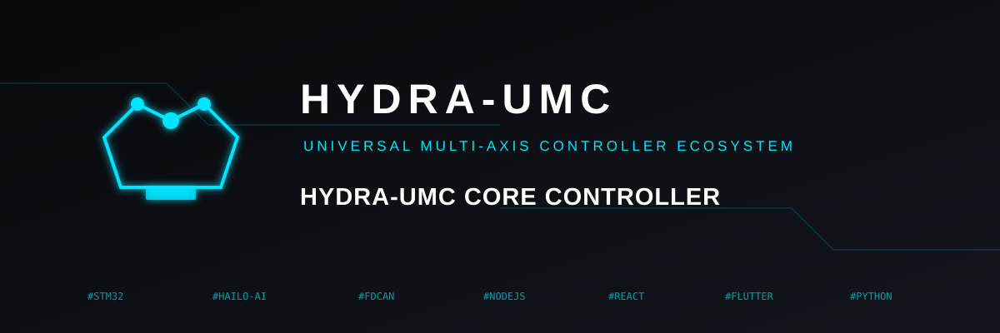
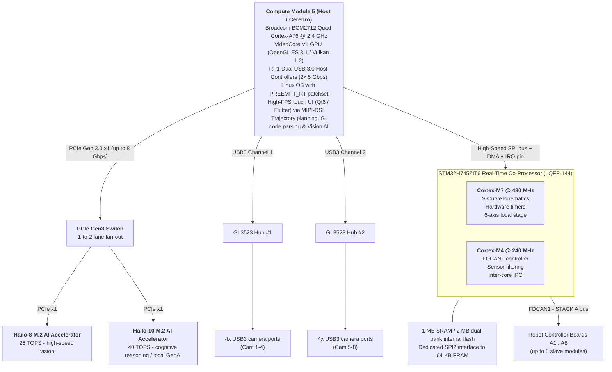
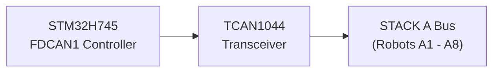
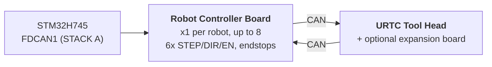

<p align="center">
  
</p>

# 🚀 HYDRA-UMC TECHNICAL SPECIFICATION

<p align="center">
  🇺🇸 <b>English</b> |
  <a href="README_spa.md">🇪🇸 Español</a> |
  <a href="README_fra.md">🇫🇷 Français</a> |
  <a href="README_ita.md">🇮🇹 Italiano</a> |
  <a href="README_deu.md">🇩🇪 Deutsch</a> |
  <a href="README_zho.md">🇨🇳 简体中文</a> |
  <a href="README_jpn.md">🇯🇵 日本語</a>
</p>

### 🤖 The Ultimate Dual-Core Micro-Factory & Multi-Robot Controller Platform (V1.0 - Dual PCIe Hailo-8 + Hailo-10 AI Accelerators & Dual USB 3.0 Hubs)

<p align="left">
  
  
  
  
  
</p>


---

## 1. 🛠️ PROJECT OVERVIEW & THE MICRO-FACTORY ECOSYSTEM

**HYDRA-UMC** (Universal Machines Controller) is an industrial-grade, distributed control platform and high-performance HMI architecture designed for multi-axis cellular robotics, micro-factories, automated manufacturing, and complex toolhead orchestration. 

Built on a **Heterogeneous Host + Real-Time Co-Processor Architecture**, HYDRA-UMC decouples high-level user interface rendering, computer vision, AI inference, and cloud connectivity from real-time step generation, fieldbus management, and power electronics actuation.



### 🤖 Micro-Factory Capabilities:
* 📡 **Distributed Multi-Robot Network:** Coordinates up to 8 distributed slave robotic modules (3, 4, 5, and 6-DOF supported today; scaling up to 7, 8, 9-DOF and Dual-Robot architectures in future releases) connected over a single physical FDCAN bus.
* 🧠 **Dual Embedded Neural Coprocessing:** An onboard PCIe Gen3 switch fans the CM5's single PCIe lane out to 2 M.2 AI accelerators - a Hailo-8 (26 TOPS) driving multi-stream YOLOv8/YOLO11 object detection, defect inspection, and real-time PnP fiducial alignment across all 8 cameras, plus a Hailo-10 (40 TOPS) running local, on-device cognitive reasoning and GenAI (quantized LLM/VLA models) without a cloud round-trip.
* 📐 **Local 6-Axis Stage:** Direct step/dir/enable pulse generation for 6 local axes (X, Y1, Y2, Z, E0, E1) for auxiliary needs: additional robots, ATC (Automatic Tool Changer) revolvers, conveyor belt synchronization, or XYZ table gantries.
* 🎯 **JuanenPNP & JuanenCNC Integration:** Directly compatible with Pick-and-Place systems (LumenPNP hardware structures) and CNC units equipped with 10W optical laser modules for PCB prototyping and SMD placement.
* 👁️ **Octal Camera Vision & Inspection Matrix:** Integrated dual USB 3.0 controllers driving 8x dedicated USB camera ports for real-time OpenCV pick-and-place optical alignment, thermal inspection, and remote stream monitoring.
* ⚡ **Actuation Matrix & Thermal Management:** Controls 16 industrial low-side MOSFET channels (8 electropneumatic valves + 8 vacuum pumps/venturi generators) and high-current bed drivers for SMD reflow soldering or 3D printing beds.
* 🚜 **JuanenBOT Mobile Platforms:** Scalable communication architecture capable of interfacing with heavy-duty 48V 4-wheeled transport platforms (50x50x50 cm frames with omnidirectional/mecanum wheels for 100 kg payloads).

---

## 2. 🖥️ HOST COMPUTING SUBSYSTEM (HMI & HIGH-LEVEL)

* 🧩 **Module:** Raspberry Pi Compute Module 5 (CM5)
* ⚙️ **Processor:** Broadcom BCM2712 Quad-Core ARM Cortex-A76 @ 2.4 GHz
* 🎮 **Graphics Engine:** VideoCore VII GPU (OpenGL ES 3.1, Vulkan 1.2)
* 💾 **System Memory:** 2 GB / 4 GB LPDDR4X (Integrated on CM5)
* 💽 **High-Speed Storage:** Integrated eMMC Flash
* 🐧 **Operating System:** Linux 64-bit (Raspberry Pi OS / Yocto patched with `PREEMPT_RT`)
* 📺 **Display Interface:** MIPI-DSI (2-lane / 4-lane) connected to high-resolution capacitive touch panel (Bambu Lab style UI at 60 FPS)
* 🌐 **Connectivity Suite:**
  * 🌐 1x Gigabit Ethernet (RJ45) for industrial LAN / RTSP video streaming / WebSockets / MQTT
  * 📶 Wi-Fi 6 & Bluetooth 5.4
  * 📷 **8x USB 3.0 / 2.0 Vision Ports:** Driven by onboard dual Genesys Logic GL3523 controllers.
  * 🎮 **2x USB 2.0 HID Ports:** Gamepad / mouse / keyboard - see section 4a.

---

## 3. 🧠 PCIE AI ACCELERATOR SUBSYSTEM (HAILO-8 + HAILO-10 DUAL NPU)

* 🔀 **PCIe Fan-Out:** The CM5 connector exposes only **one** PCIe Gen 2.0/3.0 x1 lane (confirmed against Table 5 of the CM5 datasheet, `docs/PINOUT_CM5_CARRIER.TXT`) - not enough to wire 2 M.2 AI accelerators directly. An onboard PCIe Gen3 packet switch (candidate: ASMedia ASM2806 family or equivalent, exact part TBD - Gen3 specifically, so the Hailo-10 link isn't bottlenecked below its own native speed) fans that single CM5-side lane out to 2 independent downstream PCIe x1 lanes, one per M.2 socket below.
* 🔌 **Physical Interfaces:** 2x onboard M.2 Key M sockets (2242 / 2280 form factor), each wired to its own downstream port of the PCIe switch above - not directly to the CM5.
* 🚀 **NPU Engine 1 - Hailo-8 (High-Speed Perception):** Hailo-8 Industrial AI Processor delivering **26 TOPS** (Tera Operations Per Second) at sub-5W power consumption. Drives multi-stream YOLOv8/YOLO11 object detection, defect inspection, and real-time PnP fiducial alignment across all 8 cameras (section 4) - the existing accelerator, unchanged in role.
* 🧠 **NPU Engine 2 - Hailo-10 (Cognitive Reasoning / Local GenAI):** Added alongside the Hailo-8, not a replacement. Delivering **40 TOPS**, it runs quantized LLM and Vision-Language-Action (VLA) models locally and privately - translating natural-language/voice operator instructions into kinematic trajectories, and handling semantic error recovery when a robot fails a task, without a round-trip to any external cloud service. Same cognitive role already established for the Hailo-10 across the rest of the HYDRA-UMC ecosystem (the sibling HYDRA-UMC-COGNITIVE-NODE project).
* ⚡ **Software Integration:** Official Hailo RT software suite integrated with Raspberry Pi OS for both accelerators, executing GStreamer/TAPPAS pipelines and OpenCV for the Hailo-8's zero-CPU-overhead vision inference; the Hailo-10's own LLM/VLA runtime integration is still design-stage (see `src/cm5_host/ai_inference/README.md`).
* ⚠️ **Open item:** the exact PCIe switch part number, and the Hailo-10's own real power draw, are both still TBD - see `hardware/PCB/kinematic_brain_stm32h745/BOM.TXT` items 05 and 09.

---

## 4. 📷 DUAL USB 3.0 VISION SUBSYSTEM (8x CAMERA PORTS)

* 🎛️ **Hub Controllers:** 2x Genesys Logic `GL3523` USB 3.0 / SuperSpeed Hub ICs integrated directly on the motherboard.
* 🔀 **Topology & Distribution:**
  * 🅰️ **Hub #1 (`GL3523-A`):** Connected to CM5's native USB3-0 SuperSpeed PHY (5 Gbps). Feeds USB Ports 1 to 4 (Cameras A1-A4).
  * 🅱️ **Hub #2 (`GL3523-B`):** Connected to CM5's native USB3-1 SuperSpeed PHY (5 Gbps). Feeds USB Ports 5 to 8 (Cameras A5-A8).
  * ℹ️ CM5 exposes these 2 SuperSpeed PHYs directly (BCM2712) - no RP1 companion chip is involved (RP1 is specific to the Raspberry Pi 5 board, not CM5). Full pin-level signal routing: `docs/PINOUT_CM5_CARRIER.TXT`.
* 🛡️ **Power Switch & Circuit Protection:** Individual USB VBUS protection via high-side current-limiting power switches (`TPS2065` / `SY6280`) configured for 500 mA - 1 A with fault reporting.
* ⚡ **High-Current VBUS Rail:** Powered by a dedicated 24V to 5V Step-Down Regulator (5V @ 6A continuous).

### 4a. 🎮 USB 2.0 HID SUBSYSTEM (2x GAMEPAD / MOUSE / KEYBOARD PORTS)

* 🎛️ **Hub Controller:** 1x small USB 2.0 hub IC (e.g. Genesys Logic `GL850G` / `FE1.1s`, TBD) fanning CM5's single native USB 2.0 PHY out to 2 physical ports.
* ℹ️ **Why a hub is needed:** the CM5 datasheet (`docs/datasheets/Raspberry Pi CM5.pdf`, §2.5) confirms BCM2712 exposes exactly **one** USB 2.0 (High Speed) port at the DF40 connector (`USB_N`/`USB_P`, pins 103/105) - separate and distinct from the 2x native USB 3.0 SuperSpeed PHYs already dedicated to the GL3523 camera hubs (section 4). A single physical pair cannot be split into 2 ports without a hub in between.
* 🔀 **Topology:** `USB_N`/`USB_P` (CM5) -> hub upstream port -> 2x downstream USB 2.0 Type-A ports (front/side panel, for a gamepad, mouse, or keyboard - manual jog/teach-pendant control and HMI input, independent of the touchscreen).
* 📌 Full pin-level signal routing: `docs/PINOUT_CM5_CARRIER.TXT` section 1.

---

## 5. ⚡ REAL-TIME CO-PROCESSING SUBSYSTEM

* 🎛️ **Microcontroller:** STMicroelectronics **STM32H745ZIT6** (Cost-optimized dual-core MCU)
* 📦 **Package:** LQFP-144 (0.5 mm pin pitch)
* 🧠 **Architecture:** Dual-Core Asymmetric Multiprocessing (AMP)
  * 🚀 **Core 1 (Cortex-M7 @ 480 MHz):** Real-time motion engine, hardware pulse generation, S-curve kinematic velocity profiles, PID control loops.
  * 📡 **Core 2 (Cortex-M4 @ 240 MHz):** FDCAN protocol management, analog sensor filtering, safety interlocks, and inter-core IPC handling.
* 💾 **Internal Memory Architecture:**
  * 💾 **2 MB** Dual-Bank Internal Flash
  * 🧠 **1 MB** Total Internal SRAM (512 KB AXI SRAM + 128 KB ITCM / 128 KB DTCM + SRAM1/SRAM2/SRAM3)
* 🧵 **RTOS:** **FreeRTOS**, one independent instance per core (AMP, not SMP - no shared scheduler state between Core 1 and Core 2). `src/mcu_stm32h745/`: Core 2 (CM4) already runs a real FDCAN1 "STACK A" master application (`CM4/STM32H745ZI_CM4_main.c`); Core 1 (CM7)'s own `main()` still calls the old do-nothing placeholder - see `docs/architecture.md` section 2.

---

## 6. 📡 DISTRIBUTED FIELDBUS COMMUNICATION (SINGLE FDCAN)

The motherboard acts as a master controller for up to 8 individual slave robotic modules distributed across a single physical CAN bus:

* 🔌 **Hardware Peripheral:** 1x Native Hardware FDCAN Controller (`FDCAN1`) built directly into the STM32H745, run in **Classic CAN mode** (`FDCAN_FRAME_CLASSIC`, `BRS_OFF`) by the real bootloader implementation - the peripheral is FD-capable silicon, but the CAN-OTA/SPI-OTA protocol this project actually speaks today (`docs/CANBUS_STM32H745.TXT`, `docs/CANBUS_STM32G474.TXT`) uses classic frames only (max DLC 8), same as every other tier (G474 Robot Controller Boards, URTC). CAN FD's larger 64-byte BRS payloads are real hardware headroom for later, not something the protocol uses yet.
* ⚡ **Physical Layer Transceiver:** 1x High-Speed CAN FD Transceiver (e.g., TI `TCAN1044AVD` / NXP `TJA1443`) - FD-capable hardware chosen for the same future-headroom reason as the peripheral above, even though today's traffic is classic frames.
* 🔀 **Bus Topology:**
  * 🅰️ **STACK A (`FDCAN1`):** Serves Slave Modules A1 through A8.
* ⏱️ **Protocol Specs:** ~1 Mbps nominal bitrate (Classic CAN, 8-byte max payload per frame). Auto-bus-off recovery is planned to be managed by the Cortex-M4 - not yet implemented; today's CM4 application (`src/mcu_stm32h745/CM4/STM32H745ZI_CM4_main.c`) already runs a real FDCAN1 "STACK A" master task (round-robin `AXIS_STATUS` queries across all 8 slots, see `KinematicBrainCan.c`) plus watchdog refresh, but bus-off recovery specifically is still real future work rather than a shipped capability.
* 🔌 **Physical Connector:** 40-pin, 2.54mm-pitch STACKING header/socket (+24V ×10 pins, GND ×10 pins, +5V ×4 pins auxiliary, FDCAN1 H/L, `BOARD_PRESENT_N`, 13 spare) - the 8 Robot Controller Boards physically STACK one on top of another on one side of this board (CONFIRMED topology, not a backplane), each board straight-through-passing all 40 signals to whatever mounts above it. Slot addressing is a LOCAL DIP switch per board (`BOARD_ID[2:0]`, README.md section 12), not derived from this connector. Full pin table and stack topology in `docs/PINOUT_STACKA_CONNECTOR.TXT`. Identical connector definition on the Kinematic Brain's own port and every Robot Controller Board's pair of ports.



---

## 7. 💾 ULTRA-FAST NON-VOLATILE MEMORY (SPI FRAM)

To guarantee zero data loss and instant state recovery during emergency power disruptions:

* 🧪 **Memory IC:** Cypress/Infineon `FM25V05-G` / Fujitsu `MB85RS64` (64 KB SPI FRAM)
* ⚡ **Bus Interface:** Dedicated SPI2 bus up to 40 MHz.
* ♾️ **Durability:** Infinite endurance (10^14 cycles) with nanosecond write latencies.
* 🛡️ **Anti-Power Loss Sequence (PVD):** The internal Power Voltage Detector (PVD) monitors the 3.3V rail. Upon voltage drop detection, a Non-Maskable Interrupt (NMI) dumps encoder vectors, active state machines, and coordinates to FRAM in under **5 microseconds** before supply shutdown.

---

## 8. 🦾 LOCAL MOTION, ACTUATION & SENSOR SUITE

### ⚙️ Motion Outputs
* 🎯 **Supported Axes:** 6-Axis Local Stage - dual-Y gantry + tool axes (`X`, `Y1`, `Y2`, `Z`, `E0`, `E1`), driven by 6x TMC5160A stepper drivers in an SPI daisy-chain.
* ⚡ **Signals:** 3.3V CMOS (`STEP`, `DIR`, `ENABLE`), shared SPI4 daisy-chain to all 6 drivers.
* ⏱️ **Timers:** Advanced-Control Timers (`TIM1` for X/Y1/Y2/Z, `TIM8` for E0/E1) with hardware pulse generation.
* 🛑 **Endstops:** 12x inputs, 2 per axis (MIN + MAX).
* 📌 Full pin-level allocation: `docs/PINOUT_STM32H745_KINEMATIC_BRAIN.TXT`.

### 🔌 Power & Fluidic Actuators
* 🔀 **20x Low-Side Switching Channels:** Industrial N-Channel MOSFET outputs with flyback protection.
  * 🧲 **8+2 Channels:** Vacuum Pumps / Venturi Pick-and-Place generators.
  * 💨 **8+2 Channels:** Electropneumatic Valves (5V/24V actuation).
* 💨 **Fans:** 3x 3-wire fans (PWM-switched supply via low-side MOSFET + tachometer sense per channel).
* 🌡️ **Thermal Management:**
  * 🔥 1x Solid-State Relay control output for the Heated Bed, switching **230VAC mains** - opto-isolated from the MCU/logic domains; this is a mains-voltage circuit and needs real creepage/clearance on the PCB, not a 24V-bus footprint.
  * 🌡️ 2x Precision NTC Thermistor analog inputs (heated bed) sampled by `ADC1`.

---

## 9. 🔌 POWER DISTRIBUTION & REGULATION

The board operates from a single industrial **24V DC** input supply bus:

* ⚡ **Main DC Input:** 24V DC ±10%
* 🔋 **5V Main Power Domain:** Step-down synchronous buck regulator supplying **5A continuous** for the CM5 module, touchscreen display backlight, and onboard logic.
* 📷 **5V USB VBUS Power Domain:** Dedicated synchronous buck regulator supplying **6A continuous** exclusively for the 8x USB 3.0 camera ports and GL3523 hub controllers.
* 🎛️ **3.3V Power Domain:** Low-noise regulator supplying **4A continuous** (dimensioned for STM32, FRAM, transceivers, the PCIe switch (section 3), and the 3.3V rails of both M.2 sockets - Hailo-8 + Hailo-10). This budget needs re-checking against the 4A figure once both M.2 modules' real power draw is confirmed (Hailo-8 is sub-5W; Hailo-10's own figure is still TBD) - may need to grow past 4A; see `hardware/PCB/kinematic_brain_stm32h745/BOM.TXT` item 09.

---

## 10. 🔄 INTER-PROCESSOR COMMUNICATION (IPC)

Communication between CM5 (Host) and STM32H745 (Co-Processor) utilizes a hardware-assisted, zero-copy SPI link:

* 🔗 **Physical Transport:** Full-Duplex SPI1 running up to 50 MHz in Slave Mode on STM32 and Master Mode on CM5.
* 🤝 **Handshake Line:** `HYDRA_DATA_READY` GPIO line.
* ⚡ **Execution Flow:** The Cortex-M4 prepares a 128-byte telemetry frame in shared AXI SRAM, asserts `HYDRA_DATA_READY`, and the CM5 fetches the packet via high-speed SPI DMA without polling overhead.

---

## 11. 🎛️ 4-LAYER PCB HARDWARE SPECIFICATIONS

* 📐 **Form Factor:** Monolithic Industrial Motherboard.
* 🥞 **Layer Stackup (4-Layer):**
  * 🟢 **Layer 1 (Top):** Component placement, high-frequency signals, 90-ohm USB SuperSpeed differential pairs, 85-ohm PCIe Gen 3.0 pairs.
  * 🛡️ **Layer 2 (Inner 1):** Continuous solid Ground Plane (`GND`).
  * ⚡ **Layer 3 (Inner 2):** Split Power Planes (`24V`, `5V_MAIN`, `5V_USB`, `3.3V`).
  * 🔴 **Layer 4 (Bottom):** Secondary signal traces and high-current power breakouts.
* 🛠️ **Connectors & Assembly:**
  * 🔲 LQFP-144 package (0.5 mm pitch) for STM32H745, QFN-88 packages for 2x GL3523 hubs, and 2x M.2 Key M 2242/2280 sockets (Hailo-8 + Hailo-10, section 3) fed by an onboard PCIe Gen3 switch.
  * 🔌 Dual Hirose DF40 mezzanine connectors for Compute Module 5.
  * 📌 40-pin, 2.54 mm-pitch STACKING header for STACK A bus connection (base of the physical Robot Controller Board stack) - `docs/PINOUT_STACKA_CONNECTOR.TXT`.
  * 🔌 8x USB 3.0 Type-A (or Hirose industrial latching) connectors for robot cameras.

---

## 12. 🦾 ROBOT CONTROLLER BOARDS & URTC TOOL HEAD (DISTRIBUTED TIER)

Each of the up to 8 slave modules on STACK A (section 6) is a **Robot
Controller Board**: one per robot, driving that robot's own 6 axes
(STEP/DIR/ENABLE), reading its endstops, and forwarding its own tool head's
traffic one hop further over a *second* CAN connection to a **URTC** board
(Universal Robot Tool Controller - see the sibling `URTC` repository) mounted
in the robot's head, optionally with its own expansion board.



* 🎛️ **MCU:** STMicroelectronics **STM32G474RET6** (Cortex-M4 @ 170 MHz,
  LQFP-64, 512 KB flash), using 2 of its 3 onboard FDCAN peripherals - one as
  the FDCAN uplink to the STM32H745, one as the CAN downlink to its own URTC
  head. See `docs/architecture.md` §1.
* 🔢 **Addressing:** `BOARD_ID[2:0]` - a local 3-position DIP switch on each
  board, manually set to 0-7 at install time, gives every board its own
  FDCAN1 slot base ID - not derived from the physical stack position or the
  STACK A connector (every board is the same interchangeable PCB). See
  `docs/PINOUT_STM32G474_ROBOT_CONTROLLER.TXT` §1c.
* 🧵 **RTOS:** **FreeRTOS** (its bootloader stays bare-metal - no scheduler
  needed to receive/verify/jump). Real application: `src/mcu_stm32g474/STM32G474RE_main.c`
  runs a real relay task (`RobotControllerRelay.c` - FDCAN2 downlink to the
  URTC Tool Head, an `AXIS_STATUS` responder, and the `RELAY_SEND`/`RELAY_RECV`
  tunnel) alongside the watchdog-refresh blink task.
* 📡 **CAN-OTA firmware updates, 4 tiers deep:** the STM32H745 itself (over
  its existing SPI link to the CM5), this board, its URTC Tool Head
  (STM32F303CCT6), and - only when installed - that head's own Advanced
  Expansion Board (STM32F303CBT6, `expansion_board_type` 3 or 4, see URTC's
  own `docs/EXPANSION.TXT`) can all be flashed and diagnosed from
  HYDRA-UMC-STUDIO's Flasher/Tester with no JTAG/SWD probe and no USB-CAN
  dongle. Full addressing scheme, the relay tunnel that reaches the last two
  tiers without any new protocol design, and current implementation status:
  `docs/architecture.md`.

See `docs/architecture.md` for the complete tiered architecture (this section
is a summary), including what's confirmed hardware fact vs. still a proposed
design pending implementation. Section 8 of that document also tracks the
current bootloaders' known, accepted security limitations (no Read-Out
Protection yet, a shared anti-rollback bypass value, unauthenticated
readback) - deliberate pre-hardware gaps, not oversights.

---

## 📂 REPOSITORY DIRECTORY STRUCTURE

```text
HYDRA-UMC/
├── .vscode/                    # Recommended extensions + build tasks - see "Development Environment" below
├── docs/
│   ├── datasheets/             # Datasheets of parts used across every board in this repo
│   ├── architecture.md         # The 4-tier system architecture (start here)
│   ├── COMPILE_STM32G474.TXT   # Robot Controller Board firmware build reference
│   ├── COMPILE_STM32H745.TXT   # Kinematic Brain firmware build reference (dual-core)
│   ├── PINOUT_STM32H745_KINEMATIC_BRAIN.TXT    # Kinematic Brain full pin allocation
│   ├── PINOUT_STM32G474_ROBOT_CONTROLLER.TXT   # Robot Controller Board full pin allocation
│   ├── PINOUT_CM5_CARRIER.TXT                  # CM5 host subsystem signal routing
│   ├── PINOUT_STACKA_CONNECTOR.TXT             # Shared 40-pin STACK A stacking connector
│   ├── CANBUS_STM32H745.TXT                    # Kinematic Brain wire-level protocol (SPI1/mailbox/FDCAN1-master)
│   ├── CANBUS_STM32G474.TXT                    # Robot Controller Board wire-level protocol (FDCAN1-slave/FDCAN2)
│   └── HYDRA-UMC_*.md/txt/TXT  # Older docs - Markdown where authored as Markdown; see each file's own banner
├── hardware/
│   ├── PCB/
│   │   ├── kinematic_brain_stm32h745/          # Main motherboard - no schematic yet, see its own README
│   │   └── robot_controller_board_stm32g474/   # Per-robot board - no schematic yet, see its own README
│   └── gerbers/                # Manufacturing output files (empty until a board is laid out)
├── src/                         # Same layout convention as the sibling URTC repo: src/ is SOURCE
│   ├── cm5_host/                # Linux userspace apps that run ON TOP of os/'s own image
│   │   ├── hmi_qt6/             # Qt6 kiosk shell wrapping HYDRA-UMC-STUDIO's own dashboard
│   │   ├── ai_inference/        # Hailo-8 TAPPAS / YOLOv8 pipeline
│   │   ├── video_streamer/      # Multi-camera RTSP/WebRTC server (MediaMTX)
│   │   ├── ipc_driver/          # CM5 <-> STM32H745 SPI link (userspace) - unfinished C skeleton, kept for reference
│   │   └── spi_bridge/          # Real CM5<->STM32H745 SPI-OTA bridge (Python) - replaces ipc_driver/,
│   │                              adapts URTC-FLASHER's own proven CRC32/HMAC bootloader state machine
│   ├── mcu_stm32h745/           # Kinematic Brain firmware (Tier 0) - dual-core
│   │   ├── CM7/                 # Motion engine, hardware timers (+ its own boot/)
│   │   ├── CM4/                 # FDCAN drivers, sensor filtering (+ its own boot/)
│   │   └── Common/              # CM7<->CM4 shared-memory IPC mailbox (ipc_mailbox.h) - implemented, used by both cores' bootloaders
│   └── mcu_stm32g474/           # Robot Controller Board firmware (Tier 1) - single-core, + its own boot/
├── os/                          # CM5 OS image - base OS choice, systemd units, first-boot provisioning
├── images/                      # README banner + icon + splashscreen (SVG)
├── build_firmware.sh            # Builds every MCU firmware target above from a clean checkout (Linux/Mac)
├── build_firmware.bat           # Same build, Windows (see "Building the Firmware" below)
├── build-test.sh / build-test.bat # Non-versioning build/compile check
├── generate_manifest.py         # Regenerates firmware/firmware_manifest.json (versions/CRC32) after a full build
├── bump_version.py              # Odometer-style version bump, run by build_firmware.sh/.bat
├── bump_manifest_version.py     # Syncs hydra-umc.project.json's version to the native one (--sync)
├── tools/
│   ├── verify_firmware_inventory.py # Read-only verification of the committed six-component inventory
│   ├── build_test.py                # Non-versioning build/compile check
│   └── ci_validate.py               # Manifest/CHANGELOG/docs validation used by CI
├── firmware/                    # Committed build output (.bin/.hex/.elf + manifest) - NOT gitignored, same convention as URTC's own output folder, see "Building the Firmware" below
├── README.md                    # This file
└── README_spa.md / README_ita.md / README_fra.md / README_deu.md / README_zho.md / README_jpn.md    # <- translations
```

See `docs/architecture.md` for what each tier actually does and how they
connect; every folder above with its own `README.md` has more detail than
this top-level summary.

## 🛠️ DEVELOPMENT ENVIRONMENT

What this project's own development machines actually have installed and
verified working (`build_firmware.sh`/`build_firmware.bat`, `g474`/`h745`/
default targets, 0 errors) - not a theoretical list:

* 🔧 **ARM GNU Toolchain** (`arm-none-eabi-gcc` 10.3+) - compiles every MCU
  firmware target. No STM32CubeIDE/CubeMX project files are used or
  required to build - `build_firmware.sh`/`build_firmware.bat` fetches ST's
  own HAL/CMSIS sources fresh from their official GitHub repos and drives
  the compiler directly, same philosophy the sibling `URTC` repo's own
  `build_firmware.sh`/`build_firmware.bat` already established.
* 🧩 **VS Code + extensions** (`.vscode/extensions.json` lists all of
  these): [STM32 VS Code Extension](https://marketplace.visualstudio.com/items?itemName=stmicroelectronics.stm32-vscode-extension)
  (project/build/debug integration), **Cortex-Debug** (SWD/JTAG debugging -
  independent of `build_firmware.sh`, useful once real hardware exists),
  **CMake Tools** (for `src/cm5_host/hmi_qt6/`'s own CMake project),
  **C/C++** (IntelliSense across every firmware/host source file),
  **Python** (`ai_inference/` pipeline scripts), **Hex Editor** (inspecting
  `.bin` firmware output), **YAML** (`video_streamer/`'s own MediaMTX
  config). Open the repo, accept the recommended-extensions prompt, and use
  **Terminal → Run Task** for the pre-wired build tasks
  (`.vscode/tasks.json`).
* 🗂️ **git** - both for this repo itself and for `build_firmware.sh`'s own
  pinned-tag vendoring of ST's HAL/CMSIS packages (cached under `build/`,
  gitignored, re-fetched on `--clean`).

## 🏗️ BUILDING THE FIRMWARE

**Linux/Mac:**
```bash
./build_firmware.sh          # builds every MCU target (Robot Controller Board + Kinematic Brain, both cores)
./build_firmware.sh g474     # Robot Controller Board only
./build_firmware.sh h745     # Kinematic Brain only (both cores)
./build_firmware.sh --clean  # wipe the vendored HAL/CMSIS cache first
```

**Windows:**
```bat
build_firmware.bat          :: builds every MCU target (Robot Controller Board + Kinematic Brain, both cores)
build_firmware.bat g474     :: Robot Controller Board only
build_firmware.bat h745     :: Kinematic Brain only (both cores)
build_firmware.bat --clean  :: wipe the vendored HAL/CMSIS cache first
```

`build_firmware.bat` is the same build as `build_firmware.sh` translated to
batch (same steps, same pinned HAL/CMSIS versions, same pass/warn/fail
reporting) - run end to end on a real Windows machine with the [Arm GNU
Toolchain](https://developer.arm.com/downloads/-/arm-gnu-toolchain-downloads)
installed and `arm-none-eabi-gcc` on `PATH`: every HAL module, both
bootloaders, and every application compiled and linked clean, and
`firmware_manifest.json` regenerated with CRC32s matching the Linux/Mac
build's own output. Requires the same tools as the Linux/Mac script: the Arm
GNU Toolchain, `git` (to fetch ST's own HAL/CMSIS sources), and `python` for
the manifest step.

**Manual build (either OS, without the script):** the script automates
exactly the steps in `docs/COMPILE_STM32G474.TXT` and
`docs/COMPILE_STM32H745.TXT` - fetch the pinned HAL/CMSIS/FreeRTOS sources
listed at the top of `build_firmware.sh`/`build_firmware.bat`, compile each
target's HAL modules and startup/system files with `arm-none-eabi-gcc`
(flags/module lists are listed in that same script), then link each
bootloader and application against its own linker script (`*.ld`, next to
its source) with `arm-none-eabi-gcc`/`-Wl,--gc-sections` and convert with
`arm-none-eabi-objcopy` to `.bin`/`.hex`. Those two `docs/COMPILE_*.TXT`
files are the authoritative, step-by-step reference if you'd rather not run
either script - the scripts exist to automate them, not replace them as the
source of truth.

Output lands in `firmware/`, which is committed and pushed to this
repo (same convention as URTC's own `firmware/` output folder) so that
HYDRA-UMC-STUDIO's GitHub-download feature can actually find real
`.bin` files there via `firmware_manifest.json` - it is NOT gitignored.
See `docs/COMPILE_STM32G474.TXT` and `docs/COMPILE_STM32H745.TXT` for
exactly what each step does and why - and each firmware folder's own
`README.md` for current status. The **bootloaders** for all 3 targets
(G474, H745 CM7, H745 CM4) are real, working CAN-OTA/SPI-OTA
implementations (CRC32 + HMAC-SHA256 verify-into-backup-before-copy-to-main,
same anti-bricking discipline as URTC's own bootloader) - compiling clean
end to end, not yet verified against real hardware. The **applications**
are still verified-compiling FreeRTOS GPIO-toggle smoke tests, not yet the
real motion/vision/relay firmware. See `docs/architecture.md` (especially
section 6's status table and section 8's known, accepted security
limitations) for exactly what's real vs. still open.

## 🔢 Versioning

All 6 firmware components (3 bootloaders + 3 applications - Robot
Controller Board's STM32G474, Kinematic Brain's CM7, Kinematic Brain's
CM4, one bootloader/application pair per chip/core) are version-
incremental: `build_firmware.sh`/`.bat` bump that component's own PATCH by
exactly 1 immediately before compiling it, via `bump_version.py`, so every
real build that produces a new binary for a component carries its own new
version baked in - never hand-typed, never able to drift out of sync with
what actually got compiled. Carry rule (an "odometer"): PATCH past 9
resets to 0 and MINOR increments by 1 (e.g. `1.1.9` -> `1.2.0`, never
`1.1.10`); MINOR past 9 carries into MAJOR the same way. See each
component's own `bootloader_common.h` and `bump_version.py`'s own header
comment for the full mechanism.

## 🔗 Related Projects

This project is part of the HYDRA-UMC robotics ecosystem by the same author (JuanenRac / Electro Hobby 3D). Worth knowing about, since a request might actually be about one of these rather than this repository.

**Directly Related** — projects that plug straight into this firmware
- **[URTC](https://github.com/JuanenRac/URTC)** — firmware for the physical Universal Robot Tool Controller PCB, 25+ tool profiles over CAN bus; the tool head firmware every robot arm this board drives mounts, one hop further over its own CAN downlink.
- **[HYDRA-UMC-OS](https://github.com/JuanenRac/HYDRA-UMC-OS)** — reproducible Raspberry Pi OS product layer for the CM5: read-only agent, validated config/profiles, WiFi first-contact provisioning; the OS this board's own CM5 host runs.
- **[HYDRA-UMC-SERVER](https://github.com/JuanenRac/HYDRA-UMC-SERVER)** — the real headless backend (REST/WebSocket) every control client actually talks to; its own `spi_bridge` service talks to this firmware over the real CM5↔STM32H745 SPI-OTA connection.
- **[HYDRA-UMC-VISION-NODE](https://github.com/JuanenRac/HYDRA-UMC-VISION-NODE)** — integration hub for the Hailo-8 vision pipeline, with a real per-stage hardware-readiness check; closes the perception/E-STOP loop against this firmware over SPI/CAN.
- **[HYDRA-UMC-SAFETY-ZONES](https://github.com/JuanenRac/HYDRA-UMC-SAFETY-ZONES)** — real zone-breach checking and E-STOP requesting, with calibration-freshness enforcement; triggers this firmware's E-STOP the moment it detects an intrusion.
- **[HYDRA-UMC-VISUAL-SERVOING-API](https://github.com/JuanenRac/HYDRA-UMC-VISUAL-SERVOING-API)** — real Position-Based Visual Servoing correction law, safety-gated on upstream zone state; sends kinematic corrections directly to this firmware.
- **[HYDRA-UMC-ORCHESTRATOR](https://github.com/JuanenRac/HYDRA-UMC-ORCHESTRATOR)** — integration hub with a real gRPC/Protobuf health-report contract and mission state machine; coordinates multiple HYDRA-UMC units as a swarm.
- **[HYDRA-UMC-TWIN](https://github.com/JuanenRac/HYDRA-UMC-TWIN)** — integration hub for the digital-twin engine, with a real version-compatibility sync contract; replicates this firmware's own kinematics.
- **[URTC-SMART-RACK](https://github.com/JuanenRac/URTC-SMART-RACK)** — firmware for a board-mounting rack with real tool-ID decoding and Smart Idle pre-heating logic; shares the same tool CAN bus as this firmware.
- **[URTC-VISION-TOOL](https://github.com/JuanenRac/URTC-VISION-TOOL)** — firmware plus a real Python vision companion for a thermal/RGB inspection tool head; shares the same tool CAN bus as this firmware.

**Also Part of the Ecosystem**

*Core Hardware & Platform*
- **[HYDRA-UMC-SDK](https://github.com/JuanenRac/HYDRA-UMC-SDK)** — the shared JSON-Schema contract and safety-gate boundary every bridge validates its commands against.

*Core Backend & Clients*
- **[HYDRA-UMC-STUDIO](https://github.com/JuanenRac/HYDRA-UMC-STUDIO)** — web control dashboard with real-time multi-robot 3D visualization.
- **[HYDRA-UMC-SUITE](https://github.com/JuanenRac/HYDRA-UMC-SUITE)** — desktop (PySide6) swarm command center for multiple servers at once, packaged as a standalone executable.
- **[HYDRA-UMC-ANDROID-CONTROL](https://github.com/JuanenRac/HYDRA-UMC-ANDROID-CONTROL)** — native Android control app with biometric login and a paired Wear OS companion.
- **[HYDRA-UMC-IOS-CONTROL](https://github.com/JuanenRac/HYDRA-UMC-IOS-CONTROL)** — iOS/iPadOS control app (Flutter) with real-time WebSocket sync.
- **[HYDRA-UMC-DSI](https://github.com/JuanenRac/HYDRA-UMC-DSI)** — native touch UI for the onboard 7" DSI touchscreen, embedded on the CM5 itself.
- **[HYDRA-UMC-EDITOR-URDF](https://github.com/JuanenRac/HYDRA-UMC-EDITOR-URDF)** — desktop graphical URDF creator/editor that pushes finished models into STUDIO's own catalog.
- **[HYDRA-UMC-BRIDGE-AMR](https://github.com/JuanenRac/HYDRA-UMC-BRIDGE-AMR)** — coordination boundary for AGV/AMR fleets via a real VDA 5050 MQTT publisher.
- **[HYDRA-UMC-BRIDGE-CNC](https://github.com/JuanenRac/HYDRA-UMC-BRIDGE-CNC)** — high-level CNC-cell coordinator with real GRBL status/control-byte access.
- **[HYDRA-UMC-BRIDGE-DROIDS](https://github.com/JuanenRac/HYDRA-UMC-BRIDGE-DROIDS)** — coordination boundary for legged/humanoid droids, with a real Boston Dynamics Spot command sender.
- **[HYDRA-UMC-BRIDGE-LASER](https://github.com/JuanenRac/HYDRA-UMC-BRIDGE-LASER)** — laser-cell safety coordinator reading 3 real key/enclosure/interlock GPIO safeguards.
- **[HYDRA-UMC-BRIDGE-OPENPNP](https://github.com/JuanenRac/HYDRA-UMC-BRIDGE-OPENPNP)** — safe high-level board-flow coordinator for OpenPnP pick-and-place.
- **[HYDRA-UMC-BRIDGE-PRINTER3D](https://github.com/JuanenRac/HYDRA-UMC-BRIDGE-PRINTER3D)** — safe coordination boundary for Moonraker/Klipper 3D printers, with real gated job commands.
- **[HYDRA-UMC-BRIDGE-ROS2](https://github.com/JuanenRac/HYDRA-UMC-BRIDGE-ROS2)** — safety coordinator with a real, lazily-imported rclpy ROS 2 transport.
- **[HYDRA-UMC-BRIDGE-UAV](https://github.com/JuanenRac/HYDRA-UMC-BRIDGE-UAV)** — coordination boundary for camera-equipped UAVs, with a real MAVLink command sender.

*URTC Tool Platform*
- **[URTC-FLASHER](https://github.com/JuanenRac/URTC-FLASHER)** — desktop GUI flashing tool for URTC boards, CAN-OTA plus full-chip SWD/JTAG.
- **[URTC-TESTER](https://github.com/JuanenRac/URTC-TESTER)** — desktop live CAN-bus diagnostic tool for URTC boards, one panel per tool profile.
- **[URTC-WEB-STUDIO](https://github.com/JuanenRac/URTC-WEB-STUDIO)** — browser-based alternative to URTC-TESTER via the Web Serial API, no local install needed.

*Vision AI Node (Hailo-8)*
- **[HYDRA-UMC-DETECTION-HEF](https://github.com/JuanenRac/HYDRA-UMC-DETECTION-HEF)** — real compiled-model registry with Hailo-architecture/checksum safe-load verification.
- **[HYDRA-UMC-VISION-STREAMER](https://github.com/JuanenRac/HYDRA-UMC-VISION-STREAMER)** — real GStreamer pipeline + MediaMTX config generator with a real HailoRT integration boundary.

*Cognitive AI Node (Hailo-10)*
- **[HYDRA-UMC-COGNITIVE-NODE](https://github.com/JuanenRac/HYDRA-UMC-COGNITIVE-NODE)** — integration hub for the Hailo-10 cognitive pipeline (LLM/VLA/voice orchestration).
- **[HYDRA-UMC-VLA-ENGINE](https://github.com/JuanenRac/HYDRA-UMC-VLA-ENGINE)** — real action-token encoding/decoding and trajectory generation for a Vision-Language-Action model.
- **[HYDRA-UMC-VOICE-UI](https://github.com/JuanenRac/HYDRA-UMC-VOICE-UI)** — real voice front-end (VAD + intent parser) with a bounded, confirmation-gated Watch relay.
- **[HYDRA-UMC-SEMANTIC-PLANNER](https://github.com/JuanenRac/HYDRA-UMC-SEMANTIC-PLANNER)** — real rule-based task decomposition and semantic error recovery over MCU error codes.
- **[HYDRA-UMC-DOCS-QA](https://github.com/JuanenRac/HYDRA-UMC-DOCS-QA)** — real stdlib-only TF-IDF document search over this ecosystem's own Markdown docs.

*Orchestration & Swarm*
- **[HYDRA-UMC-JOB-DISPATCHER](https://github.com/JuanenRac/HYDRA-UMC-JOB-DISPATCHER)** — real priority-based job queue with deduplication, over a real HTTP API.
- **[HYDRA-UMC-NODE-HEALING](https://github.com/JuanenRac/HYDRA-UMC-NODE-HEALING)** — real gRPC-based fleet health watchdog with retry/backoff and identity-mismatch detection.
- **[HYDRA-UMC-PATH-PLANNER-3D](https://github.com/JuanenRac/HYDRA-UMC-PATH-PLANNER-3D)** — real RRT-based 3D path planner with real obstacle/workspace collision validation.
- **[HYDRA-UMC-SWARM-SYNC](https://github.com/JuanenRac/HYDRA-UMC-SWARM-SYNC)** — real CRDT LWW-Element-Map state sync, property-tested for multi-cell convergence.

*Digital Twin & Simulation*
- **[HYDRA-UMC-HIL-BRIDGE](https://github.com/JuanenRac/HYDRA-UMC-HIL-BRIDGE)** — real hardware-in-the-loop safety interlock routing commands between simulation and real hardware.
- **[HYDRA-UMC-PHYSICS-REPLICA](https://github.com/JuanenRac/HYDRA-UMC-PHYSICS-REPLICA)** — real forward kinematics and joint-limit validation over a real URDF subset.
- **[HYDRA-UMC-SYNTHETIC-DATA-GEN](https://github.com/JuanenRac/HYDRA-UMC-SYNTHETIC-DATA-GEN)** — real procedural 2D scene generator with YOLO/COCO annotation export.

*Data & Analytics*
- **[HYDRA-UMC-DATALAKE](https://github.com/JuanenRac/HYDRA-UMC-DATALAKE)** — real sqlite3-backed time-series store with a real ingest/query HTTP API.
- **[HYDRA-UMC-ANOMALY-DETECTOR](https://github.com/JuanenRac/HYDRA-UMC-ANOMALY-DETECTOR)** — real FFT + statistical baseline anomaly detector with drift monitoring.
- **[HYDRA-UMC-PRODUCTION-REPORTS](https://github.com/JuanenRac/HYDRA-UMC-PRODUCTION-REPORTS)** — real OEE/availability calculation over DATALAKE history, with reproducible CSV export.
- **[HYDRA-UMC-TELEMETRY-COLLECTOR](https://github.com/JuanenRac/HYDRA-UMC-TELEMETRY-COLLECTOR)** — real CAN/WebSocket ingestion pipeline into DATALAKE, with sequence deduplication.

*Industrial Gateway*
- **[HYDRA-UMC-GATEWAY-INDUSTRIAL](https://github.com/JuanenRac/HYDRA-UMC-GATEWAY-INDUSTRIAL)** — integration hub relaying to industrial protocols, with a real command allowlist/backpressure layer.
- **[HYDRA-UMC-OPCUA-SERVER](https://github.com/JuanenRac/HYDRA-UMC-OPCUA-SERVER)** — real OPC-UA address space, verified with a real binary-protocol client session.
- **[HYDRA-UMC-MQTT-BROKER](https://github.com/JuanenRac/HYDRA-UMC-MQTT-BROKER)** — real MQTT broker with optional per-client authentication and topic ACLs.
- **[HYDRA-UMC-MTCONNECT-ADAPTER](https://github.com/JuanenRac/HYDRA-UMC-MTCONNECT-ADAPTER)** — real MTConnect `/probe` and `/current` XML endpoints with degraded-mode output.

*Complementary Tools & Ecosystem Operations*
- **[HYDRA-UMC-DASHBOARD-AI](https://github.com/JuanenRac/HYDRA-UMC-DASHBOARD-AI)** — Smart Summaries and Anomaly Highlighting panels over DATALAKE/ANOMALY-DETECTOR, with an honest statistical fallback.
- **[HYDRA-UMC-TOOL-CLI](https://github.com/JuanenRac/HYDRA-UMC-TOOL-CLI)** — fleet CLI with a real, stable exit-code contract, a genuine live client of HYDRA-UMC-SERVER's own API.
- **[HYDRA-UMC-WATCH](https://github.com/JuanenRac/HYDRA-UMC-WATCH)** — WearOS companion app with real haptic alerts and a paired-phone voice relay.
- **[HYDRA-UMC-UPDATER](https://github.com/JuanenRac/HYDRA-UMC-UPDATER)** — administrative desktop tool that discovers, clones and updates every repo in this ecosystem.
- **[HYDRA-UMC-OS-REBUILDER](https://github.com/JuanenRac/HYDRA-UMC-OS-REBUILDER)** — Windows/Linux desktop tool that builds a ready-to-flash CM5 image pre-loaded with the ecosystem's most current versions, with Raspberry-Pi-Imager-style first-boot Wi-Fi/user/SSH configuration.

---

## 📚 Documentation & Community

- **[CONTRIBUTING.md](CONTRIBUTING.md)** — tech stack and coding guidelines for a pull request.
- **[CODE_OF_CONDUCT.md](CODE_OF_CONDUCT.md)** — the standards of behavior expected in this community.
- **[SECURITY.md](SECURITY.md)** — how to report a vulnerability, and this project's own real security focus areas.
- **[SUPPORT.md](SUPPORT.md)** — where to ask questions and report bugs.
- **[LICENSE.md](LICENSE.md)** — this project's own license.

## 👤 AUTHOR
**JuanenRac** (Electro Hobby 3D)
📧 electrohobby3d@gmail.com
📺 [youtube.com/@electrohobby3d](https://youtube.com/@electrohobby3d)

## 📜 LICENSE

HYDRA-UMC is (c) 2026 JuanenRac (Electro Hobby 3D). This notice must be included in any distributions of this project or derivative works.

Because this project consists of several different types of content, individual parts are made available under different licenses - each suited to what it actually covers, rather than forcing one license to fit everything:

1. The **firmware** located at `./firmware` (application and CAN bootloader alike) is available under the **GNU General Public License v3.0 (GPL-3.0)**. Full text at https://www.gnu.org/licenses/gpl-3.0.html.

2. The **hardware designs** (Eagle schematic/board files, gerbers, and the 3D-printable parts under `./hardware` and `./3D`) are available under the **CERN Open Hardware Licence v2 - Strongly Reciprocal (CERN-OHL-S v2)**. Full text at https://cern-ohl.web.cern.ch/.

3. The **documentation** (this README, the service manual, and the reference files under `./docs` is available under **Creative Commons Attribution-ShareAlike 4.0 International (CC BY-SA 4.0)**. Full text at https://creativecommons.org/licenses/by-sa/4.0/.

If you build on this project, keep the licensing split in mind: code changes to the firmware or the flashing tool should stay GPL-3.0, hardware modifications should stay CERN-OHL-S, and documentation derivatives should stay CC BY-SA - each with attribution back to this project.
