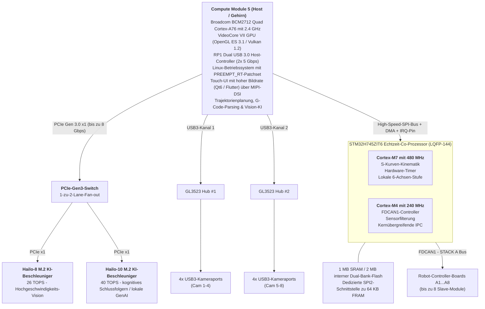
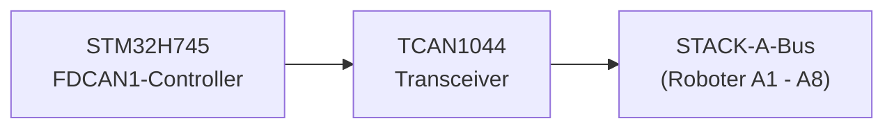
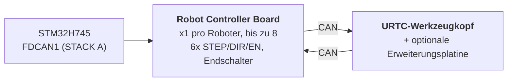

<p align="center">
  
</p>

# 🚀 TECHNISCHE SPEZIFIKATION VON HYDRA-UMC

<p align="center">
  <a href="README.md">🇺🇸 English</a> |
  <a href="README_spa.md">🇪🇸 Español</a> |
  <a href="README_fra.md">🇫🇷 Français</a> |
  <a href="README_ita.md">🇮🇹 Italiano</a> |
  🇩🇪 <b>Deutsch</b> |
  <a href="README_zho.md">🇨🇳 简体中文</a> |
  <a href="README_jpn.md">🇯🇵 日本語</a>
</p>

### 🤖 Die ultimative Dual-Core-Mikrofabrik- und Multi-Roboter-Steuerungsplattform (V1.0 - Doppelter PCIe-Hailo-8+Hailo-10-KI-Beschleuniger und Doppel-USB-3.0-Hubs)

<p align="left">
  
  
  
  
  
</p>


---

## 1. 🛠️ PROJEKTÜBERSICHT UND DAS MIKROFABRIK-ÖKOSYSTEM

**HYDRA-UMC** (Universal Machines Controller) ist eine industrietaugliche, verteilte Steuerungsplattform und Hochleistungs-HMI-Architektur für Multi-Achsen-Zellenrobotik, Mikrofabriken, automatisierte Fertigung und komplexe Werkzeugkopf-Orchestrierung.

Aufgebaut auf einer **heterogenen Host + Echtzeit-Co-Prozessor-Architektur**, entkoppelt HYDRA-UMC das High-Level-Rendering der Benutzeroberfläche, Computer Vision, KI-Inferenz und Cloud-Konnektivität von der Echtzeit-Schritterzeugung, der Feldbusverwaltung und der Ansteuerung der Leistungselektronik.



### 🤖 Mikrofabrik-Fähigkeiten:
* 📡 **Verteiltes Multi-Roboter-Netzwerk:** Koordiniert bis zu 8 verteilte robotische Slave-Module (3, 4, 5 und 6 Achsen werden heute unterstützt; Skalierung auf 7, 8, 9 Achsen und Dual-Roboter-Architekturen in zukünftigen Versionen), die über einen einzigen physischen FDCAN-Bus verbunden sind.
* 🧠 **Doppeltes eingebettetes neuronales Coprocessing:** Ein Onboard-PCIe-Gen3-Switch verteilt die einzige PCIe-Lane des CM5 auf 2 M.2-KI-Beschleuniger - einen Hailo-8 (26 TOPS) für Multi-Stream-YOLOv8/YOLO11-Objekterkennung, Fehlerinspektion und Echtzeit-PnP-Fiducial-Ausrichtung über alle 8 Kameras, plus einen Hailo-10 (40 TOPS) für lokales, geräteseitiges kognitives Schlussfolgern und GenAI (quantisierte LLM-/VLA-Modelle) ohne Cloud-Umweg.
* 📐 **Lokale 6-Achsen-Stufe:** Direkte Step/Dir/Enable-Impulserzeugung für 6 lokale Achsen (X, Y1, Y2, Z, E0, E1) für Zusatzbedarfe: zusätzliche Roboter, ATC-Revolver (automatischer Werkzeugwechsler), Förderbandsynchronisation oder XYZ-Tischportale.
* 🎯 **JuanenPNP- und JuanenCNC-Integration:** Direkt kompatibel mit Pick-and-Place-Systemen (LumenPNP-Hardwarestrukturen) und CNC-Einheiten, die mit 10W-optischen Lasermodulen für PCB-Prototyping und SMD-Bestückung ausgestattet sind.
* 👁️ **Octal-Kamera-Vision- und Inspektionsmatrix:** Integrierte doppelte USB-3.0-Controller, die 8x dedizierte USB-Kameraports für Echtzeit-OpenCV-Pick-and-Place-optische Ausrichtung, Wärmeinspektion und Fernstream-Überwachung ansteuern.
* ⚡ **Ansteuerungsmatrix und Wärmemanagement:** Steuert 16 industrielle Low-Side-MOSFET-Kanäle (8 elektropneumatische Ventile + 8 Vakuumpumpen/Venturi-Generatoren) sowie Hochstrom-Bett-Treiber für SMD-Reflow-Löten oder 3D-Druckbetten.
* 🚜 **JuanenBOT-Mobilplattformen:** Skalierbare Kommunikationsarchitektur, die eine Schnittstelle zu robusten 48V-4-Rad-Transportplattformen ermöglicht (50x50x50 cm Rahmen mit omnidirektionalen/Mecanum-Rädern für 100 kg Nutzlast).

---

## 2. 🖥️ HOST-COMPUTING-SUBSYSTEM (HMI & HOCHNIVEAU)

* 🧩 **Modul:** Raspberry Pi Compute Module 5 (CM5)
* ⚙️ **Prozessor:** Broadcom BCM2712 Quad-Core ARM Cortex-A76 mit 2.4 GHz
* 🎮 **Grafik-Engine:** VideoCore VII GPU (OpenGL ES 3.1, Vulkan 1.2)
* 💾 **Systemspeicher:** 2 GB / 4 GB LPDDR4X (integriert auf dem CM5)
* 💽 **High-Speed-Speicher:** Integrierter eMMC-Flash
* 🐧 **Betriebssystem:** 64-Bit-Linux (Raspberry Pi OS / Yocto, gepatcht mit `PREEMPT_RT`)
* 📺 **Display-Schnittstelle:** MIPI-DSI (2-Lane / 4-Lane), verbunden mit einem hochauflösenden kapazitiven Touch-Panel (Bambu-Lab-artige UI mit 60 FPS)
* 🌐 **Konnektivitäts-Suite:**
  * 🌐 1x Gigabit-Ethernet (RJ45) für industrielles LAN / RTSP-Videostreaming / WebSockets / MQTT
  * 📶 Wi-Fi 6 & Bluetooth 5.4
  * 📷 **8x USB-3.0/2.0-Vision-Ports:** Angesteuert von zwei Onboard-Genesys-Logic-GL3523-Controllern.
  * 🎮 **2x USB-2.0-HID-Ports:** Gamepad / Maus / Tastatur - siehe Abschnitt 4a.

---

## 3. 🧠 PCIE-KI-BESCHLEUNIGER-SUBSYSTEM (DOPPELTE HAILO-8+HAILO-10-NPU)

* 🔀 **PCIe-Fan-out:** Der CM5-Anschluss stellt nur **eine** PCIe-Gen-2.0/3.0-x1-Lane bereit (bestätigt anhand von Tabelle 5 des CM5-Datenblatts, `docs/PINOUT_CM5_CARRIER.TXT`) - nicht genug, um 2 M.2-KI-Beschleuniger direkt zu verkabeln. Ein Onboard-PCIe-Gen3-Paket-Switch (Kandidat: ASMedia-ASM2806-Familie oder gleichwertig, genaues Bauteil noch offen - explizit Gen3, damit die Hailo-10-Verbindung nicht unter ihrer eigenen nativen Geschwindigkeit gedrosselt wird) verteilt diese einzelne CM5-seitige Lane auf 2 unabhängige nachgelagerte PCIe-x1-Lanes, eine je M.2-Sockel unten.
* 🔌 **Physische Schnittstellen:** 2x Onboard-M.2-Key-M-Sockel (Formfaktor 2242 / 2280), jeweils mit einem eigenen nachgelagerten Port des obigen PCIe-Switches verbunden - nicht direkt mit dem CM5.
* 🚀 **NPU-Engine 1 - Hailo-8 (Hochgeschwindigkeits-Wahrnehmung):** Hailo-8-Industrie-KI-Prozessor mit **26 TOPS** (Tera Operations Per Second) bei einem Verbrauch unter 5W. Steuert Multi-Stream-YOLOv8/YOLO11-Objekterkennung, Fehlerinspektion und Echtzeit-PnP-Fiducial-Ausrichtung über alle 8 Kameras (Abschnitt 4) - der bereits vorhandene Beschleuniger, unveränderte Rolle.
* 🧠 **NPU-Engine 2 - Hailo-10 (Kognitives Schlussfolgern / Lokale GenAI):** Zusätzlich zum Hailo-8, kein Ersatz. Mit **40 TOPS** führt er quantisierte LLM- und Vision-Language-Action-Modelle (VLA) lokal und privat aus - übersetzt natürlichsprachliche/sprachliche Bedienerbefehle in kinematische Trajektorien und übernimmt die semantische Fehlerbehebung, wenn ein Roboter eine Aufgabe nicht ausführen kann, ganz ohne Umweg über einen externen Cloud-Dienst. Dieselbe kognitive Rolle, die dem Hailo-10 bereits im restlichen HYDRA-UMC-Ökosystem zugewiesen ist (das Schwesterprojekt HYDRA-UMC-COGNITIVE-NODE).
* ⚡ **Software-Integration:** Offizielle Hailo-RT-Softwaresuite, integriert mit Raspberry Pi OS für beide Beschleuniger, die GStreamer-/TAPPAS-Pipelines und OpenCV für die neuronale Vision-Inferenz ohne CPU-Overhead des Hailo-8 ausführt; die eigene LLM-/VLA-Runtime-Integration des Hailo-10 befindet sich noch im Entwurfsstadium (siehe `src/cm5_host/ai_inference/README.md`).
* ⚠️ **Offener Punkt:** sowohl die genaue Teilenummer des PCIe-Switches als auch der reale Leistungsbedarf des Hailo-10 sind noch offen - siehe `hardware/PCB/kinematic_brain_stm32h745/BOM.TXT`, Positionen 05 und 09.

---

## 4. 📷 DOPPEL-USB-3.0-VISION-SUBSYSTEM (8x KAMERAPORTS)

* 🎛️ **Hub-Controller:** 2x Genesys-Logic-`GL3523`-USB-3.0/SuperSpeed-Hub-ICs, direkt auf der Hauptplatine integriert.
* 🔀 **Topologie und Verteilung:**
  * 🅰️ **Hub #1 (`GL3523-A`):** Verbunden mit dem nativen USB3-0-SuperSpeed-PHY des CM5 (5 Gbps). Versorgt USB-Ports 1 bis 4 (Kameras A1-A4).
  * 🅱️ **Hub #2 (`GL3523-B`):** Verbunden mit dem nativen USB3-1-SuperSpeed-PHY des CM5 (5 Gbps). Versorgt USB-Ports 5 bis 8 (Kameras A5-A8).
  * ℹ️ Der CM5 stellt diese 2 SuperSpeed-PHYs direkt bereit (BCM2712) - es ist kein RP1-Companion-Chip beteiligt (der RP1 ist spezifisch für das Raspberry-Pi-5-Board, nicht für das CM5). Vollständige Signalführung auf Pin-Ebene: `docs/PINOUT_CM5_CARRIER.TXT`.
* 🛡️ **Leistungsschalter und Schutzschaltung:** Individueller USB-VBUS-Schutz über High-Side-Strombegrenzungs-Leistungsschalter (`TPS2065` / `SY6280`), konfiguriert für 500 mA - 1 A mit Fehlermeldung.
* ⚡ **Hochstrom-VBUS-Schiene:** Versorgt von einem dedizierten 24V-zu-5V-Step-Down-Regler (5V @ 6A kontinuierlich).

### 4a. 🎮 USB-2.0-HID-SUBSYSTEM (2x PORTS FÜR GAMEPAD / MAUS / TASTATUR)

* 🎛️ **Hub-Controller:** 1x kleiner USB-2.0-Hub-IC (z. B. Genesys Logic `GL850G` / `FE1.1s`, noch zu bestätigen), der den einzigen nativen USB-2.0-PHY des CM5 auf 2 physische Ports auffächert.
* ℹ️ **Warum ein Hub benötigt wird:** Das Datenblatt des CM5 (`docs/datasheets/Raspberry Pi CM5.pdf`, §2.5) bestätigt, dass der BCM2712 genau **einen** USB-2.0-Port (High Speed) am DF40-Steckverbinder bereitstellt (`USB_N`/`USB_P`, Pins 103/105) - getrennt und unabhängig von den 2 nativen USB-3.0-SuperSpeed-PHYs, die bereits den GL3523-Kamera-Hubs zugeordnet sind (Abschnitt 4). Ein einzelnes physisches Paar kann ohne einen zwischengeschalteten Hub nicht in 2 Ports aufgeteilt werden.
* 🔀 **Topologie:** `USB_N`/`USB_P` (CM5) -> Upstream-Port des Hubs -> 2x Downstream-USB-2.0-Type-A-Ports (Front-/Seitenpanel, für Gamepad, Maus oder Tastatur - manuelle Jog-/Teach-Pendant-Steuerung und HMI-Eingabe, unabhängig vom Touchscreen).
* 📌 Vollständige Signalführung auf Pin-Ebene: `docs/PINOUT_CM5_CARRIER.TXT` Abschnitt 1.

---

## 5. ⚡ ECHTZEIT-CO-PROCESSING-SUBSYSTEM

* 🎛️ **Mikrocontroller:** STMicroelectronics **STM32H745ZIT6** (kostenoptimierte Dual-Core-MCU)
* 📦 **Gehäuse:** LQFP-144 (0.5 mm Pin-Abstand)
* 🧠 **Architektur:** Asymmetrisches Dual-Core-Multiprocessing (AMP)
  * 🚀 **Kern 1 (Cortex-M7 mit 480 MHz):** Echtzeit-Bewegungs-Engine, hardwarebasierte Impulserzeugung, S-Kurven-kinematische Geschwindigkeitsprofile, PID-Regelkreise.
  * 📡 **Kern 2 (Cortex-M4 mit 240 MHz):** FDCAN-Protokollverwaltung, Filterung analoger Sensoren, Sicherheitsverriegelungen und kernübergreifendes IPC-Handling.
* 💾 **Interne Speicherarchitektur:**
  * 💾 **2 MB** interner Dual-Bank-Flash
  * 🧠 **1 MB** gesamte interne SRAM (512 KB AXI-SRAM + 128 KB ITCM / 128 KB DTCM + SRAM1/SRAM2/SRAM3)
* 🧵 **RTOS:** **FreeRTOS**, eine unabhängige Instanz pro Kern (AMP, nicht SMP - kein gemeinsamer Scheduler-Zustand zwischen Kern 1 und Kern 2). `src/mcu_stm32h745/`: Kern 2 (CM4) führt bereits eine echte FDCAN1-„STACK A“-Master-Anwendung aus (`CM4/STM32H745ZI_CM4_main.c`); Kern 1 (CM7)s eigenes `main()` ruft noch den alten, nichts tuenden Platzhalter auf - siehe `docs/architecture.md` Abschnitt 2.

---

## 6. 📡 VERTEILTE FELDBUS-KOMMUNIKATION (EINZELNER FDCAN)

Die Hauptplatine fungiert als Master-Controller für bis zu 8 einzelne robotische Slave-Module, die über einen einzigen physischen CAN-Bus verteilt sind:

* 🔌 **Hardware-Peripherie:** 1x nativer Hardware-FDCAN-Controller (`FDCAN1`), direkt in den STM32H745 integriert, betrieben im **klassischen CAN-Modus** (`FDCAN_FRAME_CLASSIC`, `BRS_OFF`) durch die reale Bootloader-Implementierung - die Peripherie ist FD-fähiges Silizium, aber das CAN-OTA/SPI-OTA-Protokoll, das dieses Projekt heute tatsächlich spricht (`docs/CANBUS_STM32H745.TXT`, `docs/CANBUS_STM32G474.TXT`), verwendet nur klassische Rahmen (max. DLC 8), genau wie jede andere Ebene (G474-Robot-Controller-Boards, URTC). Die größeren 64-Byte-BRS-Payloads von CAN FD sind echter Hardware-Spielraum für später, nicht etwas, das das Protokoll bereits nutzt.
* ⚡ **Physical-Layer-Transceiver:** 1x High-Speed-CAN-FD-Transceiver (z. B. TI `TCAN1044AVD` / NXP `TJA1443`) - FD-fähige Hardware, aus demselben Zukunftsspielraum-Grund gewählt wie die obige Peripherie, auch wenn der heutige Verkehr aus klassischen Rahmen besteht.
* 🔀 **Bus-Topologie:**
  * 🅰️ **STACK A (`FDCAN1`):** Bedient die Slave-Module A1 bis A8.
* ⏱️ **Protokoll-Spezifikationen:** ~1 Mbps nominale Bitrate (klassisches CAN, max. 8-Byte-Payload pro Rahmen). Die automatische Bus-Off-Erholung ist geplant, vom Cortex-M4 verwaltet zu werden - noch nicht implementiert; die heutige Anwendung des CM4 (`src/mcu_stm32h745/CM4/STM32H745ZI_CM4_main.c`) führt bereits eine echte FDCAN1-„STACK A“-Master-Task aus (Round-Robin-`AXIS_STATUS`-Abfragen über alle 8 Slots, siehe `KinematicBrainCan.c`) plus Watchdog-Refresh, aber die Bus-Off-Erholung selbst bleibt reale zukünftige Arbeit, keine bereits gelieferte Fähigkeit.
* 🔌 **Physischer Steckverbinder:** 40-poliger STAPEL-Steckverbinder/Sockel mit 2.54mm-Abstand (+24V ×10 Pins, GND ×10 Pins, +5V ×4 Hilfspins, FDCAN1 H/L, `BOARD_PRESENT_N`, 13 Reserve) - die 8 Robot-Controller-Boards werden physisch aufeinander GESTAPELT, auf einer Seite dieses Boards (BESTÄTIGTE Topologie, kein Backplane), wobei jedes Board alle 40 Signale direkt an das durchreicht, was darüber montiert wird. Die Slot-Adressierung erfolgt über einen LOKALEN DIP-Schalter pro Board (`BOARD_ID[2:0]`, README.md Abschnitt 12), nicht abgeleitet von diesem Steckverbinder. Vollständige Pin-Tabelle und Stapel-Topologie in `docs/PINOUT_STACKA_CONNECTOR.TXT`. Identische Steckverbinder-Definition sowohl am eigenen Port des Kinematic Brain als auch an jedem Portpaar der Robot-Controller-Boards.



---

## 7. 💾 ULTRASCHNELLER NICHTFLÜCHTIGER SPEICHER (SPI FRAM)

Um Nulldatenverlust und sofortige Zustandswiederherstellung bei Notfall-Stromunterbrechungen zu gewährleisten:

* 🧪 **Speicher-IC:** Cypress/Infineon `FM25V05-G` / Fujitsu `MB85RS64` (64 KB SPI FRAM)
* ⚡ **Bus-Schnittstelle:** Dedizierter SPI2-Bus mit bis zu 40 MHz.
* ♾️ **Haltbarkeit:** Unendliche Ausdauer (10^14 Zyklen) mit Schreiblatenzen im Nanosekundenbereich.
* 🛡️ **Anti-Stromausfall-Sequenz (PVD):** Der interne Power Voltage Detector (PVD) überwacht die 3.3V-Schiene. Bei Erkennung eines Spannungsabfalls lädt ein nicht maskierbarer Interrupt (NMI) Encoder-Vektoren, aktive Zustandsmaschinen und Koordinaten in weniger als **5 Mikrosekunden** in das FRAM, bevor die Stromversorgung abgeschaltet wird.

---

## 8. 🦾 LOKALE BEWEGUNGS-, ANSTEUERUNGS- UND SENSOR-SUITE

### ⚙️ Bewegungsausgänge
* 🎯 **Unterstützte Achsen:** Lokale 6-Achsen-Stufe - Doppel-Y-Portal plus Werkzeugachsen (`X`, `Y1`, `Y2`, `Z`, `E0`, `E1`), angetrieben von 6x TMC5160A-Schrittmotortreibern in einer SPI-Daisy-Chain.
* ⚡ **Signale:** 3.3V-CMOS (`STEP`, `DIR`, `ENABLE`), gemeinsame SPI4-Daisy-Chain zu allen 6 Treibern.
* ⏱️ **Timer:** Advanced-Control-Timer (`TIM1` für X/Y1/Y2/Z, `TIM8` für E0/E1) mit hardwarebasierter Impulserzeugung.
* 🛑 **Endschalter:** 12x Eingänge, 2 pro Achse (MIN + MAX).
* 📌 Vollständige Pin-Zuordnung auf Pin-Ebene: `docs/PINOUT_STM32H745_KINEMATIC_BRAIN.TXT`.

### 🔌 Leistungs- und Fluidaktoren
* 🔀 **20x Low-Side-Schaltkanäle:** Industrielle N-Kanal-MOSFET-Ausgänge mit Flyback-Schutz.
  * 🧲 **8+2 Kanäle:** Vakuumpumpen / Venturi-Pick-and-Place-Generatoren.
  * 💨 **8+2 Kanäle:** Elektropneumatische Ventile (5V/24V-Ansteuerung).
* 💨 **Lüfter:** 3x 3-Draht-Lüfter (PWM-geschaltete Versorgung über Low-Side-MOSFET + Tachometer-Erfassung pro Kanal).
* 🌡️ **Wärmemanagement:**
  * 🔥 1x Halbleiterrelais-Steuerausgang für das Heizbett, der die **230-VAC-Netzspannung** schaltet - optoisoliert von den MCU-/Logikdomänen; dies ist ein Netzspannungskreis und benötigt echte Kriech-/Luftstrecken auf der Leiterplatte, keine 24V-Bus-Footprint.
  * 🌡️ 2x analoge Präzisions-NTC-Thermistor-Eingänge (Heizbett), abgetastet von `ADC1`.

---

## 9. 🔌 STROMVERTEILUNG UND -REGELUNG

Die Platine arbeitet mit einer einzigen industriellen **24V-DC**-Eingangsversorgungsschiene:

* ⚡ **Haupt-DC-Eingang:** 24V DC ±10%
* 🔋 **5V-Hauptversorgungsdomäne:** Synchroner Step-Down-Buck-Regler, der **5A kontinuierlich** für das CM5-Modul, die Touchscreen-Hintergrundbeleuchtung und die Onboard-Logik liefert.
* 📷 **5V-USB-VBUS-Versorgungsdomäne:** Dedizierter synchroner Buck-Regler, der **6A kontinuierlich** ausschließlich für die 8x USB-3.0-Kameraports und GL3523-Hub-Controller liefert.
* 🎛️ **3.3V-Versorgungsdomäne:** Rauscharmer Regler, der **4A kontinuierlich** liefert (dimensioniert für STM32, FRAM, Transceiver, den PCIe-Switch (Abschnitt 3) und die 3.3V-Schienen beider M.2-Sockel - Hailo-8 + Hailo-10). Dieses Budget muss neu geprüft werden, sobald der reale Leistungsbedarf beider M.2-Module bestätigt ist (Hailo-8 liegt unter 5W; die eigene Zahl des Hailo-10 ist noch offen) - könnte über 4A hinauswachsen müssen; siehe `hardware/PCB/kinematic_brain_stm32h745/BOM.TXT`, Position 09.

---

## 10. 🔄 INTERPROZESSOR-KOMMUNIKATION (IPC)

Die Kommunikation zwischen dem CM5 (Host) und dem STM32H745 (Co-Prozessor) nutzt eine hardwaregestützte Zero-Copy-SPI-Verbindung:

* 🔗 **Physischer Transport:** Vollduplex-SPI1 mit bis zu 50 MHz im Slave-Modus auf dem STM32 und Master-Modus auf dem CM5.
* 🤝 **Handshake-Leitung:** `HYDRA_DATA_READY`-GPIO-Leitung.
* ⚡ **Ausführungsablauf:** Der Cortex-M4 bereitet einen 128-Byte-Telemetrierahmen im gemeinsamen AXI-SRAM vor, aktiviert `HYDRA_DATA_READY`, und der CM5 holt das Paket über High-Speed-SPI-DMA ohne Polling-Overhead ab.

---

## 11. 🎛️ HARDWARE-SPEZIFIKATIONEN DER 4-LAGEN-LEITERPLATTE

* 📐 **Formfaktor:** Monolithische industrielle Hauptplatine.
* 🥞 **Lagenaufbau (4 Lagen):**
  * 🟢 **Lage 1 (Oben):** Bauteilplatzierung, Hochfrequenzsignale, 90-Ohm-USB-SuperSpeed-Differenzialpaare, 85-Ohm-PCIe-Gen-3.0-Paare.
  * 🛡️ **Lage 2 (Innen 1):** Durchgehende massive Masseebene (`GND`).
  * ⚡ **Lage 3 (Innen 2):** Geteilte Leistungsebenen (`24V`, `5V_MAIN`, `5V_USB`, `3.3V`).
  * 🔴 **Lage 4 (Unten):** Sekundäre Signalleiterbahnen und Hochstrom-Leistungsauskopplungen.
* 🛠️ **Steckverbinder und Montage:**
  * 🔲 LQFP-144-Gehäuse (0.5 mm Abstand) für den STM32H745, QFN-88-Gehäuse für die 2 GL3523-Hubs, und 2x M.2-Key-M-2242/2280-Sockel (Hailo-8 + Hailo-10, Abschnitt 3), versorgt über einen Onboard-PCIe-Gen3-Switch.
  * 🔌 Doppelte Hirose-DF40-Mezzanine-Steckverbinder für das Compute Module 5.
  * 📌 40-poliger STAPEL-Steckverbinder mit 2.54-mm-Abstand für die STACK-A-Busverbindung (Basis des physischen Robot-Controller-Board-Stapels) - `docs/PINOUT_STACKA_CONNECTOR.TXT`.
  * 🔌 8x USB-3.0-Type-A-Steckverbinder (oder industrielle Hirose-Rastverbinder) für die Roboterkameras.

---

## 12. 🦾 ROBOT-CONTROLLER-BOARDS UND URTC-WERKZEUGKOPF (VERTEILTE EBENE)

Jedes der bis zu 8 Slave-Module auf STACK A (Abschnitt 6) ist ein **Robot
Controller Board**: eines pro Roboter, das die eigenen 6 Achsen dieses
Roboters ansteuert (STEP/DIR/ENABLE), seine Endschalter liest und den
Verkehr seines eigenen Werkzeugkopfs einen weiteren Sprung über eine
*zweite* CAN-Verbindung an ein **URTC**-Board (Universal Robot Tool
Controller - siehe das Schwester-Repository `URTC`) weiterleitet, das im
Kopf des Roboters montiert ist, optional mit einer eigenen
Erweiterungsplatine.



* 🎛️ **MCU:** STMicroelectronics **STM32G474RET6** (Cortex-M4 mit 170 MHz,
  LQFP-64, 512 KB Flash), das 2 seiner 3 Onboard-FDCAN-Peripheriegeräte
  nutzt - eines als FDCAN-Uplink zum STM32H745, eines als CAN-Downlink zum
  eigenen URTC-Kopf. Siehe `docs/architecture.md` §1.
* 🔢 **Adressierung:** `BOARD_ID[2:0]` - ein lokaler 3-Positionen-DIP-Schalter
  an jedem Board, manuell bei der Installation auf 0-7 eingestellt, gibt
  jedem Board eine eigene FDCAN1-Slot-Basis-ID - nicht abgeleitet aus der
  physischen Stapelposition oder dem STACK-A-Steckverbinder (jedes Board
  ist dieselbe austauschbare Leiterplatte). Siehe
  `docs/PINOUT_STM32G474_ROBOT_CONTROLLER.TXT` §1c.
* 🧵 **RTOS:** **FreeRTOS** (dessen Bootloader bleibt bare-metal - kein
  Scheduler wird benötigt, um zu empfangen/verifizieren/zu springen).
  Echte Anwendung: `src/mcu_stm32g474/STM32G474RE_main.c` führt eine
  echte Relay-Task aus (`RobotControllerRelay.c` - FDCAN2-Downlink zum
  URTC Tool Head, ein `AXIS_STATUS`-Responder und der
  `RELAY_SEND`/`RELAY_RECV`-Tunnel) neben der Blink-Task mit
  Watchdog-Refresh.
* 📡 **CAN-OTA-Firmware-Updates, 4 Ebenen tief:** der STM32H745 selbst
  (über seine bestehende SPI-Verbindung zum CM5), dieses Board, sein
  URTC-Werkzeugkopf (STM32F303CCT6), und - nur wenn installiert - die
  eigene Advanced Expansion Board dieses Kopfes (STM32F303CBT6,
  `expansion_board_type` 3 oder 4, siehe URTCs eigene
  `docs/EXPANSION.TXT`) können alle vom Flasher/Tester von
  HYDRA-UMC-STUDIO ohne JTAG/SWD-Sonde und ohne USB-CAN-Dongle geflasht
  und diagnostiziert werden. Vollständiges Adressierungsschema, der
  Relay-Tunnel, der die letzten beiden Ebenen ohne jegliches neues
  Protokolldesign erreicht, und der aktuelle Implementierungsstatus:
  `docs/architecture.md`.

Siehe `docs/architecture.md` für die vollständige gestufte Architektur
(dieser Abschnitt ist eine Zusammenfassung), einschließlich dessen, was als
bestätigte Hardware-Tatsache gilt gegenüber dem, was noch ein
vorgeschlagenes Design ist, das auf die Implementierung wartet. Abschnitt 8
dieses Dokuments erfasst außerdem die bekannten, akzeptierten
Sicherheitseinschränkungen der aktuellen Bootloader (noch kein
Read-Out-Schutz, ein gemeinsam genutzter Anti-Rollback-Bypass-Wert,
nicht authentifiziertes Rücklesen) - bewusste Vor-Hardware-Lücken, keine
Versehen.

---

## 📂 VERZEICHNISSTRUKTUR DES REPOSITORYS

```text
HYDRA-UMC/
├── .vscode/                    # Empfohlene Erweiterungen + Build-Tasks - siehe "Entwicklungsumgebung" unten
├── docs/
│   ├── datasheets/             # Datenblätter der auf jedem Board dieses Repositorys verwendeten Bauteile
│   ├── architecture.md         # Die 4-Ebenen-Systemarchitektur (hier anfangen)
│   ├── COMPILE_STM32G474.TXT   # Build-Referenz für die Robot-Controller-Board-Firmware
│   ├── COMPILE_STM32H745.TXT   # Build-Referenz für die Kinematic-Brain-Firmware (Dual-Core)
│   ├── PINOUT_STM32H745_KINEMATIC_BRAIN.TXT    # Vollständige Pin-Zuordnung des Kinematic Brain
│   ├── PINOUT_STM32G474_ROBOT_CONTROLLER.TXT   # Vollständige Pin-Zuordnung des Robot Controller Board
│   ├── PINOUT_CM5_CARRIER.TXT                  # Signalführung des CM5-Host-Subsystems
│   ├── PINOUT_STACKA_CONNECTOR.TXT             # Gemeinsamer 40-poliger STACK-A-Stapelsteckverbinder
│   ├── CANBUS_STM32H745.TXT                    # Protokoll auf Leitungsebene des Kinematic Brain (SPI1/Mailbox/FDCAN1-Master)
│   ├── CANBUS_STM32G474.TXT                    # Protokoll auf Leitungsebene des Robot Controller Board (FDCAN1-Slave/FDCAN2)
│   └── HYDRA-UMC_*.md/txt/TXT  # Ältere Dokumente - Markdown, wenn als Markdown verfasst; siehe das eigene Banner jeder Datei
├── hardware/
│   ├── PCB/
│   │   ├── kinematic_brain_stm32h745/          # Haupt-Hauptplatine - noch kein Schaltplan, siehe eigenes README
│   │   └── robot_controller_board_stm32g474/   # Pro-Roboter-Board - noch kein Schaltplan, siehe eigenes README
│   └── gerbers/                # Fertigungsausgabedateien (leer, bis ein Board entworfen wird)
├── src/                         # Gleiche Layout-Konvention wie das Schwester-Repository URTC: src/ ist die QUELLE
│   ├── cm5_host/                # Linux-Userspace-Anwendungen, die OBEN auf dem eigenen Image von os/ laufen
│   │   ├── hmi_qt6/             # Qt6-Kiosk-Shell, die das eigene Dashboard von HYDRA-UMC-STUDIO umhüllt
│   │   ├── ai_inference/        # Hailo-8-TAPPAS-/YOLOv8-Pipeline
│   │   ├── video_streamer/      # Multi-Kamera-RTSP/WebRTC-Server (MediaMTX)
│   │   ├── ipc_driver/          # CM5 <-> STM32H745 SPI-Verbindung (Userspace) - unfertiges C-Skelett, als Referenz behalten
│   │   └── spi_bridge/          # Echte CM5<->STM32H745 SPI-OTA-Brücke (Python) - ersetzt ipc_driver/,
│   │                              übernimmt die eigene, bereits bewährte CRC32/HMAC-Bootloader-Zustandsmaschine von URTC-FLASHER
│   ├── mcu_stm32h745/           # Kinematic-Brain-Firmware (Ebene 0) - Dual-Core
│   │   ├── CM7/                 # Bewegungs-Engine, Hardware-Timer (+ eigene boot/)
│   │   ├── CM4/                 # FDCAN-Treiber, Sensorfilterung (+ eigene boot/)
│   │   └── Common/              # CM7<->CM4 Shared-Memory-IPC-Mailbox (ipc_mailbox.h) - implementiert, von den Bootloadern beider Kerne genutzt
│   └── mcu_stm32g474/           # Robot-Controller-Board-Firmware (Ebene 1) - Single-Core, + eigene boot/
├── os/                          # CM5-OS-Image - Basis-Betriebssystemwahl, systemd-Units, Erstinbetriebnahme-Provisionierung
├── images/                      # README-Banner + Icon + Splashscreen (SVG)
├── build_firmware.sh            # Baut jedes obige MCU-Firmware-Ziel aus einem sauberen Checkout (Linux/Mac)
├── build_firmware.bat           # Derselbe Build, Windows (siehe "Die Firmware bauen" unten)
├── build-test.sh / build-test.bat # Build-/Kompilierprüfung ohne Versionserhöhung
├── generate_manifest.py         # Regeneriert firmware/firmware_manifest.json (Versionen/CRC32) nach einem vollständigen Build
├── bump_version.py              # Versionserhöhung im Kilometerzähler-Stil, ausgeführt von build_firmware.sh/.bat
├── bump_manifest_version.py     # Synchronisiert die Version von hydra-umc.project.json mit der nativen (--sync)
├── tools/
│   ├── verify_firmware_inventory.py # Schreibgeschützte Prüfung des Inventars mit sechs Komponenten
│   ├── build_test.py                # Build-/Kompilierprüfung ohne Versionserhöhung
│   └── ci_validate.py               # Manifest-/CHANGELOG-/Doku-Validierung, von der CI genutzt
├── firmware/                    # Committete Build-Ausgabe (.bin/.hex/.elf + Manifest) - NICHT in gitignore, dieselbe Konvention wie der eigene Ausgabeordner von URTC, siehe "Die Firmware bauen" unten
├── README.md                    # Diese Datei
└── README_spa.md / README_ita.md / README_fra.md / README_deu.md / README_zho.md / README_jpn.md    # <- Übersetzungen
```

Siehe `docs/architecture.md` für das, was jede Ebene tatsächlich tut und wie
sie verbunden sind; jeder obige Ordner mit eigenem `README.md` hat mehr
Details als diese Zusammenfassung auf oberster Ebene.

## 🛠️ ENTWICKLUNGSUMGEBUNG

Was die eigenen Entwicklungsmaschinen dieses Projekts tatsächlich installiert
und funktionierend verifiziert haben
(`build_firmware.sh`/`build_firmware.bat`, Ziele `g474`/`h745`/Standard, 0
Fehler) - keine theoretische Liste:

* 🔧 **ARM GNU Toolchain** (`arm-none-eabi-gcc` 10.3+) - kompiliert jedes
  MCU-Firmware-Ziel. Es werden keine STM32CubeIDE-/CubeMX-Projektdateien
  verwendet oder für den Build benötigt -
  `build_firmware.sh`/`build_firmware.bat` holt STs eigene HAL-/CMSIS-Quellen
  frisch von deren offiziellen GitHub-Repositories und steuert den Compiler
  direkt an, dieselbe Philosophie, die bereits das eigene
  `build_firmware.sh`/`build_firmware.bat` des Schwester-Repositorys `URTC`
  etabliert hat.
* 🧩 **VS Code + Erweiterungen** (`.vscode/extensions.json` listet alle
  davon): [STM32 VS Code Extension](https://marketplace.visualstudio.com/items?itemName=stmicroelectronics.stm32-vscode-extension)
  (Projekt-/Build-/Debug-Integration), **Cortex-Debug** (SWD/JTAG-Debugging -
  unabhängig von `build_firmware.sh`, nützlich sobald reale Hardware
  existiert), **CMake Tools** (für das eigene CMake-Projekt von
  `src/cm5_host/hmi_qt6/`), **C/C++** (IntelliSense über jede
  Firmware-/Host-Quelldatei), **Python** (`ai_inference/`-Pipeline-Skripte),
  **Hex Editor** (Inspektion der `.bin`-Firmware-Ausgabe), **YAML** (die
  eigene MediaMTX-Konfiguration von `video_streamer/`). Öffnen Sie das
  Repository, akzeptieren Sie die Aufforderung für empfohlene Erweiterungen,
  und nutzen Sie **Terminal → Run Task** für die vorkonfigurierten
  Build-Tasks (`.vscode/tasks.json`).
* 🗂️ **git** - sowohl für dieses Repository selbst als auch für das eigene
  tag-fixierte Vendoring der HAL/CMSIS-Pakete von ST durch
  `build_firmware.sh` (zwischengespeichert unter `build/`, in gitignore,
  bei `--clean` erneut abgerufen).

## 🏗️ DIE FIRMWARE BAUEN

**Linux/Mac:**
```bash
./build_firmware.sh          # baut jedes MCU-Ziel (Robot Controller Board + Kinematic Brain, beide Kerne)
./build_firmware.sh g474     # nur Robot Controller Board
./build_firmware.sh h745     # nur Kinematic Brain (beide Kerne)
./build_firmware.sh --clean  # löscht zuerst den vendorten HAL/CMSIS-Cache
```

**Windows:**
```bat
build_firmware.bat          :: baut jedes MCU-Ziel (Robot Controller Board + Kinematic Brain, beide Kerne)
build_firmware.bat g474     :: nur Robot Controller Board
build_firmware.bat h745     :: nur Kinematic Brain (beide Kerne)
build_firmware.bat --clean  :: löscht zuerst den vendorten HAL/CMSIS-Cache
```

`build_firmware.bat` ist derselbe Build wie `build_firmware.sh`, übersetzt
nach Batch (dieselben Schritte, dieselben festgelegten HAL/CMSIS-Versionen,
dieselbe Pass/Warn/Fail-Berichterstattung) - end-to-end auf einer echten
Windows-Maschine ausgeführt, mit installiertem [Arm-GNU-
Toolchain](https://developer.arm.com/downloads/-/arm-gnu-toolchain-downloads)
und `arm-none-eabi-gcc` im `PATH`: jedes HAL-Modul, beide Bootloader und
jede Anwendung sauber kompiliert und gelinkt, und `firmware_manifest.json`
mit CRC32-Werten regeneriert, die mit der eigenen Ausgabe des
Linux/Mac-Builds übereinstimmen. Benötigt dieselben Werkzeuge wie das
Linux/Mac-Skript: den Arm-GNU-Toolchain, `git` (um STs eigene
HAL/CMSIS-Quellen zu holen), und `python` für den Manifest-Schritt.

**Manueller Build (beide Betriebssysteme, ohne das Skript):** Das Skript
automatisiert genau die Schritte aus `docs/COMPILE_STM32G474.TXT` und
`docs/COMPILE_STM32H745.TXT` - holt die festgelegten
HAL-/CMSIS-/FreeRTOS-Quellen, die oben in
`build_firmware.sh`/`build_firmware.bat` aufgeführt sind, kompiliert die
HAL-Module und Startup-/System-Dateien jedes Ziels mit `arm-none-eabi-gcc`
(Flags/Modullisten sind in demselben Skript aufgeführt), linkt dann jeden
Bootloader und jede Anwendung gegen sein eigenes Linker-Skript (`*.ld`, neben
seiner Quelle) mit `arm-none-eabi-gcc`/`-Wl,--gc-sections` und konvertiert
mit `arm-none-eabi-objcopy` nach `.bin`/`.hex`. Diese beiden
`docs/COMPILE_*.TXT`-Dateien sind die maßgebliche, schrittweise Referenz,
falls Sie lieber keines der beiden Skripte ausführen möchten - die Skripte
existieren, um sie zu automatisieren, nicht um sie als Wahrheitsquelle zu
ersetzen.

Die Ausgabe landet in `firmware/`, was committet und in dieses Repository
gepusht wird (dieselbe Konvention wie der eigene `firmware/`-Ausgabeordner
von URTC), damit die GitHub-Download-Funktion von HYDRA-UMC-STUDIO dort
tatsächlich echte `.bin`-Dateien über `firmware_manifest.json` finden kann -
es ist NICHT in gitignore.
Siehe `docs/COMPILE_STM32G474.TXT` und `docs/COMPILE_STM32H745.TXT` für
genau das, was jeder Schritt tut und warum - und das eigene `README.md`
jedes Firmware-Ordners für den aktuellen Status. Die **Bootloader** für alle
3 Ziele (G474, H745 CM7, H745 CM4) sind echte, funktionierende
CAN-OTA/SPI-OTA-Implementierungen (CRC32 + HMAC-SHA256-Verifizierung,
verifizieren-in-Backup-vor-Kopieren-in-Haupt, dieselbe Anti-Brick-Disziplin
wie der eigene Bootloader von URTC) - kompilieren end-to-end sauber, noch
nicht gegen reale Hardware verifiziert. Die **Anwendungen** sind weiterhin
kompilierungsgeprüfte FreeRTOS-GPIO-Toggle-Smoke-Tests, noch nicht die
reale Bewegungs-/Vision-/Relais-Firmware. Siehe `docs/architecture.md`
(insbesondere die Statustabelle von Abschnitt 6 und die bekannten,
akzeptierten Sicherheitseinschränkungen von Abschnitt 8) für das, was genau
real ist gegenüber dem, was noch offen ist.

## 🔢 Versionierung

Alle 6 Firmware-Komponenten (3 Bootloader + 3 Anwendungen - Robot
Controller Board STM32G474, Kinematic Brain CM7, Kinematic Brain CM4, je
ein Bootloader-/Anwendungspaar pro Chip/Kern) sind versionsinkrementell:
`build_firmware.sh`/`.bat` erhöhen den PATCH-Wert dieser Komponente um
genau 1, unmittelbar bevor sie kompiliert wird, über `bump_version.py` -
jeder echte Build, der ein neues Binary für eine Komponente erzeugt, trägt
also seine eigene neue Version bereits eingebacken, nie von Hand
eingetragen, nie in der Lage, vom tatsächlich Kompilierten abzuweichen.
Übertragsregel (ein "Kilometerzähler"): überschreitet PATCH 9, wird er auf
0 zurückgesetzt und MINOR um 1 erhöht (z. B. `1.1.9` -> `1.2.0`, niemals
`1.1.10`); überschreitet MINOR 9, trägt es auf dieselbe Weise in MAJOR
über. Siehe die eigene `bootloader_common.h` jeder Komponente sowie den
Header-Kommentar von `bump_version.py` für den vollständigen Mechanismus.

## 🔗 Verwandte Projekte

Dieses Projekt ist Teil des HYDRA-UMC-Robotik-Ökosystems desselben Autors (JuanenRac / Electro Hobby 3D). Gut zu wissen, da eine Anfrage eigentlich eines dieser Projekte betreffen könnte statt dieses Repositorys.

**Direkt verwandt** — Projekte, die direkt an diese Firmware andocken
- **[URTC](https://github.com/JuanenRac/URTC)** — Firmware für die physische Universal-Robot-Tool-Controller-Platine, 25+ Werkzeugprofile über CAN-Bus; die Werkzeugkopf-Firmware, die jeder von dieser Platine angetriebene Roboterarm trägt, eine Station weiter über die eigene CAN-Downlink-Verbindung.
- **[HYDRA-UMC-OS](https://github.com/JuanenRac/HYDRA-UMC-OS)** — reproduzierbare Raspberry-Pi-OS-Produktschicht für den CM5: schreibgeschützter Agent, validierte Konfiguration/Profile, WiFi-Ersteinrichtung; das Betriebssystem, das der eigene CM5-Host dieser Platine ausführt.
- **[HYDRA-UMC-SERVER](https://github.com/JuanenRac/HYDRA-UMC-SERVER)** — das reale Headless-Backend (REST/WebSocket), mit dem jeder Steuerungsclient tatsächlich spricht; sein eigener `spi_bridge`-Dienst spricht mit dieser Firmware über die echte CM5↔STM32H745-SPI-OTA-Verbindung.
- **[HYDRA-UMC-VISION-NODE](https://github.com/JuanenRac/HYDRA-UMC-VISION-NODE)** — Integrationsknoten für die Hailo-8-Vision-Pipeline, mit einer echten stufenweisen Hardware-Bereitschaftsprüfung; schließt die Wahrnehmungs-/E-STOP-Schleife gegen diese Firmware über SPI/CAN.
- **[HYDRA-UMC-SAFETY-ZONES](https://github.com/JuanenRac/HYDRA-UMC-SAFETY-ZONES)** — echte Zonenverletzungsprüfung und E-STOP-Anforderung, mit erzwungener Kalibrierungsaktualität; löst den E-STOP dieser Firmware in dem Moment aus, in dem eine Intrusion erkannt wird.
- **[HYDRA-UMC-VISUAL-SERVOING-API](https://github.com/JuanenRac/HYDRA-UMC-VISUAL-SERVOING-API)** — echtes Position-Based-Visual-Servoing-Korrekturgesetz, sicherheitsgesteuert nach vorgelagertem Zonenstatus; sendet kinematische Korrekturen direkt an diese Firmware.
- **[HYDRA-UMC-ORCHESTRATOR](https://github.com/JuanenRac/HYDRA-UMC-ORCHESTRATOR)** — Integrationsknoten mit einem echten gRPC/Protobuf-Health-Report-Vertrag und einer Missions-Zustandsmaschine; koordiniert mehrere HYDRA-UMC-Einheiten als Schwarm.
- **[HYDRA-UMC-TWIN](https://github.com/JuanenRac/HYDRA-UMC-TWIN)** — Integrationsknoten für die Digital-Twin-Engine, mit einem echten Versionskompatibilitäts-Sync-Vertrag; repliziert die eigene Kinematik dieser Firmware.
- **[URTC-SMART-RACK](https://github.com/JuanenRac/URTC-SMART-RACK)** — Firmware für ein Platinenmontagegestell mit echter Werkzeug-ID-Dekodierung und Smart-Idle-Vorheizlogik; teilt denselben Werkzeug-CAN-Bus wie diese Firmware.
- **[URTC-VISION-TOOL](https://github.com/JuanenRac/URTC-VISION-TOOL)** — Firmware plus ein echter Python-Vision-Begleiter für einen Thermal-/RGB-Inspektionswerkzeugkopf; teilt denselben Werkzeug-CAN-Bus wie diese Firmware.

**Ebenfalls Teil des Ökosystems**

*Kern-Hardware & Plattform*
- **[HYDRA-UMC-SDK](https://github.com/JuanenRac/HYDRA-UMC-SDK)** — der gemeinsame JSON-Schema-Vertrag und die Sicherheitsschranke, gegen die jede Bridge ihre Befehle validiert.

*Kern-Backend & Clients*
- **[HYDRA-UMC-STUDIO](https://github.com/JuanenRac/HYDRA-UMC-STUDIO)** — Web-Steuerungs-Dashboard mit Echtzeit-3D-Visualisierung mehrerer Roboter.
- **[HYDRA-UMC-SUITE](https://github.com/JuanenRac/HYDRA-UMC-SUITE)** — Desktop-Schwarmleitstand (PySide6) für mehrere Server gleichzeitig, verpackt als eigenständige ausführbare Datei.
- **[HYDRA-UMC-ANDROID-CONTROL](https://github.com/JuanenRac/HYDRA-UMC-ANDROID-CONTROL)** — native Android-Steuerungs-App mit biometrischem Login und einer gekoppelten Wear-OS-Begleit-App.
- **[HYDRA-UMC-IOS-CONTROL](https://github.com/JuanenRac/HYDRA-UMC-IOS-CONTROL)** — iOS/iPadOS-Steuerungs-App (Flutter) mit Echtzeit-WebSocket-Synchronisierung.
- **[HYDRA-UMC-DSI](https://github.com/JuanenRac/HYDRA-UMC-DSI)** — native Touch-UI für das eingebaute 7"-DSI-Touchscreen, direkt auf dem CM5 eingebettet.
- **[HYDRA-UMC-EDITOR-URDF](https://github.com/JuanenRac/HYDRA-UMC-EDITOR-URDF)** — grafischer Desktop-URDF-Ersteller/-Editor, der fertige Modelle in STUDIOs eigenen Katalog überträgt.
- **[HYDRA-UMC-BRIDGE-AMR](https://github.com/JuanenRac/HYDRA-UMC-BRIDGE-AMR)** — Koordinationsschranke für AGV-/AMR-Flotten über einen echten VDA-5050-MQTT-Publisher.
- **[HYDRA-UMC-BRIDGE-CNC](https://github.com/JuanenRac/HYDRA-UMC-BRIDGE-CNC)** — High-Level-Koordinator für CNC-Zellen mit echtem GRBL-Status-/Steuerbyte-Zugriff.
- **[HYDRA-UMC-BRIDGE-DROIDS](https://github.com/JuanenRac/HYDRA-UMC-BRIDGE-DROIDS)** — Koordinationsschranke für laufende/humanoide Droiden, mit einem echten Boston-Dynamics-Spot-Befehlssender.
- **[HYDRA-UMC-BRIDGE-LASER](https://github.com/JuanenRac/HYDRA-UMC-BRIDGE-LASER)** — Sicherheitskoordinator für Laserzellen, liest 3 echte Schlüssel-/Gehäuse-/Verriegelungs-GPIO-Sicherungen.
- **[HYDRA-UMC-BRIDGE-OPENPNP](https://github.com/JuanenRac/HYDRA-UMC-BRIDGE-OPENPNP)** — sicherer High-Level-Koordinator für den Leiterplattenfluss von OpenPnP Pick-and-Place.
- **[HYDRA-UMC-BRIDGE-PRINTER3D](https://github.com/JuanenRac/HYDRA-UMC-BRIDGE-PRINTER3D)** — sichere Koordinationsschranke für Moonraker/Klipper-3D-Drucker, mit echten gesicherten Job-Befehlen.
- **[HYDRA-UMC-BRIDGE-ROS2](https://github.com/JuanenRac/HYDRA-UMC-BRIDGE-ROS2)** — Sicherheitskoordinator mit einem echten, träge importierten rclpy-ROS-2-Transport.
- **[HYDRA-UMC-BRIDGE-UAV](https://github.com/JuanenRac/HYDRA-UMC-BRIDGE-UAV)** — Koordinationsschranke für kameraausgestattete UAVs, mit einem echten MAVLink-Befehlssender.

*URTC-Werkzeugplattform*
- **[URTC-FLASHER](https://github.com/JuanenRac/URTC-FLASHER)** — Desktop-GUI-Flash-Tool für URTC-Platinen, CAN-OTA plus Full-Chip-SWD/JTAG.
- **[URTC-TESTER](https://github.com/JuanenRac/URTC-TESTER)** — Desktop-Live-CAN-Bus-Diagnosetool für URTC-Platinen, ein Panel pro Werkzeugprofil.
- **[URTC-WEB-STUDIO](https://github.com/JuanenRac/URTC-WEB-STUDIO)** — browserbasierte Alternative zu URTC-TESTER über die Web-Serial-API, ohne lokale Installation.

*Vision-KI-Knoten (Hailo-8)*
- **[HYDRA-UMC-DETECTION-HEF](https://github.com/JuanenRac/HYDRA-UMC-DETECTION-HEF)** — echte Registry für kompilierte Modelle mit Hailo-Architektur-/Prüfsummen-Safe-Load-Verifizierung.
- **[HYDRA-UMC-VISION-STREAMER](https://github.com/JuanenRac/HYDRA-UMC-VISION-STREAMER)** — echter GStreamer-Pipeline- + MediaMTX-Konfigurationsgenerator mit einer echten HailoRT-Integrationsschranke.

*Kognitiver KI-Knoten (Hailo-10)*
- **[HYDRA-UMC-COGNITIVE-NODE](https://github.com/JuanenRac/HYDRA-UMC-COGNITIVE-NODE)** — Integrationsknoten für die Hailo-10-Cognitive-Pipeline (LLM-/VLA-/Sprach-Orchestrierung).
- **[HYDRA-UMC-VLA-ENGINE](https://github.com/JuanenRac/HYDRA-UMC-VLA-ENGINE)** — echte Aktions-Token-Kodierung/-Dekodierung und Trajektoriengenerierung für ein Vision-Language-Action-Modell.
- **[HYDRA-UMC-VOICE-UI](https://github.com/JuanenRac/HYDRA-UMC-VOICE-UI)** — echtes Sprach-Frontend (VAD + Intent-Parser) mit einem begrenzten, bestätigungsgesicherten Watch-Relay.
- **[HYDRA-UMC-SEMANTIC-PLANNER](https://github.com/JuanenRac/HYDRA-UMC-SEMANTIC-PLANNER)** — echte regelbasierte Aufgabenzerlegung und semantische Fehlerbehebung über MCU-Fehlercodes.
- **[HYDRA-UMC-DOCS-QA](https://github.com/JuanenRac/HYDRA-UMC-DOCS-QA)** — echte, nur auf der Standardbibliothek basierende TF-IDF-Dokumentensuche über die eigenen Markdown-Dokumente dieses Ökosystems.

*Orchestrierung & Schwarm*
- **[HYDRA-UMC-JOB-DISPATCHER](https://github.com/JuanenRac/HYDRA-UMC-JOB-DISPATCHER)** — echte prioritätsbasierte Job-Queue mit Deduplizierung, über eine echte HTTP-API.
- **[HYDRA-UMC-NODE-HEALING](https://github.com/JuanenRac/HYDRA-UMC-NODE-HEALING)** — echter gRPC-basierter Flotten-Health-Watchdog mit Retry/Backoff und Identitäts-Mismatch-Erkennung.
- **[HYDRA-UMC-PATH-PLANNER-3D](https://github.com/JuanenRac/HYDRA-UMC-PATH-PLANNER-3D)** — echter RRT-basierter 3D-Pfadplaner mit echter Hindernis-/Arbeitsraum-Kollisionsvalidierung.
- **[HYDRA-UMC-SWARM-SYNC](https://github.com/JuanenRac/HYDRA-UMC-SWARM-SYNC)** — echte CRDT-LWW-Element-Map-Zustandssynchronisation, eigenschaftsgetestet auf Multi-Zellen-Konvergenz.

*Digitaler Zwilling & Simulation*
- **[HYDRA-UMC-HIL-BRIDGE](https://github.com/JuanenRac/HYDRA-UMC-HIL-BRIDGE)** — echte Hardware-in-the-Loop-Sicherheitsverriegelung, die Befehle zwischen Simulation und echter Hardware routet.
- **[HYDRA-UMC-PHYSICS-REPLICA](https://github.com/JuanenRac/HYDRA-UMC-PHYSICS-REPLICA)** — echte Vorwärtskinematik und Gelenkgrenzenvalidierung über eine echte URDF-Teilmenge.
- **[HYDRA-UMC-SYNTHETIC-DATA-GEN](https://github.com/JuanenRac/HYDRA-UMC-SYNTHETIC-DATA-GEN)** — echter prozeduraler 2D-Szenengenerator mit YOLO/COCO-Annotationsexport.

*Daten & Analytik*
- **[HYDRA-UMC-DATALAKE](https://github.com/JuanenRac/HYDRA-UMC-DATALAKE)** — echter sqlite3-gestützter Zeitreihenspeicher mit einer echten Ingest-/Abfrage-HTTP-API.
- **[HYDRA-UMC-ANOMALY-DETECTOR](https://github.com/JuanenRac/HYDRA-UMC-ANOMALY-DETECTOR)** — echter FFT- + statistischer Basislinien-Anomaliedetektor mit Drift-Überwachung.
- **[HYDRA-UMC-PRODUCTION-REPORTS](https://github.com/JuanenRac/HYDRA-UMC-PRODUCTION-REPORTS)** — echte OEE-/Verfügbarkeitsberechnung über den DATALAKE-Verlauf, mit reproduzierbarem CSV-Export.
- **[HYDRA-UMC-TELEMETRY-COLLECTOR](https://github.com/JuanenRac/HYDRA-UMC-TELEMETRY-COLLECTOR)** — echte CAN/WebSocket-Ingestion-Pipeline in DATALAKE, mit Sequenz-Deduplizierung.

*Industrie-Gateway*
- **[HYDRA-UMC-GATEWAY-INDUSTRIAL](https://github.com/JuanenRac/HYDRA-UMC-GATEWAY-INDUSTRIAL)** — Integrationsknoten, der zu Industrieprotokollen weiterleitet, mit einer echten Befehls-Allowlist-/Backpressure-Schicht.
- **[HYDRA-UMC-OPCUA-SERVER](https://github.com/JuanenRac/HYDRA-UMC-OPCUA-SERVER)** — echter OPC-UA-Adressraum, verifiziert mit einer echten Binärprotokoll-Client-Session.
- **[HYDRA-UMC-MQTT-BROKER](https://github.com/JuanenRac/HYDRA-UMC-MQTT-BROKER)** — echter MQTT-Broker mit optionaler Pro-Client-Authentifizierung und Topic-ACLs.
- **[HYDRA-UMC-MTCONNECT-ADAPTER](https://github.com/JuanenRac/HYDRA-UMC-MTCONNECT-ADAPTER)** — echte MTConnect-`/probe`- und `/current`-XML-Endpunkte mit Degraded-Mode-Ausgabe.

*Ergänzende Tools & Ökosystembetrieb*
- **[HYDRA-UMC-DASHBOARD-AI](https://github.com/JuanenRac/HYDRA-UMC-DASHBOARD-AI)** — Smart-Summaries- und Anomaly-Highlighting-Panels über DATALAKE/ANOMALY-DETECTOR, mit einem ehrlichen statistischen Fallback.
- **[HYDRA-UMC-TOOL-CLI](https://github.com/JuanenRac/HYDRA-UMC-TOOL-CLI)** — Flotten-CLI mit einem echten, stabilen Exit-Code-Vertrag, ein echter Live-Client der eigenen API von HYDRA-UMC-SERVER.
- **[HYDRA-UMC-WATCH](https://github.com/JuanenRac/HYDRA-UMC-WATCH)** — WearOS-Begleit-App mit echten haptischen Alarmen und einem Sprach-Relay zum gekoppelten Telefon.
- **[HYDRA-UMC-UPDATER](https://github.com/JuanenRac/HYDRA-UMC-UPDATER)** — administratives Desktop-Tool, das jedes Repository in diesem Ökosystem entdeckt, klont und aktualisiert.
- **[HYDRA-UMC-OS-REBUILDER](https://github.com/JuanenRac/HYDRA-UMC-OS-REBUILDER)** — Windows/Linux-Desktop-Tool, das ein flashbereites CM5-Image baut, vorgeladen mit den aktuellsten Versionen des Ökosystems, mit Ersteinrichtungs-Konfiguration für WLAN/Benutzer/SSH im Stil von Raspberry Pi Imager.

---

## 📚 Dokumentation & Community

- **[CONTRIBUTING.md](CONTRIBUTING.md)** — Technologie-Stack und Coding-Richtlinien für einen Pull Request.
- **[CODE_OF_CONDUCT.md](CODE_OF_CONDUCT.md)** — die in dieser Community erwarteten Verhaltensstandards.
- **[SECURITY.md](SECURITY.md)** — wie man eine Schwachstelle meldet, und die echten Sicherheitsschwerpunkte dieses Projekts.
- **[SUPPORT.md](SUPPORT.md)** — wo man Fragen stellt und Fehler meldet.
- **[LICENSE.md](LICENSE.md)** — die eigene Lizenz dieses Projekts.

## 👤 AUTOR
**JuanenRac** (Electro Hobby 3D)
📧 electrohobby3d@gmail.com
📺 [youtube.com/@electrohobby3d](https://youtube.com/@electrohobby3d)

## 📜 LIZENZ

HYDRA-UMC ist (c) 2026 JuanenRac (Electro Hobby 3D). Dieser Hinweis muss in allen Verbreitungen dieses Projekts oder abgeleiteten Werken enthalten sein.

Da dieses Projekt aus mehreren verschiedenen Inhaltstypen besteht, werden die einzelnen Teile unter unterschiedlichen Lizenzen bereitgestellt - jede passend zu dem, was sie tatsächlich abdeckt, anstatt eine einzige Lizenz auf alles zu erzwingen:

1. Die **Firmware** unter `./firmware` (sowohl Anwendung als auch CAN-Bootloader) ist unter der **GNU General Public License v3.0 (GPL-3.0)** verfügbar. Vollständiger Text unter https://www.gnu.org/licenses/gpl-3.0.html.

2. Die **Hardware-Designs** (Eagle-Schaltplan-/Board-Dateien, Gerber-Dateien und die 3D-druckbaren Teile unter `./hardware` und `./3D`) sind unter der **CERN Open Hardware Licence v2 - Strongly Reciprocal (CERN-OHL-S v2)** verfügbar. Vollständiger Text unter https://cern-ohl.web.cern.ch/.

3. Die **Dokumentation** (dieses README, das Servicehandbuch und die Referenzdateien unter `./docs`) ist unter **Creative Commons Attribution-ShareAlike 4.0 International (CC BY-SA 4.0)** verfügbar. Vollständiger Text unter https://creativecommons.org/licenses/by-sa/4.0/.

Wenn Sie auf diesem Projekt aufbauen, denken Sie an die Lizenzaufteilung: Code-Änderungen an der Firmware sollten GPL-3.0 bleiben, Hardware-Modifikationen sollten CERN-OHL-S bleiben, und Dokumentationsableitungen sollten CC BY-SA bleiben - jede mit Namensnennung zurück zu diesem Projekt.
