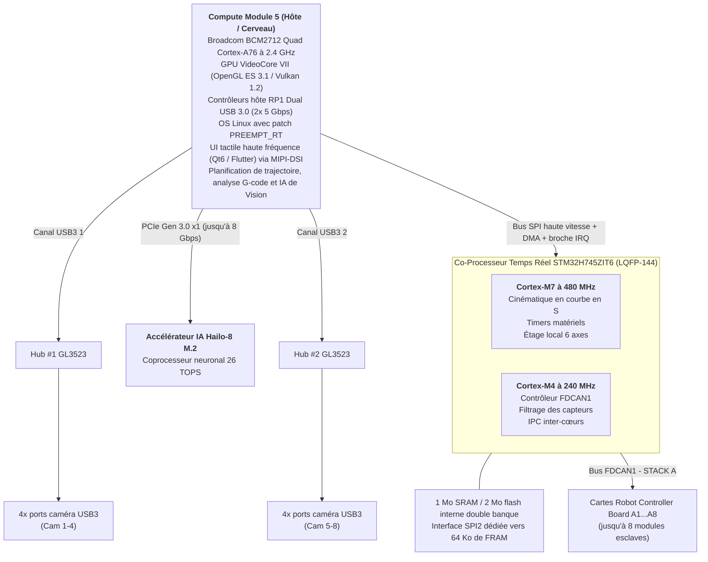
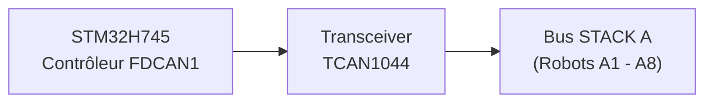
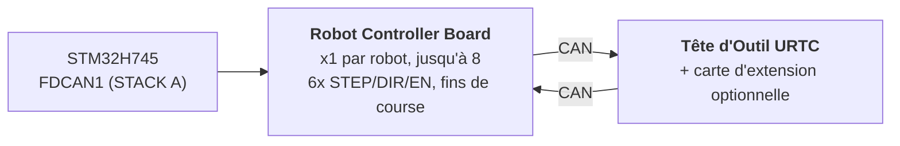

<p align="center">
  
</p>

# 🚀 SPÉCIFICATION TECHNIQUE DE HYDRA-UMC

<p align="center">
  <a href="README.md">🇺🇸 English</a> |
  <a href="README_spa.md">🇪🇸 Español</a> |
  🇫🇷 <b>Français</b> |
  <a href="README_ita.md">🇮🇹 Italiano</a> |
  <a href="README_deu.md">🇩🇪 Deutsch</a>
</p>

### 🤖 La Plateforme Ultime de Micro-Usine à Double Cœur et Contrôleur Multi-Robot (V1.0 - Accélérateur IA Hailo-8 PCIe et Double Hub USB 3.0)

<p align="left">
  
  
  
  
  
</p>


---

## 1. 🛠️ VUE D'ENSEMBLE DU PROJET ET DE L'ÉCOSYSTÈME MICRO-USINE

**HYDRA-UMC** (Universal Multi-axis Controller) est une plateforme de contrôle distribué de qualité industrielle et une architecture HMI hautes performances conçue pour la robotique cellulaire multi-axes, les micro-usines, la fabrication automatisée et l'orchestration complexe de têtes d'outils.

Construite sur une **Architecture Hétérogène Hôte + Co-Processeur Temps Réel**, HYDRA-UMC découple le rendu d'interface utilisateur haut niveau, la vision par ordinateur, l'inférence IA et la connectivité cloud, de la génération de pas en temps réel, de la gestion du bus de terrain et de l'actionnement de l'électronique de puissance.



### 🤖 Capacités de la Micro-Usine :
* 📡 **Réseau Multi-Robot Distribué :** Coordonne jusqu'à 8 modules robotiques esclaves distribués (3, 4, 5 et 6-DDL supportés aujourd'hui ; évolution vers des architectures 7, 8, 9-DDL et des robots doubles dans les futures versions) connectés via un unique bus physique FDCAN.
* 🧠 **Supercalcul de Vision Neuronale Embarqué :** Coprocesseur Hailo-8 M.2 PCIe embarqué (26 TOPS) permettant la détection d'objets multi-flux YOLOv8/YOLO11, l'inspection de défauts et l'alignement de repères fiduciaires PnP en temps réel sur les 8 caméras.
* 📐 **Étage Local 6 Axes :** Génération directe d'impulsions step/dir/enable pour 6 axes locaux (X, Y1, Y2, Z, E0, E1) pour des besoins auxiliaires : robots supplémentaires, révolveds ATC (Automatic Tool Changer), synchronisation de bandes transporteuses ou portiques de tables XYZ.
* 🎯 **Intégration JuanenPNP et JuanenCNC :** Directement compatible avec les systèmes Pick-and-Place (structures matérielles LumenPNP) et les unités CNC équipées de modules laser optiques de 10W pour le prototypage de PCB et le placement SMD.
* 👁️ **Matrice de Vision et d'Inspection Octuple par Caméra :** Double contrôleur USB 3.0 intégré alimentant 8 ports caméra USB dédiés pour l'alignement optique pick-and-place OpenCV en temps réel, l'inspection thermique, et la surveillance de flux vidéo à distance.
* ⚡ **Matrice d'Actionnement et Gestion Thermique :** Contrôle 16 canaux MOSFET industriels côté bas (8 électrovannes pneumatiques + 8 pompes à vide/générateurs venturi) et des drivers de plateau chauffant haute intensité pour le brasage par refusion SMD ou les plateaux d'impression 3D.
* 🚜 **Plateformes Mobiles JuanenBOT :** Architecture de communication évolutive capable d'interfacer avec des plateformes de transport 4 roues robustes à 48V (châssis de 50x50x50 cm avec roues omnidirectionnelles/mecanum pour des charges utiles de 100 kg).

---

## 2. 🖥️ SOUS-SYSTÈME DE CALCUL HÔTE (HMI ET HAUT NIVEAU)

* 🧩 **Module :** Raspberry Pi Compute Module 5 (CM5)
* ⚙️ **Processeur :** Broadcom BCM2712 Quad-Core ARM Cortex-A76 à 2.4 GHz
* 🎮 **Moteur Graphique :** GPU VideoCore VII (OpenGL ES 3.1, Vulkan 1.2)
* 💾 **Mémoire Système :** 2 Go / 4 Go LPDDR4X (intégrée sur le CM5)
* 💽 **Stockage Haute Vitesse :** Flash eMMC intégrée
* 🐧 **Système d'Exploitation :** Linux 64 bits (Raspberry Pi OS / Yocto patché avec `PREEMPT_RT`)
* 📺 **Interface d'Affichage :** MIPI-DSI (2 voies / 4 voies) connectée à un panneau tactile capacitif haute résolution (UI style Bambu Lab à 60 FPS)
* 🌐 **Suite de Connectivité :**
  * 🌐 1x Ethernet Gigabit (RJ45) pour LAN industriel / streaming vidéo RTSP / WebSockets / MQTT
  * 📶 Wi-Fi 6 et Bluetooth 5.4
  * 📷 **8x Ports de Vision USB 3.0 / 2.0 :** Pilotés par deux contrôleurs Genesys Logic GL3523 embarqués.
  * 🎮 **2x Ports HID USB 2.0 :** Manette / souris / clavier - voir section 4a.

---

## 3. 🧠 SOUS-SYSTÈME ACCÉLÉRATEUR IA PCIE (NPU HAILO-8)

* 🔌 **Interface Physique :** Emplacement M.2 Key M embarqué (format 2242 / 2280) connecté directement au bus PCIe Gen 2.0 / 3.0 x1 du CM5.
* 🚀 **Moteur NPU :** Processeur IA industriel Hailo-8 délivrant **26 TOPS** (Téra Opérations Par Seconde) avec une consommation inférieure à 5W.
* ⚡ **Intégration Logicielle :** Suite logicielle officielle Hailo RT intégrée à Raspberry Pi OS, exécutant des pipelines GStreamer et OpenCV pour une inférence neuronale sans surcharge CPU.

---

## 4. 📷 SOUS-SYSTÈME DE VISION DOUBLE USB 3.0 (8x PORTS CAMÉRA)

* 🎛️ **Contrôleurs de Hub :** 2x circuits intégrés hub USB 3.0 / SuperSpeed Genesys Logic `GL3523` intégrés directement sur la carte mère.
* 🔀 **Topologie et Distribution :**
  * 🅰️ **Hub #1 (`GL3523-A`) :** Connecté au PHY SuperSpeed USB3-0 natif du CM5 (5 Gbps). Alimente les ports USB 1 à 4 (Caméras A1-A4).
  * 🅱️ **Hub #2 (`GL3523-B`) :** Connecté au PHY SuperSpeed USB3-1 natif du CM5 (5 Gbps). Alimente les ports USB 5 à 8 (Caméras A5-A8).
  * ℹ️ Le CM5 expose ces 2 PHY SuperSpeed directement (BCM2712) - aucune puce compagnon RP1 n'est impliquée (le RP1 est spécifique à la carte Raspberry Pi 5, pas au CM5). Routage complet des signaux au niveau des broches : `docs/PINOUT_CM5_CARRIER.TXT`.
* 🛡️ **Interrupteur d'Alimentation et Protection de Circuit :** Protection VBUS individuelle par USB via des interrupteurs d'alimentation à limitation de courant côté haut (`TPS2065` / `SY6280`) configurés pour 500 mA - 1 A avec signalement de défaut.
* ⚡ **Rail VBUS Haute Intensité :** Alimenté par un régulateur Step-Down dédié de 24V vers 5V (5V @ 6A continus).

### 4a. 🎮 SOUS-SYSTÈME HID USB 2.0 (2x PORTS MANETTE / SOURIS / CLAVIER)

* 🎛️ **Contrôleur de Hub :** 1x petit circuit intégré hub USB 2.0 (p. ex. Genesys Logic `GL850G` / `FE1.1s`, à confirmer) répartissant l'unique PHY USB 2.0 natif du CM5 sur 2 ports physiques.
* ℹ️ **Pourquoi un hub est nécessaire :** la fiche technique du CM5 (`docs/datasheets/Raspberry Pi CM5.pdf`, §2.5) confirme que le BCM2712 expose exactement **un** port USB 2.0 (High Speed) sur le connecteur DF40 (`USB_N`/`USB_P`, broches 103/105) - séparé et distinct des 2 PHY SuperSpeed USB 3.0 natifs déjà dédiés aux hubs caméra GL3523 (section 4). Une seule paire physique ne peut pas être divisée en 2 ports sans un hub intermédiaire.
* 🔀 **Topologie :** `USB_N`/`USB_P` (CM5) -> port amont du hub -> 2x ports aval USB 2.0 Type-A (panneau avant/latéral, pour manette, souris, ou clavier - contrôle manuel jog/teach-pendant et entrée HMI, indépendant de l'écran tactile).
* 📌 Routage complet des signaux au niveau des broches : `docs/PINOUT_CM5_CARRIER.TXT` section 1.

---

## 5. ⚡ SOUS-SYSTÈME DE CO-TRAITEMENT TEMPS RÉEL

* 🎛️ **Microcontrôleur :** STMicroelectronics **STM32H745ZIT6** (MCU double cœur optimisé en coût)
* 📦 **Boîtier :** LQFP-144 (pas de broches 0.5 mm)
* 🧠 **Architecture :** Multiprocessing Asymétrique Double Cœur (AMP)
  * 🚀 **Cœur 1 (Cortex-M7 à 480 MHz) :** Moteur de mouvement temps réel, génération d'impulsions matérielle, profils de vitesse cinématiques en courbe en S, boucles de contrôle PID.
  * 📡 **Cœur 2 (Cortex-M4 à 240 MHz) :** Gestion du protocole FDCAN, filtrage des capteurs analogiques, verrouillages de sécurité, et gestion IPC inter-cœurs.
* 💾 **Architecture Mémoire Interne :**
  * 💾 **2 Mo** de flash interne double banque
  * 🧠 **1 Mo** de SRAM interne totale (512 Ko AXI SRAM + 128 Ko ITCM / 128 Ko DTCM + SRAM1/SRAM2/SRAM3)
* 🧵 **RTOS :** **FreeRTOS**, une instance indépendante par cœur (AMP, pas SMP - aucun état d'ordonnanceur partagé entre le Cœur 1 et le Cœur 2). Squelette de firmware : `src/mcu_stm32h745/`, voir `docs/architecture.md` section 2.

---

## 6. 📡 COMMUNICATION BUS DE TERRAIN DISTRIBUÉ (FDCAN UNIQUE)

La carte mère agit comme contrôleur maître pour jusqu'à 8 modules robotiques esclaves individuels distribués sur un unique bus physique CAN :

* 🔌 **Périphérique Matériel :** 1x Contrôleur FDCAN matériel natif (`FDCAN1`) intégré directement dans le STM32H745, exécuté en **mode CAN Classique** (`FDCAN_FRAME_CLASSIC`, `BRS_OFF`) par l'implémentation réelle du bootloader - le périphérique est un silicium compatible FD, mais le protocole CAN-OTA/SPI-OTA que ce projet parle réellement aujourd'hui (`docs/CANBUS_STM32H745.TXT`, `docs/CANBUS_STM32G474.TXT`) n'utilise que des trames classiques (DLC max 8), comme chaque autre niveau (Cartes Robot Controller Board G474, URTC). Les charges utiles BRS de 64 octets du CAN FD sont une marge matérielle réelle pour plus tard, pas quelque chose que le protocole utilise encore.
* ⚡ **Transceiver de Couche Physique :** 1x Transceiver CAN FD haute vitesse (p. ex. TI `TCAN1044AVD` / NXP `TJA1443`) - matériel compatible FD choisi pour la même raison de marge future que le périphérique ci-dessus, même si le trafic d'aujourd'hui reste des trames classiques.
* 🔀 **Topologie du Bus :**
  * 🅰️ **STACK A (`FDCAN1`) :** Dessert les Modules Esclaves A1 à A8.
* ⏱️ **Spécifications du Protocole :** ~1 Mbps de débit binaire nominal (CAN Classique, charge utile max de 8 octets par trame). La récupération automatique après bus-off est prévue pour être gérée par le Cortex-M4 - pas encore implémentée dans le firmware applicatif (le `main.c` actuel du CM4 est un squelette de mise en route/clignotement, voir `src/mcu_stm32h745/CM4/`), suivi comme un travail futur réel plutôt qu'une capacité déjà livrée.
* 🔌 **Connecteur Physique :** Connecteur/embase d'EMPILEMENT 40 broches, pas 2.54mm (+24V ×10 broches, GND ×10 broches, +5V ×4 broches auxiliaires, FDCAN1 H/L, `BOARD_PRESENT_N`, 13 de réserve) - les 8 Cartes Robot Controller Board s'EMPILENT physiquement l'une sur l'autre d'un côté de cette carte (topologie CONFIRMÉE, pas un backplane), chaque carte faisant passer directement les 40 signaux vers ce qui est monté au-dessus. L'adressage des emplacements est un commutateur DIP LOCAL par carte (`BOARD_ID[2:0]`, README.md section 12), non dérivé de ce connecteur. Table complète des broches et topologie d'empilement dans `docs/PINOUT_STACKA_CONNECTOR.TXT`. Définition de connecteur identique à la fois sur le propre port du Kinematic Brain et sur chaque paire de ports des Cartes Robot Controller Board.



---

## 7. 💾 MÉMOIRE NON VOLATILE ULTRA-RAPIDE (SPI FRAM)

Pour garantir zéro perte de données et une récupération d'état instantanée lors d'interruptions d'urgence de l'alimentation :

* 🧪 **Circuit Mémoire :** Cypress/Infineon `FM25V05-G` / Fujitsu `MB85RS64` (64 Ko de SPI FRAM)
* ⚡ **Interface Bus :** Bus SPI2 dédié jusqu'à 40 MHz.
* ♾️ **Durabilité :** Endurance infinie (10^14 cycles) avec des latences d'écriture de l'ordre de la nanoseconde.
* 🛡️ **Séquence Anti-Perte d'Alimentation (PVD) :** Le Détecteur de Tension d'Alimentation (PVD) interne surveille le rail 3.3V. Lors de la détection d'une chute de tension, une Interruption Non Masquable (NMI) décharge les vecteurs d'encodeur, les machines d'état actives, et les coordonnées vers la FRAM en moins de **5 microsecondes** avant la coupure de l'alimentation.

---

## 8. 🦾 SUITE LOCALE DE MOUVEMENT, ACTIONNEMENT ET CAPTEURS

### ⚙️ Sorties de Mouvement
* 🎯 **Axes Supportés :** Étage Local 6 Axes - portique double-Y plus axes d'outil (`X`, `Y1`, `Y2`, `Z`, `E0`, `E1`), pilotés par 6x drivers moteur pas-à-pas TMC5160A en chaîne SPI.
* ⚡ **Signaux :** CMOS 3.3V (`STEP`, `DIR`, `ENABLE`), chaîne SPI4 partagée vers les 6 drivers.
* ⏱️ **Timers :** Timers de Contrôle Avancé (`TIM1` pour X/Y1/Y2/Z, `TIM8` pour E0/E1) avec génération d'impulsions matérielle.
* 🛑 **Fins de Course :** 12x entrées, 2 par axe (MIN + MAX).
* 📌 Affectation complète des broches : `docs/PINOUT_STM32H745_KINEMATIC_BRAIN.TXT`.

### 🔌 Actionneurs de Puissance et Fluidiques
* 🔀 **20x Canaux de Commutation Côté Bas :** Sorties MOSFET industrielles canal N avec protection flyback.
  * 🧲 **8+2 Canaux :** Pompes à vide / générateurs venturi Pick-and-Place.
  * 💨 **8+2 Canaux :** Électrovannes pneumatiques (actionnement 5V/24V).
* 💨 **Ventilateurs :** 3x ventilateurs 3 fils (alimentation commutée PWM via MOSFET côté bas + détection tachymétrique par canal).
* 🌡️ **Gestion Thermique :**
  * 🔥 1x sortie de contrôle relais statique pour le Plateau Chauffant, commutant le **secteur 230VAC** - isolée optiquement des domaines MCU/logique ; c'est un circuit à tension secteur qui nécessite un véritable creepage/clearance sur le PCB, pas une empreinte de bus 24V.
  * 🌡️ 2x entrées analogiques thermistance NTC de précision (plateau chauffant) échantillonnées par `ADC1`.

---

## 9. 🔌 DISTRIBUTION ET RÉGULATION DE PUISSANCE

La carte fonctionne à partir d'un unique bus d'alimentation industriel **24V DC** :

* ⚡ **Entrée DC Principale :** 24V DC ±10%
* 🔋 **Domaine d'Alimentation Principal 5V :** Régulateur buck synchrone step-down fournissant **5A continus** pour le module CM5, le rétroéclairage de l'écran tactile, et la logique embarquée.
* 📷 **Domaine d'Alimentation VBUS USB 5V :** Régulateur buck synchrone dédié fournissant **6A continus** exclusivement pour les 8 ports caméra USB 3.0 et les contrôleurs de hub GL3523.
* 🎛️ **Domaine d'Alimentation 3.3V :** Régulateur bas bruit fournissant **4A continus** (dimensionné pour le STM32, la FRAM, les transceivers, et le rail 3.3V de l'emplacement M.2 Hailo-8).

---

## 10. 🔄 COMMUNICATION INTER-PROCESSEUR (IPC)

La communication entre le CM5 (Hôte) et le STM32H745 (Co-Processeur) utilise une liaison SPI zéro-copie assistée par matériel :

* 🔗 **Transport Physique :** SPI1 full-duplex fonctionnant jusqu'à 50 MHz en Mode Esclave sur le STM32 et Mode Maître sur le CM5.
* 🤝 **Ligne de Handshake :** Ligne GPIO `HYDRA_DATA_READY`.
* ⚡ **Flux d'Exécution :** Le Cortex-M4 prépare une trame de télémétrie de 128 octets dans la SRAM AXI partagée, active `HYDRA_DATA_READY`, et le CM5 récupère le paquet via DMA SPI haute vitesse sans surcharge de scrutation (polling).

---

## 11. 🎛️ SPÉCIFICATIONS MATÉRIELLES PCB 4 COUCHES

* 📐 **Facteur de Forme :** Carte Mère Industrielle Monolithique.
* 🥞 **Empilement des Couches (4 Couches) :**
  * 🟢 **Couche 1 (Supérieure) :** Placement des composants, signaux haute fréquence, paires différentielles USB SuperSpeed 90 ohms, paires PCIe Gen 3.0 85 ohms.
  * 🛡️ **Couche 2 (Interne 1) :** Plan de masse (`GND`) solide continu.
  * ⚡ **Couche 3 (Interne 2) :** Plans d'alimentation divisés (`24V`, `5V_MAIN`, `5V_USB`, `3.3V`).
  * 🔴 **Couche 4 (Inférieure) :** Pistes de signal secondaires et dérivations de puissance haute intensité.
* 🛠️ **Connecteurs et Assemblage :**
  * 🔲 Boîtier LQFP-144 (pas 0.5 mm) pour le STM32H745, boîtiers QFN-88 pour les 2 hubs GL3523, et emplacement M.2 Key M 2242/2280 pour le Hailo-8.
  * 🔌 Double connecteur mezzanine Hirose DF40 pour le Compute Module 5.
  * 📌 Embase d'EMPILEMENT 40 broches, pas 2.54 mm, pour la connexion au bus STACK A (base de l'empilement physique des Cartes Robot Controller Board) - `docs/PINOUT_STACKA_CONNECTOR.TXT`.
  * 🔌 8x connecteurs USB 3.0 Type-A (ou verrouillage industriel Hirose) pour les caméras du robot.

---

## 12. 🦾 CARTES ROBOT CONTROLLER BOARD ET TÊTE D'OUTIL URTC (NIVEAU DISTRIBUÉ)

Chacun des jusqu'à 8 modules esclaves sur STACK A (section 6) est une **Robot
Controller Board** : une par robot, pilotant les 6 propres axes de ce robot
(STEP/DIR/ENABLE), lisant ses propres fins de course, et relayant le trafic
de sa propre tête d'outil un saut plus loin via une *seconde* connexion CAN
vers une carte **URTC** (Universal Robot Tool Controller - voir le
repository jumeau `URTC`) montée dans la tête du robot, optionnellement avec
sa propre carte d'extension.



* 🎛️ **MCU :** STMicroelectronics **STM32G474RET6** (Cortex-M4 à 170 MHz,
  LQFP-64, 512 Ko de flash), utilisant 2 de ses 3 périphériques FDCAN
  embarqués - un comme liaison montante FDCAN vers le STM32H745, l'autre
  comme liaison descendante CAN vers sa propre tête URTC. Voir
  `docs/architecture.md` §1.
* 🔢 **Adressage :** `BOARD_ID[2:0]` - un commutateur DIP local à 3
  positions sur chaque carte, réglé manuellement de 0 à 7 lors de
  l'installation, donne à chaque carte son propre emplacement de base
  FDCAN1 - non dérivé de la position physique dans l'empilement ni du
  connecteur STACK A (chaque carte est le même PCB interchangeable). Voir
  `docs/PINOUT_STM32G474_ROBOT_CONTROLLER.TXT` §1c.
* 🧵 **RTOS :** **FreeRTOS** (son bootloader reste bare-metal - aucun
  ordonnanceur n'est nécessaire pour recevoir/vérifier/sauter). Squelette
  de firmware : `src/mcu_stm32g474/`.
* 📡 **Mises à jour firmware CAN-OTA, sur 4 niveaux de profondeur :** le
  STM32H745 lui-même (via sa liaison SPI existante vers le CM5), cette
  carte, sa Tête d'Outil URTC (STM32F303CCT6), et - seulement lorsqu'elle
  est installée - la propre Carte d'Extension Avancée de cette tête
  (STM32F303CBT6, `expansion_board_type` 3 ou 4, voir le propre
  `docs/EXPANSION.TXT` d'URTC) peuvent toutes être flashées et
  diagnostiquées depuis le Flasher/Tester de HYDRA-UMC-STUDIO sans sonde
  JTAG/SWD et sans dongle USB-CAN. Schéma d'adressage complet, le tunnel de
  relais qui atteint les 2 derniers niveaux sans aucune nouvelle conception
  de protocole, et l'état actuel de l'implémentation :
  `docs/architecture.md`.

Voir `docs/architecture.md` pour l'architecture complète à niveaux (cette
section est un résumé), y compris ce qui est confirmé comme un fait matériel
par rapport à ce qui reste une conception proposée en attente
d'implémentation. La section 8 de ce document répertorie également les
limitations de sécurité connues et acceptées des bootloaders actuels (pas
encore de Protection en Lecture, une valeur de contournement anti-rollback
partagée, lecture non authentifiée) - des lacunes délibérées pré-matériel,
pas des oublis.

---

## 📂 STRUCTURE DU RÉPERTOIRE DU REPOSITORY

```text
HYDRA-UMC/
├── .vscode/                    # Extensions recommandées + tâches de build - voir "Environnement de Développement" ci-dessous
├── docs/
│   ├── datasheets/             # Fiches techniques des composants utilisés sur chaque carte de ce repository
│   ├── architecture.md         # L'architecture système à 4 niveaux (commencer ici)
│   ├── COMPILE_STM32G474.TXT   # Référence de build du firmware de la Robot Controller Board
│   ├── COMPILE_STM32H745.TXT   # Référence de build du firmware du Kinematic Brain (double cœur)
│   ├── PINOUT_STM32H745_KINEMATIC_BRAIN.TXT    # Affectation complète des broches du Kinematic Brain
│   ├── PINOUT_STM32G474_ROBOT_CONTROLLER.TXT   # Affectation complète des broches de la Robot Controller Board
│   ├── PINOUT_CM5_CARRIER.TXT                  # Routage des signaux du sous-système hôte CM5
│   ├── PINOUT_STACKA_CONNECTOR.TXT             # Connecteur d'empilement partagé STACK A 40 broches
│   ├── CANBUS_STM32H745.TXT                    # Protocole au niveau du câblage du Kinematic Brain (SPI1/boîte aux lettres/FDCAN1-maître)
│   ├── CANBUS_STM32G474.TXT                    # Protocole au niveau du câblage de la Robot Controller Board (FDCAN1-esclave/FDCAN2)
│   └── HYDRA-UMC_*.txt/TXT     # Documents plus anciens - plusieurs remplacés, voir la propre bannière de chaque fichier
├── hardware/
│   ├── PCB/
│   │   ├── kinematic_brain_stm32h745/          # Carte mère principale - pas encore de schématique, voir son propre README
│   │   └── robot_controller_board_stm32g474/   # Carte par robot - pas encore de schématique, voir son propre README
│   └── gerbers/                # Fichiers de sortie de fabrication (vide jusqu'à ce qu'une carte soit conçue)
├── src/                         # Même convention de disposition que le repository jumeau URTC : src/ est la SOURCE
│   ├── cm5_host/                # Applications Linux userspace exécutées AU-DESSUS de la propre image de os/
│   │   ├── hmi_qt6/             # Shell kiosque Qt6 enveloppant le propre tableau de bord de HYDRA-UMC-STUDIO
│   │   ├── ai_inference/        # Pipeline Hailo-8 TAPPAS / YOLOv8
│   │   ├── video_streamer/      # Serveur RTSP/WebRTC multi-caméra (MediaMTX)
│   │   └── ipc_driver/          # Liaison SPI CM5 <-> STM32H745 (userspace)
│   ├── mcu_stm32h745/           # Firmware du Kinematic Brain (Niveau 0) - double cœur
│   │   ├── CM7/                 # Moteur de mouvement, timers matériels (+ son propre boot/)
│   │   ├── CM4/                 # Drivers FDCAN, filtrage des capteurs (+ son propre boot/)
│   │   └── Common/              # Boîte aux lettres IPC en mémoire partagée CM7<->CM4 (ipc_mailbox.h) - implémentée, utilisée par les bootloaders des deux cœurs
│   └── mcu_stm32g474/           # Firmware de la Robot Controller Board (Niveau 1) - cœur unique, + son propre boot/
├── os/                          # Image OS du CM5 - choix de l'OS de base, unités systemd, provisionnement au premier démarrage
├── images/                      # Bannière du README + icône + écran de démarrage (SVG)
├── build_firmware.sh            # Compile chaque cible firmware MCU ci-dessus depuis un checkout propre (Linux/Mac)
├── build_firmware.bat           # Même build, Windows (voir "Compiler le Firmware" ci-dessous)
├── generate_manifest.py         # Régénère firmware/firmware_manifest.json (versions/CRC32) après une build complète
├── firmware/                    # Sortie de build commitée (.bin/.hex/.elf + manifest) - PAS dans gitignore, même convention que le propre dossier de sortie d'URTC, voir "Compiler le Firmware" ci-dessous
├── README.md                    # Ce fichier
└── README_spa.md / README_ita.md / README_fra.md / README_deu.md    # <- traductions
```

Voir `docs/architecture.md` pour ce que fait réellement chaque niveau et
comment ils se connectent ; chaque dossier ci-dessus avec son propre
`README.md` contient plus de détails que ce résumé de haut niveau.

## 🛠️ ENVIRONNEMENT DE DÉVELOPPEMENT

Ce que les machines de développement de ce projet lui-même ont réellement
installé et vérifié fonctionnel (`build_firmware.sh`/`build_firmware.bat`,
cibles `g474`/`h745`/par défaut, 0 erreur) - pas une liste théorique :

* 🔧 **ARM GNU Toolchain** (`arm-none-eabi-gcc` 10.3+) - compile chaque
  cible firmware MCU. Aucun fichier de projet STM32CubeIDE/CubeMX n'est
  utilisé ni requis pour la build - `build_firmware.sh`/`build_firmware.bat`
  récupère les propres sources HAL/CMSIS de ST directement depuis leurs
  repositories GitHub officiels et pilote le compilateur directement, la
  même philosophie déjà établie par le propre
  `build_firmware.sh`/`build_firmware.bat` du repository jumeau `URTC`.
* 🧩 **VS Code + extensions** (`.vscode/extensions.json` les liste toutes) :
  [STM32 VS Code Extension](https://marketplace.visualstudio.com/items?itemName=stmicroelectronics.stm32-vscode-extension)
  (intégration projet/build/debug), **Cortex-Debug** (débogage SWD/JTAG -
  indépendant de `build_firmware.sh`, utile une fois qu'un matériel réel
  existe), **CMake Tools** (pour le propre projet CMake de
  `src/cm5_host/hmi_qt6/`), **C/C++** (IntelliSense sur chaque fichier
  source firmware/hôte), **Python** (scripts du pipeline `ai_inference/`),
  **Hex Editor** (inspecter la sortie firmware `.bin`), **YAML** (la
  configuration propre à MediaMTX de `video_streamer/`). Ouvrez le
  repository, acceptez l'invite des extensions recommandées, et utilisez
  **Terminal → Run Task** pour les tâches de build déjà préconfigurées
  (`.vscode/tasks.json`).
* 🗂️ **git** - à la fois pour ce repository lui-même et pour le propre
  vendoring à tag fixe des paquets HAL/CMSIS de ST fait par
  `build_firmware.sh` (mis en cache sous `build/`, dans gitignore,
  re-récupéré avec `--clean`).

## 🏗️ COMPILER LE FIRMWARE

**Linux/Mac :**
```bash
./build_firmware.sh          # compile chaque cible MCU (Robot Controller Board + Kinematic Brain, les deux cœurs)
./build_firmware.sh g474     # Robot Controller Board uniquement
./build_firmware.sh h745     # Kinematic Brain uniquement (les deux cœurs)
./build_firmware.sh --clean  # efface d'abord le cache HAL/CMSIS vendoré
```

**Windows :**
```bat
build_firmware.bat          :: compile chaque cible MCU (Robot Controller Board + Kinematic Brain, les deux cœurs)
build_firmware.bat g474     :: Robot Controller Board uniquement
build_firmware.bat h745     :: Kinematic Brain uniquement (les deux cœurs)
build_firmware.bat --clean  :: efface d'abord le cache HAL/CMSIS vendoré
```

`build_firmware.bat` est la même build que `build_firmware.sh` traduite en
batch (mêmes étapes, mêmes versions fixes de HAL/CMSIS, même rapport
pass/warn/fail) - exécutée de bout en bout sur une véritable machine Windows
avec l'[Arm GNU
Toolchain](https://developer.arm.com/downloads/-/arm-gnu-toolchain-downloads)
installé et `arm-none-eabi-gcc` dans le `PATH` : chaque module HAL, les deux
bootloaders, et chaque application compilés et liés proprement, et
`firmware_manifest.json` régénéré avec des CRC32 correspondant à la propre
sortie de la build Linux/Mac. Nécessite les mêmes outils que le script
Linux/Mac : l'Arm GNU Toolchain, `git` (pour récupérer les propres sources
HAL/CMSIS de ST), et `python` pour l'étape du manifest.

**Build manuelle (l'un ou l'autre OS, sans le script) :** le script
automatise exactement les étapes de `docs/COMPILE_STM32G474.TXT` et
`docs/COMPILE_STM32H745.TXT` - récupère les sources fixes
HAL/CMSIS/FreeRTOS listées en haut de
`build_firmware.sh`/`build_firmware.bat`, compile les modules HAL et les
fichiers startup/system de chaque cible avec `arm-none-eabi-gcc` (les
options/listes de modules sont listées dans ce même script), puis lie
chaque bootloader et application contre son propre script de liaison
(`*.ld`, à côté de sa source) avec `arm-none-eabi-gcc`/`-Wl,--gc-sections` et
convertit avec `arm-none-eabi-objcopy` en `.bin`/`.hex`. Ces deux fichiers
`docs/COMPILE_*.TXT` sont la référence faisant autorité, étape par étape, si
vous préférez ne pas exécuter l'un des deux scripts - les scripts existent
pour les automatiser, pas pour les remplacer comme source de vérité.

La sortie atterrit dans `firmware/`, qui est commitée et poussée vers ce
repository (même convention que le propre dossier de sortie `firmware/`
d'URTC) afin que la fonctionnalité de téléchargement depuis GitHub de
HYDRA-UMC-STUDIO puisse réellement y trouver de vrais fichiers `.bin` via
`firmware_manifest.json` - ce n'est PAS dans gitignore.
Voir `docs/COMPILE_STM32G474.TXT` et `docs/COMPILE_STM32H745.TXT` pour ce que
fait exactement chaque étape et pourquoi - et le propre `README.md` de
chaque dossier firmware pour l'état actuel. Les **bootloaders** pour les 3
cibles (G474, H745 CM7, H745 CM4) sont des implémentations CAN-OTA/SPI-OTA
réelles et fonctionnelles (vérification CRC32 + HMAC-SHA256,
vérifier-dans-la-sauvegarde-avant-de-copier-vers-le-principal, même
discipline anti-brick que le propre bootloader d'URTC) - compilant
proprement de bout en bout, pas encore vérifiées contre un matériel réel.
Les **applications** restent des tests de fumée FreeRTOS GPIO-toggle
vérifiés à la compilation, pas encore le vrai firmware de
mouvement/vision/relais. Voir `docs/architecture.md` (en particulier le
tableau d'état de la section 6 et les limitations de sécurité connues et
acceptées de la section 8) pour ce qui est exactement réel par rapport à ce
qui reste ouvert.

## 🔢 Versionnage

Les 6 composants du firmware (3 bootloaders + 3 applications - Robot
Controller Board STM32G474, Kinematic Brain CM7, Kinematic Brain CM4, une
paire bootloader/application par puce/cœur) sont incrémentiels en version :
`build_firmware.sh`/`.bat` incrémentent le PATCH de ce composant
d'exactement 1 juste avant de le compiler, via `bump_version.py`, de sorte
que chaque build réel produisant un nouveau binaire pour un composant
embarque sa propre nouvelle version - jamais saisie à la main, jamais
susceptible de dériver de ce qui a été réellement compilé. Règle de
retenue (un « odomètre ») : si PATCH dépasse 9, il revient à 0 et MINOR
s'incrémente de 1 (ex. `1.1.9` -> `1.2.0`, jamais `1.1.10`) ; si MINOR
dépasse 9, la retenue se propage vers MAJOR de la même façon. Voir le
`bootloader_common.h` propre à chaque composant et le commentaire d'en-tête
de `bump_version.py` pour le mécanisme complet.

## 🔗 Projets Liés

Ce projet fait partie d'un écosystème robotique plus vaste du même auteur (JuanenRac / Electro Hobby 3D). Cela vaut la peine de le savoir, car une requête pourrait en réalité concerner l'un d'entre eux plutôt que ce repository :

**Plateforme HYDRA-UMC** — la cellule micro-usine multi-robot
- **HYDRA-UMC** *(ce repository)* — la carte mère elle-même : hôte Raspberry Pi CM5 + co-processeur temps réel STM32H745 double cœur, orchestrant jusqu'à 8 bras robotiques distribués via CAN-OTA/SPI-OTA. Matériel + firmware propres, GPL-3.0/CERN-OHL-S v2/CC BY-SA 4.0.
- **[HYDRA-UMC STUDIO](https://github.com/JuanenRac/HYDRA-UMC-STUDIO)** — tableau de bord de contrôle basé sur le web pour HYDRA-UMC : visualisation 3D multi-robot, enregistrement de cinématique/trajectoire, flashage et test CAN-OTA pour l'ensemble de la plateforme. React + Vite + Three.js.
- **[HYDRA-UMC-SERVER](https://github.com/JuanenRac/HYDRA-UMC-SERVER)** — le backend headless (Node/Express/WebSocket) qui était auparavant intégré dans le propre processus de HYDRA-UMC-STUDIO. Détient l'API REST/WS de contrôle des robots, la persistance de settings.json, l'authentification JWT et la découverte mDNS. HYDRA-UMC-STUDIO est désormais un client frontend statique pur qui communique avec lui via le réseau.
- **[HYDRA-UMC-ANDROID-CONTROL](https://github.com/JuanenRac/HYDRA-UMC-ANDROID-CONTROL)** — application de contrôle Android pour HYDRA-UMC via Wi-Fi/Bluetooth. Application réelle et fonctionnelle - ensemble complet de fonctionnalités de contrôle à distance, authentification JWT, stockage chiffré des identifiants.
- **[HYDRA-UMC-IOS-CONTROL](https://github.com/JuanenRac/HYDRA-UMC-IOS-CONTROL)** — application de contrôle iOS/iPadOS pour HYDRA-UMC via Wi-Fi, construite en Flutter (multiplateforme, vérifiable sous Windows sans Mac ; l'empaquetage final `.ipa` nécessite tout de même Xcode). Application réelle et fonctionnelle - même ensemble de fonctionnalités que l'application Android.
- **[HYDRA-UMC-SUITE](https://github.com/JuanenRac/HYDRA-UMC-SUITE)** — centre de commande d'essaim de bureau (Python/PySide6) : découverte de réseau multi-contrôleur, synchronisation bidirectionnelle en direct, viewport 3D robot réel, espace de travail ancrable façon Photoshop. Réel et fonctionnel, pas un placeholder.
- **[HYDRA-UMC-EDITOR-URDF](https://github.com/JuanenRac/HYDRA-UMC-EDITOR-URDF)** — créateur/éditeur graphique URDF de bureau (Python/PySide6) pour le propre catalogue de modèles de ce projet : récupère les fichiers source depuis GitHub ou un dossier local, valide la faisabilité des degrés de liberté (DOF), modifie couleur/échelle/cinématique avec un aperçu 3D en direct, et publie le résultat final vers un serveur STUDIO en cours d'exécution. Réel et fonctionnel, pas un placeholder.
- **[HYDRA-UMC-DSI](https://github.com/JuanenRac/HYDRA-UMC-DSI)** — interface tactile native en Flutter pour l'écran tactile DSI 5"/7" propre à HYDRA-UMC (1280×720, même résolution dans les deux tailles) sur le Compute Module 5, contrôlant ce même serveur directement depuis la carte. Scaffold réel et fonctionnel avec les 6 écrans du catalogue (dashboard, contrôle manuel, caméra, vue 3D simplifiée, métriques système, connexion) connectés au serveur en direct ; la compilation réelle de la cible Linux n'a pas encore été exécutée sur du matériel réel (environnement de travail uniquement Windows jusqu'à présent - voir le README de ce projet).

**Plateforme URTC** — le contrôleur de tête d'outil que porte chaque bras robotique HYDRA-UMC
- **[URTC](https://github.com/JuanenRac/URTC)** — Universal Robot Tool Controller : contrôleur de tête d'outil sur bus CAN basé sur STM32F303, 25 profils d'outil entièrement implémentés, mise à jour firmware CAN-OTA.
- **[URTC Flasher](https://github.com/JuanenRac/URTC-FLASHER)** — outil de bureau de flashage CAN-OTA + puce complète SWD/JTAG pour les cartes URTC (Windows/Linux).
- **[URTC Tester](https://github.com/JuanenRac/URTC-TESTER)** — outil de bureau de diagnostic bus CAN en direct pour les cartes URTC, un panneau par profil d'outil (Windows/Linux).
- **[URTC Web Studio](https://github.com/JuanenRac/URTC-WEB-STUDIO)** — alternative basée sur navigateur aux 2 outils de bureau ci-dessus (Web Serial API + SLCAN), aucune installation locale nécessaire.

## 👤 Auteur

**JuanenRac** (Electro Hobby 3D)
📧 electrohobby3d@gmail.com
📺 youtube.com/@electrohobby3d

## 📜 Licence et Avis de Copyright

HYDRA-UMC est (c) 2026 JuanenRac (Electro Hobby 3D). Cet avis doit être inclus dans toute distribution de ce projet ou de travaux dérivés.

Étant donné que ce projet comprend plusieurs types de contenu différents, chaque partie individuelle est mise à disposition sous des licences différentes - chacune adaptée à ce qu'elle couvre réellement, plutôt que de forcer une seule licence à tout couvrir :

1. Le **firmware** situé dans `./firmware` (application et bootloader CAN indifféremment) est disponible sous la **GNU General Public License v3.0 (GPL-3.0)**. Texte intégral sur https://www.gnu.org/licenses/gpl-3.0.html.

2. Les **conceptions matérielles** (fichiers schématique/carte Eagle, gerbers, et les pièces imprimables en 3D sous `./hardware` et `./3D`) sont disponibles sous la **CERN Open Hardware Licence v2 - Strongly Reciprocal (CERN-OHL-S v2)**. Texte intégral sur https://cern-ohl.web.cern.ch/.

3. La **documentation** (ce README, le manuel de service, et les fichiers de référence sous `./docs`) est disponible sous **Creative Commons Attribution-ShareAlike 4.0 International (CC BY-SA 4.0)**. Texte intégral sur https://creativecommons.org/licenses/by-sa/4.0/.

Si vous vous appuyez sur ce projet, gardez à l'esprit la séparation des licences : les modifications de code du firmware devraient rester GPL-3.0, les modifications matérielles devraient rester CERN-OHL-S, et les dérivés de documentation devraient rester CC BY-SA - chacun avec une attribution renvoyant à ce projet.
