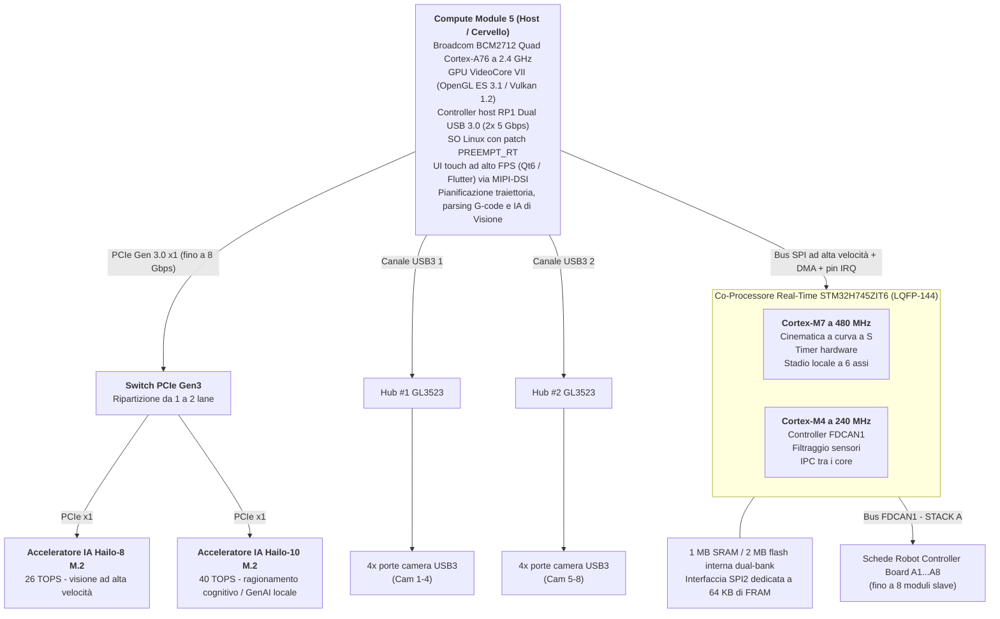
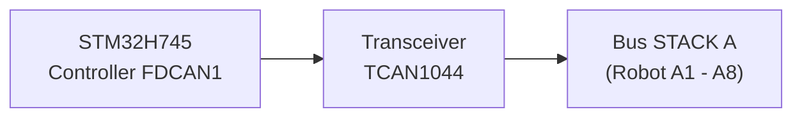
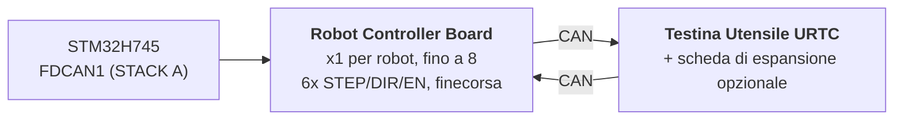

<p align="center">
  
</p>

# 🚀 SPECIFICA TECNICA DI HYDRA-UMC

<p align="center">
  <a href="README.md">🇺🇸 English</a> |
  <a href="README_spa.md">🇪🇸 Español</a> |
  <a href="README_fra.md">🇫🇷 Français</a> |
  🇮🇹 <b>Italiano</b> |
  <a href="README_deu.md">🇩🇪 Deutsch</a> |
  <a href="README_zho.md">🇨🇳 简体中文</a> |
  <a href="README_jpn.md">🇯🇵 日本語</a>
</p>

### 🤖 La Piattaforma Definitiva di Micro-Fabbrica a Doppio Nucleo e Controller Multi-Robot (V1.0 - Doppio Acceleratore IA PCIe Hailo-8 + Hailo-10 e Doppio Hub USB 3.0)

<p align="left">
  
  
  
  
  
</p>


---

## 1. 🛠️ PANORAMICA DEL PROGETTO E DELL'ECOSISTEMA MICRO-FABBRICA

**HYDRA-UMC** (Universal Multi-axis Controller) è una piattaforma di controllo distribuito di livello industriale e un'architettura HMI ad alte prestazioni progettata per robotica cellulare multi-asse, micro-fabbriche, produzione automatizzata e orchestrazione complessa di testine utensile.

Costruita su un'**Architettura Ibrida Host + Co-Processore Real-Time**, HYDRA-UMC disaccoppia il rendering dell'interfaccia utente di alto livello, la visione artificiale, l'inferenza IA e la connettività cloud dalla generazione degli step in tempo reale, dalla gestione del bus di campo e dall'attuazione dell'elettronica di potenza.



### 🤖 Capacità della Micro-Fabbrica:
* 📡 **Rete Multi-Robot Distribuita:** Coordina fino a 8 moduli robotici slave distribuiti (soporte per 3, 4, 5 e 6 assi attualmente; scalabile a 7, 8, 9 assi e architetture di robot duali nelle versioni future) collegati su un unico bus fisico FDCAN.
* 🧠 **Doppio Coprocessore Neurale Embedded:** Uno switch PCIe Gen3 onboard ripartisce l'unica lane PCIe del CM5 tra 2 acceleratori IA M.2 - un Hailo-8 (26 TOPS) che esegue il rilevamento oggetti multi-stream YOLOv8/YOLO11, l'ispezione difetti e l'allineamento fiduciale PnP in tempo reale su tutte e 8 le camere, più un Hailo-10 (40 TOPS) che esegue ragionamento cognitivo e GenAI locale direttamente sul dispositivo (modelli LLM/VLA quantizzati) senza passare dal cloud.
* 📐 **Stadio Locale a 6 Assi:** Generazione diretta di impulsi step/dir/enable per 6 assi locali (X, Y1, Y2, Z, E0, E1) per esigenze ausiliarie: robot aggiuntivi, revolver ATC (Automatic Tool Changer), sincronizzazione di nastri trasportatori o portali di tavole XYZ.
* 🎯 **Integrazione JuanenPNP e JuanenCNC:** Direttamente compatibile con sistemi Pick-and-Place (strutture hardware LumenPNP) e unità CNC dotate di moduli laser ottico da 10W per la prototipazione PCB e il posizionamento SMD.
* 👁️ **Matrice di Visione e Ispezione Octal a Camera:** Doppio controller USB 3.0 integrato che alimenta 8 porte camera USB dedicate per l'allineamento ottico pick-and-place con OpenCV in tempo reale, l'ispezione termica e il monitoraggio remoto dello streaming.
* ⚡ **Matrice di Attuazione e Gestione Termica:** Controlla 16 canali industriali MOSFET low-side (8 valvole elettropneumatiche + 8 pompe per vuoto/generatori venturi) e driver del piano riscaldato ad alta corrente per la saldatura a rifusione SMD o i piani di stampa 3D.
* 🚜 **Piattaforme Mobili JuanenBOT:** Architettura di comunicazione scalabile in grado di interfacciarsi con piattaforme di trasporto a 4 ruote heavy-duty a 48V (telai 50x50x50 cm con ruote omnidirezionali/mecanum per carichi utili di 100 kg).

---

## 2. 🖥️ SOTTOSISTEMA DI COMPUTAZIONE HOST (HMI E ALTO LIVELLO)

* 🧩 **Modulo:** Raspberry Pi Compute Module 5 (CM5)
* ⚙️ **Processore:** Broadcom BCM2712 Quad-Core ARM Cortex-A76 a 2.4 GHz
* 🎮 **Motore Grafico:** GPU VideoCore VII (OpenGL ES 3.1, Vulkan 1.2)
* 💾 **Memoria di Sistema:** 2 GB / 4 GB LPDDR4X (integrata sul CM5)
* 💽 **Storage ad Alta Velocità:** Flash eMMC integrata
* 🐧 **Sistema Operativo:** Linux a 64 bit (Raspberry Pi OS / Yocto con patch `PREEMPT_RT`)
* 📺 **Interfaccia Display:** MIPI-DSI (2 lane / 4 lane) collegata a un pannello touch capacitivo ad alta risoluzione (UI in stile Bambu Lab a 60 FPS)
* 🌐 **Suite di Connettività:**
  * 🌐 1x Ethernet Gigabit (RJ45) per LAN industriale / streaming video RTSP / WebSocket / MQTT
  * 📶 Wi-Fi 6 e Bluetooth 5.4
  * 📷 **8x Porte di Visione USB 3.0 / 2.0:** Alimentate da due controller Genesys Logic GL3523 onboard.
  * 🎮 **2x Porte HID USB 2.0:** Gamepad / mouse / tastiera - vedi sezione 4a.

---

## 3. 🧠 SOTTOSISTEMA ACCELERATORE IA PCIE (NPU DOPPIO HAILO-8 + HAILO-10)

* 🔀 **Ripartizione della Lane PCIe:** Il connettore del CM5 espone solamente **una** lane PCIe Gen 2.0/3.0 x1 (confermato dalla Tabella 5 del datasheet del CM5, `docs/PINOUT_CM5_CARRIER.TXT`) - non sufficiente per collegare 2 acceleratori IA M.2 direttamente. Uno switch di pacchetti PCIe Gen3 onboard (candidato: famiglia ASMedia ASM2806 o equivalente, part number esatto TBD - Gen3 nello specifico, così il collegamento del Hailo-10 non viene limitato al di sotto della propria velocità nativa) ripartisce questa unica lane lato CM5 in 2 lane PCIe x1 downstream indipendenti, una per ciascuno zoccolo M.2 sottostante.
* 🔌 **Interfacce Fisiche:** 2x zoccoli M.2 Key M onboard (form factor 2242 / 2280), ciascuno collegato alla propria porta downstream dello switch PCIe di cui sopra - non direttamente al CM5.
* 🚀 **Motore NPU 1 - Hailo-8 (Percezione ad Alta Velocità):** Processore IA industriale Hailo-8 che eroga **26 TOPS** (Tera Operazioni Al Secondo) con un consumo inferiore a 5W. Esegue il rilevamento oggetti multi-stream YOLOv8/YOLO11, l'ispezione difetti e l'allineamento fiduciale PnP in tempo reale su tutte e 8 le camere (sezione 4) - l'acceleratore già esistente, ruolo invariato.
* 🧠 **Motore NPU 2 - Hailo-10 (Ragionamento Cognitivo / GenAI Locale):** Aggiunto accanto al Hailo-8, non in sostituzione. Con **40 TOPS**, esegue localmente e in modo privato modelli LLM e Vision-Language-Action (VLA) quantizzati - traducendo le istruzioni vocali/in linguaggio naturale dell'operatore in traiettorie cinematiche, e gestendo il recupero semantico degli errori quando un robot fallisce un compito, senza alcuna andata e ritorno verso un servizio cloud esterno. Lo stesso ruolo cognitivo già stabilito per il Hailo-10 nel resto dell'ecosistema HYDRA-UMC (il progetto gemello HYDRA-UMC-COGNITIVE-NODE).
* ⚡ **Integrazione Software:** Suite software ufficiale Hailo RT integrata con Raspberry Pi OS per entrambi gli acceleratori, eseguendo pipeline GStreamer/TAPPAS e OpenCV per l'inferenza di visione a zero overhead di CPU del Hailo-8; l'integrazione del runtime LLM/VLA proprio del Hailo-10 è ancora in fase di progettazione (vedi `src/cm5_host/ai_inference/README.md`).
* ⚠️ **Punto aperto:** il part number esatto dello switch PCIe e il reale consumo proprio del Hailo-10 restano entrambi TBD - vedi `hardware/PCB/kinematic_brain_stm32h745/BOM.TXT` voci 05 e 09.

---

## 4. 📷 SOTTOSISTEMA DI VISIONE DOPPIO USB 3.0 (8x PORTE CAMERA)

* 🎛️ **Controller Hub:** 2x circuiti integrati hub USB 3.0 / SuperSpeed Genesys Logic `GL3523` integrati direttamente sulla scheda madre.
* 🔀 **Topologia e Distribuzione:**
  * 🅰️ **Hub #1 (`GL3523-A`):** Collegato al PHY SuperSpeed USB3-0 nativo del CM5 (5 Gbps). Alimenta le porte USB da 1 a 4 (Camere A1-A4).
  * 🅱️ **Hub #2 (`GL3523-B`):** Collegato al PHY SuperSpeed USB3-1 nativo del CM5 (5 Gbps). Alimenta le porte USB da 5 a 8 (Camere A5-A8).
  * ℹ️ Il CM5 espone questi 2 PHY SuperSpeed direttamente (BCM2712) - non è coinvolto alcun chip companion RP1 (l'RP1 è specifico della scheda Raspberry Pi 5, non del CM5). Instradamento completo dei segnali a livello di pin: `docs/PINOUT_CM5_CARRIER.TXT`.
* 🛡️ **Interruttore di Potenza e Protezione del Circuito:** Protezione VBUS individuale per USB tramite interruttori di potenza a limitazione di corrente high-side (`TPS2065` / `SY6280`) configurati per 500 mA - 1 A con segnalazione di guasto.
* ⚡ **Rail VBUS ad Alta Corrente:** Alimentato da un regolatore Step-Down dedicato da 24V a 5V (5V @ 6A continui).

### 4a. 🎮 SOTTOSISTEMA HID USB 2.0 (2x PORTE PER GAMEPAD / MOUSE / TASTIERA)

* 🎛️ **Controller Hub:** 1x piccolo circuito integrato hub USB 2.0 (es. Genesys Logic `GL850G` / `FE1.1s`, da confermare) che distribuisce l'unico PHY USB 2.0 nativo del CM5 su 2 porte fisiche.
* ℹ️ **Perché serve un hub:** il datasheet del CM5 (`docs/datasheets/Raspberry Pi CM5.pdf`, §2.5) conferma che il BCM2712 espone esattamente **una** porta USB 2.0 (High Speed) sul connettore DF40 (`USB_N`/`USB_P`, pin 103/105) - separata e distinta dai 2 PHY SuperSpeed USB 3.0 nativi già dedicati agli hub camera GL3523 (sezione 4). Un'unica coppia fisica non può essere divisa in 2 porte senza un hub in mezzo.
* 🔀 **Topologia:** `USB_N`/`USB_P` (CM5) -> porta upstream dell'hub -> 2x porte downstream USB 2.0 Type-A (pannello anteriore/laterale, per gamepad, mouse o tastiera - controllo manuale jog/teach-pendant e input HMI, indipendente dal touchscreen).
* 📌 Instradamento completo dei segnali a livello di pin: `docs/PINOUT_CM5_CARRIER.TXT` sezione 1.

---

## 5. ⚡ SOTTOSISTEMA DI CO-PROCESSING REAL-TIME

* 🎛️ **Microcontroller:** STMicroelectronics **STM32H745ZIT6** (MCU dual-core ottimizzato in termini di costo)
* 📦 **Package:** LQFP-144 (passo pin 0.5 mm)
* 🧠 **Architettura:** Multiprocessing Asimmetrico Dual-Core (AMP)
  * 🚀 **Core 1 (Cortex-M7 a 480 MHz):** Motore di movimento real-time, generazione impulsi hardware, profili di velocità cinematici a curva a S, cicli di controllo PID.
  * 📡 **Core 2 (Cortex-M4 a 240 MHz):** Gestione del protocollo FDCAN, filtraggio sensori analogici, interblocchi di sicurezza e gestione IPC tra i core.
* 💾 **Architettura di Memoria Interna:**
  * 💾 **2 MB** di flash interna dual-bank
  * 🧠 **1 MB** di SRAM interna totale (512 KB AXI SRAM + 128 KB ITCM / 128 KB DTCM + SRAM1/SRAM2/SRAM3)
* 🧵 **RTOS:** **FreeRTOS**, un'istanza indipendente per core (AMP, non SMP - nessuno stato di scheduler condiviso tra Core 1 e Core 2). Scheletro firmware: `src/mcu_stm32h745/`, vedi `docs/architecture.md` sezione 2.

---

## 6. 📡 COMUNICAZIONE FIELDBUS DISTRIBUITA (FDCAN UNICO)

La scheda madre agisce da controller master per fino a 8 singoli moduli robotici slave distribuiti su un unico bus fisico CAN:

* 🔌 **Periferica Hardware:** 1x Controller FDCAN hardware nativo (`FDCAN1`) integrato direttamente nell'STM32H745, eseguito in **modalità CAN Classico** (`FDCAN_FRAME_CLASSIC`, `BRS_OFF`) dall'implementazione reale del bootloader - la periferica è silicio con capacità FD, ma il protocollo CAN-OTA/SPI-OTA che questo progetto parla realmente oggi (`docs/CANBUS_STM32H745.TXT`, `docs/CANBUS_STM32G474.TXT`) usa solo frame classici (DLC massimo 8), come ogni altro livello (Schede Robot Controller Board G474, URTC). I payload BRS a 64 byte di CAN FD sono margine hardware reale per il futuro, non qualcosa che il protocollo usa ancora.
* ⚡ **Transceiver a Livello Fisico:** 1x Transceiver CAN FD ad alta velocità (es. TI `TCAN1044AVD` / NXP `TJA1443`) - hardware con capacità FD scelto per lo stesso motivo di margine futuro della periferica sopra, anche se il traffico odierno è composto da frame classici.
* 🔀 **Topologia del Bus:**
  * 🅰️ **STACK A (`FDCAN1`):** Serve i Moduli Slave da A1 a A8.
* ⏱️ **Specifiche di Protocollo:** ~1 Mbps di bitrate nominale (CAN Classico, payload massimo di 8 byte per frame). Il recupero automatico da bus-off è pianificato per essere gestito dal Cortex-M4 - non ancora implementato nel firmware applicativo (l'attuale `main.c` del CM4 è uno scheletro di bring-up/lampeggio, vedi `src/mcu_stm32h745/CM4/`), tracciato come lavoro futuro reale piuttosto che una capacità già consegnata.
* 🔌 **Connettore Fisico:** Header/socket di IMPILAMENTO a 40 pin, passo 2.54mm (+24V ×10 pin, GND ×10 pin, +5V ×4 pin ausiliari, FDCAN1 H/L, `BOARD_PRESENT_N`, 13 di riserva) - le 8 Schede Robot Controller Board si IMPILANO fisicamente una sopra l'altra su un lato di questa scheda (topologia CONFERMATA, non un backplane), ogni scheda passando direttamente tutti i 40 segnali a qualunque cosa venga montata sopra. L'indirizzamento dello slot è un DIP switch LOCALE per scheda (`BOARD_ID[2:0]`, README.md sezione 12), non derivato da questo connettore. Tabella pin completa e topologia di impilamento in `docs/PINOUT_STACKA_CONNECTOR.TXT`. Definizione di connettore identica sia sulla porta del Kinematic Brain sia su ogni coppia di porte delle Schede Robot Controller Board.



---

## 7. 💾 MEMORIA NON VOLATILE ULTRA-VELOCE (SPI FRAM)

Per garantire zero perdita di dati e recupero istantaneo dello stato durante interruzioni di emergenza dell'alimentazione:

* 🧪 **Circuito di Memoria:** Cypress/Infineon `FM25V05-G` / Fujitsu `MB85RS64` (64 KB di SPI FRAM)
* ⚡ **Interfaccia Bus:** Bus SPI2 dedicato fino a 40 MHz.
* ♾️ **Durata:** Resistenza infinita (10^14 cicli) con latenze di scrittura dell'ordine dei nanosecondi.
* 🛡️ **Sequenza Anti-Perdita di Alimentazione (PVD):** Il Power Voltage Detector (PVD) interno monitora il rail a 3.3V. Al rilevamento di un calo di tensione, un'Interruzione Non Mascherabile (NMI) scarica i vettori encoder, le macchine a stati attive e le coordinate sulla FRAM in meno di **5 microsecondi** prima dello spegnimento dell'alimentazione.

---

## 8. 🦾 SUITE LOCALE DI MOVIMENTO, ATTUAZIONE E SENSORI

### ⚙️ Uscite di Movimento
* 🎯 **Assi Supportati:** Stadio Locale a 6 Assi - gantry doppio-Y più assi utensile (`X`, `Y1`, `Y2`, `Z`, `E0`, `E1`), azionati da 6x driver per motore passo-passo TMC5160A in daisy-chain SPI.
* ⚡ **Segnali:** CMOS a 3.3V (`STEP`, `DIR`, `ENABLE`), daisy-chain SPI4 condivisa verso tutti e 6 i driver.
* ⏱️ **Timer:** Timer di Controllo Avanzato (`TIM1` per X/Y1/Y2/Z, `TIM8` per E0/E1) con generazione impulsi hardware.
* 🛑 **Finecorsa:** 12x ingressi, 2 per asse (MIN + MAX).
* 📌 Assegnazione completa dei pin: `docs/PINOUT_STM32H745_KINEMATIC_BRAIN.TXT`.

### 🔌 Attuatori di Potenza e Fluidici
* 🔀 **20x Canali di Commutazione Low-Side:** Uscite MOSFET industriali a canale N con protezione flyback.
  * 🧲 **8+2 Canali:** Pompe per vuoto / generatori venturi per Pick-and-Place.
  * 💨 **8+2 Canali:** Valvole elettropneumatiche (azionamento 5V/24V).
* 💨 **Ventole:** 3x ventole a 3 fili (alimentazione commutata PWM tramite MOSFET low-side + rilevamento tachimetrico per canale).
* 🌡️ **Gestione Termica:**
  * 🔥 1x uscita di controllo relè a stato solido per il Piano Riscaldato, che commuta la **rete elettrica a 230VAC** - isolata otticamente dai domini MCU/logica; questo è un circuito a tensione di rete e necessita di un vero creepage/clearance sulla PCB, non un footprint da bus a 24V.
  * 🌡️ 2x ingressi analogici per termistore NTC di precisione (piano riscaldato) campionati da `ADC1`.

---

## 9. 🔌 DISTRIBUZIONE E REGOLAZIONE DI POTENZA

La scheda opera da un unico bus di alimentazione industriale a **24V DC**:

* ⚡ **Ingresso DC Principale:** 24V DC ±10%
* 🔋 **Dominio di Potenza Principale a 5V:** Regolatore buck sincrono step-down che fornisce **5A continui** per il modulo CM5, la retroilluminazione del touchscreen e la logica onboard.
* 📷 **Dominio di Potenza VBUS USB a 5V:** Regolatore buck sincrono dedicato che fornisce **6A continui** esclusivamente per le 8 porte camera USB 3.0 e i controller hub GL3523.
* 🎛️ **Dominio di Potenza a 3.3V:** Regolatore a basso rumore che fornisce **4A continui** (dimensionato per STM32, FRAM, transceiver, lo switch PCIe (sezione 3), e i rail a 3.3V di entrambi gli zoccoli M.2 - Hailo-8 + Hailo-10). Questo budget va riverificato rispetto ai 4A non appena sia confermato il consumo reale di entrambi i moduli M.2 (il Hailo-8 è sotto i 5W; la cifra propria del Hailo-10 resta TBD) - potrebbe dover crescere oltre i 4A; vedi `hardware/PCB/kinematic_brain_stm32h745/BOM.TXT` voce 09.

---

## 10. 🔄 COMUNICAZIONE INTER-PROCESSORE (IPC)

La comunicazione tra il CM5 (Host) e l'STM32H745 (Co-Processore) utilizza un collegamento SPI zero-copy assistito da hardware:

* 🔗 **Trasporto Fisico:** SPI1 full-duplex fino a 50 MHz in Modalità Slave sull'STM32 e Modalità Master sul CM5.
* 🤝 **Linea di Handshake:** Linea GPIO `HYDRA_DATA_READY`.
* ⚡ **Flusso di Esecuzione:** Il Cortex-M4 prepara un frame di telemetria di 128 byte nella SRAM AXI condivisa, attiva `HYDRA_DATA_READY`, e il CM5 recupera il pacchetto tramite DMA SPI ad alta velocità senza overhead di polling.

---

## 11. 🎛️ SPECIFICHE HARDWARE PCB A 4 STRATI

* 📐 **Form Factor:** Scheda Madre Industriale Monolitica.
* 🥞 **Stackup degli Strati (4 Strati):**
  * 🟢 **Strato 1 (Superiore):** Posizionamento componenti, segnali ad alta frequenza, coppie differenziali USB SuperSpeed da 90 ohm, coppie PCIe Gen 3.0 da 85 ohm.
  * 🛡️ **Strato 2 (Interno 1):** Piano di massa (`GND`) solido continuo.
  * ⚡ **Strato 3 (Interno 2):** Piani di alimentazione divisi (`24V`, `5V_MAIN`, `5V_USB`, `3.3V`).
  * 🔴 **Strato 4 (Inferiore):** Tracce di segnale secondarie e derivazioni di potenza ad alta corrente.
* 🛠️ **Connettori e Assemblaggio:**
  * 🔲 Package LQFP-144 (passo 0.5 mm) per l'STM32H745, package QFN-88 per i 2 hub GL3523, e 2x zoccoli M.2 Key M 2242/2280 (Hailo-8 + Hailo-10, sezione 3) alimentati da uno switch PCIe Gen3 onboard.
  * 🔌 Doppio connettore mezzanine Hirose DF40 per il Compute Module 5.
  * 📌 Header di IMPILAMENTO a 40 pin, passo 2.54 mm, per il collegamento al bus STACK A (base dell'impilamento fisico delle Schede Robot Controller Board) - `docs/PINOUT_STACKA_CONNECTOR.TXT`.
  * 🔌 8x connettori USB 3.0 Type-A (o industriali a scatto Hirose) per le camere del robot.

---

## 12. 🦾 SCHEDE ROBOT CONTROLLER BOARD E TESTINA UTENSILE URTC (LIVELLO DISTRIBUITO)

Ognuno dei fino a 8 moduli slave su STACK A (sezione 6) è una **Robot
Controller Board**: una per robot, che aziona i propri 6 assi del robot
(STEP/DIR/ENABLE), legge i propri finecorsa, e inoltra il traffico della
propria testina utensile un ulteriore salto più avanti tramite una *seconda*
connessione CAN verso una scheda **URTC** (Universal Robot Tool Controller -
vedi il repository gemello `URTC`) montata sulla testina del robot,
opzionalmente con la propria scheda di espansione.



* 🎛️ **MCU:** STMicroelectronics **STM32G474RET6** (Cortex-M4 a 170 MHz,
  LQFP-64, 512 KB di flash), che usa 2 delle sue 3 periferiche FDCAN
  onboard - una come collegamento uplink FDCAN verso l'STM32H745, l'altra
  come collegamento downlink CAN verso la propria testina URTC. Vedi
  `docs/architecture.md` §1.
* 🔢 **Indirizzamento:** `BOARD_ID[2:0]` - un DIP switch locale a 3
  posizioni su ogni scheda, impostato manualmente da 0 a 7 al momento
  dell'installazione, assegna a ogni scheda il proprio slot base FDCAN1 -
  non derivato dalla posizione fisica nell'impilamento né dal connettore
  STACK A (ogni scheda è la stessa PCB intercambiabile). Vedi
  `docs/PINOUT_STM32G474_ROBOT_CONTROLLER.TXT` §1c.
* 🧵 **RTOS:** **FreeRTOS** (il suo bootloader resta bare-metal - nessuno
  scheduler necessario per ricevere/verificare/saltare). Scheletro
  firmware: `src/mcu_stm32g474/`.
* 📡 **Aggiornamenti firmware CAN-OTA, 4 livelli di profondità:** lo stesso
  STM32H745 (tramite il suo collegamento SPI esistente verso il CM5),
  questa scheda, la sua Testina Utensile URTC (STM32F303CCT6), e - solo
  quando installata - la propria Scheda di Espansione Avanzata di quella
  testina (STM32F303CBT6, `expansion_board_type` 3 o 4, vedi il proprio
  `docs/EXPANSION.TXT` di URTC) possono essere tutte flashate e
  diagnosticate dal Flasher/Tester di HYDRA-UMC-STUDIO senza sonda
  JTAG/SWD e senza dongle USB-CAN. Schema di indirizzamento completo, il
  tunnel di relay che raggiunge gli ultimi 2 livelli senza alcun nuovo
  design di protocollo, e lo stato attuale di implementazione:
  `docs/architecture.md`.

Vedi `docs/architecture.md` per l'architettura completa a livelli (questa
sezione è un riassunto), incluso ciò che è confermato come fatto hardware
rispetto a ciò che resta un design proposto in attesa di implementazione. La
sezione 8 di quel documento traccia anche le limitazioni di sicurezza note e
accettate degli attuali bootloader (ancora nessuna Read-Out Protection, un
valore di bypass anti-rollback condiviso, lettura non autenticata) -
lacune deliberate pre-hardware, non svista.

---

## 📂 STRUTTURA DELLA DIRECTORY DEL REPOSITORY

```text
HYDRA-UMC/
├── .vscode/                    # Estensioni consigliate + task di build - vedi "Ambiente di Sviluppo" sotto
├── docs/
│   ├── datasheets/             # Datasheet dei componenti usati su ogni scheda di questo repository
│   ├── architecture.md         # L'architettura di sistema a 4 livelli (iniziare qui)
│   ├── COMPILE_STM32G474.TXT   # Riferimento di build del firmware della Robot Controller Board
│   ├── COMPILE_STM32H745.TXT   # Riferimento di build del firmware del Kinematic Brain (dual-core)
│   ├── PINOUT_STM32H745_KINEMATIC_BRAIN.TXT    # Assegnazione completa dei pin del Kinematic Brain
│   ├── PINOUT_STM32G474_ROBOT_CONTROLLER.TXT   # Assegnazione completa dei pin della Robot Controller Board
│   ├── PINOUT_CM5_CARRIER.TXT                  # Instradamento dei segnali del sottosistema host CM5
│   ├── PINOUT_STACKA_CONNECTOR.TXT             # Connettore di impilamento condiviso STACK A a 40 pin
│   ├── CANBUS_STM32H745.TXT                    # Protocollo a livello di cablaggio del Kinematic Brain (SPI1/mailbox/FDCAN1-master)
│   ├── CANBUS_STM32G474.TXT                    # Protocollo a livello di cablaggio della Robot Controller Board (FDCAN1-slave/FDCAN2)
│   └── HYDRA-UMC_*.txt/TXT     # Documenti più vecchi - diversi superati, vedi l'intestazione di ciascun file
├── hardware/
│   ├── PCB/
│   │   ├── kinematic_brain_stm32h745/          # Scheda madre principale - nessuno schematico ancora, vedi il proprio README
│   │   └── robot_controller_board_stm32g474/   # Scheda per robot - nessuno schematico ancora, vedi il proprio README
│   └── gerbers/                # File di output per la produzione (vuoto finché una scheda non viene progettata)
├── src/                         # Stessa convenzione di layout del repository gemello URTC: src/ è la SORGENTE
│   ├── cm5_host/                # App Linux userspace eseguite SOPRA la propria immagine di os/
│   │   ├── hmi_qt6/             # Shell kiosk Qt6 che avvolge la propria dashboard di HYDRA-UMC-STUDIO
│   │   ├── ai_inference/        # Pipeline Hailo-8 TAPPAS / YOLOv8
│   │   ├── video_streamer/      # Server RTSP/WebRTC multi-camera (MediaMTX)
│   │   └── ipc_driver/          # Collegamento SPI CM5 <-> STM32H745 (userspace)
│   ├── mcu_stm32h745/           # Firmware del Kinematic Brain (Livello 0) - dual-core
│   │   ├── CM7/                 # Motore di movimento, timer hardware (+ il proprio boot/)
│   │   ├── CM4/                 # Driver FDCAN, filtraggio sensori (+ il proprio boot/)
│   │   └── Common/              # Mailbox IPC a memoria condivisa CM7<->CM4 (ipc_mailbox.h) - implementato, usato dai bootloader di entrambi i core
│   └── mcu_stm32g474/           # Firmware della Robot Controller Board (Livello 1) - single-core, + il proprio boot/
├── os/                          # Immagine SO del CM5 - scelta SO base, unit systemd, provisioning al primo avvio
├── images/                      # Banner del README + icona + splashscreen (SVG)
├── build_firmware.sh            # Compila ogni target firmware MCU sopra da un checkout pulito (Linux/Mac)
├── build_firmware.bat           # Stessa build, Windows (vedi "Compilare il Firmware" sotto)
├── generate_manifest.py         # Rigenera firmware/firmware_manifest.json (versioni/CRC32) dopo una build completa
├── firmware/                    # Output di build committato (.bin/.hex/.elf + manifest) - NON in gitignore, stessa convenzione della cartella di output propria di URTC, vedi "Compilare il Firmware" sotto
├── README.md                    # Questo file
└── README_spa.md / README_ita.md / README_fra.md / README_deu.md / README_zho.md / README_jpn.md    # <- traduzioni
```

Vedi `docs/architecture.md` per cosa fa realmente ogni livello e come si
collegano; ogni cartella sopra con il proprio `README.md` ha più dettagli
di questo riassunto di alto livello.

## 🛠️ AMBIENTE DI SVILUPPO

Cosa hanno effettivamente installato e verificato funzionante le macchine di
sviluppo di questo stesso progetto (`build_firmware.sh`/`build_firmware.bat`,
target `g474`/`h745`/default, 0 errori) - non un elenco teorico:

* 🔧 **ARM GNU Toolchain** (`arm-none-eabi-gcc` 10.3+) - compila ogni target
  firmware MCU. Nessun file di progetto STM32CubeIDE/CubeMX viene usato o
  richiesto per la build - `build_firmware.sh`/`build_firmware.bat` recupera
  le sorgenti HAL/CMSIS di ST direttamente dai loro repository GitHub
  ufficiali e guida il compilatore direttamente, stessa filosofia già
  stabilita dal proprio `build_firmware.sh`/`build_firmware.bat` del
  repository gemello `URTC`.
* 🧩 **VS Code + estensioni** (`.vscode/extensions.json` le elenca tutte):
  [STM32 VS Code Extension](https://marketplace.visualstudio.com/items?itemName=stmicroelectronics.stm32-vscode-extension)
  (integrazione progetto/build/debug), **Cortex-Debug** (debug SWD/JTAG -
  indipendente da `build_firmware.sh`, utile una volta che esista hardware
  reale), **CMake Tools** (per il proprio progetto CMake di
  `src/cm5_host/hmi_qt6/`), **C/C++** (IntelliSense su ogni file sorgente
  firmware/host), **Python** (script della pipeline `ai_inference/`), **Hex
  Editor** (ispezionare l'output firmware `.bin`), **YAML** (la config
  propria di MediaMTX di `video_streamer/`). Apri il repository, accetta il
  prompt delle estensioni consigliate, e usa **Terminal → Run Task** per i
  task di build già preconfigurati (`.vscode/tasks.json`).
* 🗂️ **git** - sia per questo stesso repository sia per il vendoring a tag
  fisso dei pacchetti HAL/CMSIS di ST fatto da `build_firmware.sh` (in
  cache sotto `build/`, in gitignore, ri-scaricato con `--clean`).

## 🏗️ COMPILARE IL FIRMWARE

**Linux/Mac:**
```bash
./build_firmware.sh          # compila ogni target MCU (Robot Controller Board + Kinematic Brain, entrambi i core)
./build_firmware.sh g474     # solo Robot Controller Board
./build_firmware.sh h745     # solo Kinematic Brain (entrambi i core)
./build_firmware.sh --clean  # cancella prima la cache HAL/CMSIS scaricata
```

**Windows:**
```bat
build_firmware.bat          :: compila ogni target MCU (Robot Controller Board + Kinematic Brain, entrambi i core)
build_firmware.bat g474     :: solo Robot Controller Board
build_firmware.bat h745     :: solo Kinematic Brain (entrambi i core)
build_firmware.bat --clean  :: cancella prima la cache HAL/CMSIS scaricata
```

`build_firmware.bat` è la stessa build di `build_firmware.sh` tradotta in
batch (stessi passi, stesse versioni fisse di HAL/CMSIS, stesso report
pass/warn/fail) - eseguita end-to-end su una macchina Windows reale con
l'[Arm GNU
Toolchain](https://developer.arm.com/downloads/-/arm-gnu-toolchain-downloads)
installato e `arm-none-eabi-gcc` nel `PATH`: ogni modulo HAL, entrambi i
bootloader, e ogni applicazione compilati e linkati puliti, e
`firmware_manifest.json` rigenerato con CRC32 corrispondenti al proprio
output della build Linux/Mac. Richiede gli stessi strumenti dello script
Linux/Mac: l'Arm GNU Toolchain, `git` (per recuperare le sorgenti HAL/CMSIS
di ST), e `python` per il passo del manifest.

**Build manuale (entrambi i SO, senza lo script):** lo script automatizza
esattamente i passi di `docs/COMPILE_STM32G474.TXT` e
`docs/COMPILE_STM32H745.TXT` - recupera le sorgenti fisse HAL/CMSIS/FreeRTOS
elencate all'inizio di `build_firmware.sh`/`build_firmware.bat`, compila i
moduli HAL e i file startup/system di ogni target con `arm-none-eabi-gcc`
(flag/elenchi moduli sono elencati in quello stesso script), poi linka ogni
bootloader e applicazione contro il proprio linker script (`*.ld`, accanto
alla propria sorgente) con `arm-none-eabi-gcc`/`-Wl,--gc-sections` e converte
con `arm-none-eabi-objcopy` in `.bin`/`.hex`. Quei due file
`docs/COMPILE_*.TXT` sono il riferimento autoritativo passo-passo se
preferisci non eseguire nessuno dei due script - gli script esistono per
automatizzarli, non per sostituirli come fonte di verità.

L'output finisce in `firmware/`, che è committata e pushata su questo
repository (stessa convenzione della propria cartella di output `firmware/`
di URTC) affinché la funzione di download da GitHub di HYDRA-UMC-STUDIO
possa effettivamente trovare lì file `.bin` reali tramite
`firmware_manifest.json` - NON è in gitignore.
Vedi `docs/COMPILE_STM32G474.TXT` e `docs/COMPILE_STM32H745.TXT` per cosa fa
esattamente ogni passo e perché - e il proprio `README.md` di ogni cartella
firmware per lo stato attuale. I **bootloader** per tutti e 3 i target (G474,
H745 CM7, H745 CM4) sono implementazioni CAN-OTA/SPI-OTA reali e funzionanti
(verifica CRC32 + HMAC-SHA256, verifica-in-backup-prima-di-copiare-nel-main,
stessa disciplina anti-brick del proprio bootloader di URTC) - compilano
puliti end-to-end, non ancora verificati contro hardware reale. Le
**applicazioni** sono ancora smoke test FreeRTOS GPIO-toggle verificati per
compilazione, non ancora il vero firmware di movimento/visione/relè. Vedi
`docs/architecture.md` (in particolare la tabella di stato della sezione 6 e
le limitazioni di sicurezza note e accettate della sezione 8) per cosa è
esattamente reale rispetto a ciò che resta aperto.

## 🔢 Versionamento

Tutti i 6 componenti firmware (3 bootloader + 3 applicazioni - Robot
Controller Board STM32G474, Kinematic Brain CM7, Kinematic Brain CM4, una
coppia bootloader/applicazione per ogni chip/core) sono incrementali nella
versione: `build_firmware.sh`/`.bat` incrementano la PATCH di quel
componente esattamente di 1 subito prima di compilarlo, tramite
`bump_version.py`, cosicché ogni build reale che produce un nuovo binario
per un componente porta già incorporata la propria nuova versione - mai
scritta a mano, mai in grado di disallinearsi da ciò che è stato
effettivamente compilato. Regola del riporto (un "contachilometri"): se la
PATCH supera 9, torna a 0 e la MINOR aumenta di 1 (es. `1.1.9` -> `1.2.0`,
mai `1.1.10`); se la MINOR supera 9, il riporto si propaga alla MAJOR nello
stesso modo. Vedi il `bootloader_common.h` di ciascun componente e il
commento di intestazione di `bump_version.py` per il meccanismo completo.

## 🔗 Progetti Correlati

Questo progetto fa parte di un ecosistema robotico più ampio dello stesso autore (JuanenRac / Electro Hobby 3D), composto da molti progetti che spaziano tra visione, orchestrazione, gemelli digitali e connettività industriale. Vale la pena conoscerlo, poiché una richiesta potrebbe in realtà riguardare uno di questi anziché questo repository:

**Direttamente correlati a HYDRA-UMC** — progetti che si collegano direttamente a questo firmware
- **[HYDRA-UMC-VISION-NODE](https://github.com/JuanenRac/HYDRA-UMC-VISION-NODE)** — chiude il ciclo percezione/E-STOP con questo firmware via SPI/CAN.
- **[HYDRA-UMC-SAFETY-ZONES](https://github.com/JuanenRac/HYDRA-UMC-SAFETY-ZONES)** — attiva l'E-STOP di questo firmware non appena rileva un'intrusione.
- **[HYDRA-UMC-VISUAL-SERVOING-API](https://github.com/JuanenRac/HYDRA-UMC-VISUAL-SERVOING-API)** — invia correzioni cinematiche direttamente a questo firmware.
- **[HYDRA-UMC-ORCHESTRATOR](https://github.com/JuanenRac/HYDRA-UMC-ORCHESTRATOR)** — coordina più unità HYDRA-UMC come uno sciame.
- **[HYDRA-UMC-TWIN](https://github.com/JuanenRac/HYDRA-UMC-TWIN)** — gemello digitale che replica la cinematica propria di questo firmware.
- **[URTC-SMART-RACK](https://github.com/JuanenRac/URTC-SMART-RACK)** — condivide lo stesso bus CAN degli utensili con questo firmware.
- **[URTC-VISION-TOOL](https://github.com/JuanenRac/URTC-VISION-TOOL)** — condivide lo stesso bus CAN degli utensili con questo firmware.

**Resto dell'ecosistema** — raggruppato per categoria
- 💠 **Ecosistema Core:** [HYDRA-UMC-SERVER](https://github.com/JuanenRac/HYDRA-UMC-SERVER), [HYDRA-UMC-STUDIO](https://github.com/JuanenRac/HYDRA-UMC-STUDIO), [HYDRA-UMC-SUITE](https://github.com/JuanenRac/HYDRA-UMC-SUITE), [HYDRA-UMC-DSI](https://github.com/JuanenRac/HYDRA-UMC-DSI), [HYDRA-UMC-ANDROID-CONTROL](https://github.com/JuanenRac/HYDRA-UMC-ANDROID-CONTROL), [HYDRA-UMC-IOS-CONTROL](https://github.com/JuanenRac/HYDRA-UMC-IOS-CONTROL), [HYDRA-UMC-EDITOR-URDF](https://github.com/JuanenRac/HYDRA-UMC-EDITOR-URDF), [URTC](https://github.com/JuanenRac/URTC), [URTC-FLASHER](https://github.com/JuanenRac/URTC-FLASHER), [URTC-TESTER](https://github.com/JuanenRac/URTC-TESTER), [URTC-WEB-STUDIO](https://github.com/JuanenRac/URTC-WEB-STUDIO)
- 👁️ **Nodo IA di Visione (Hailo-8):** [HYDRA-UMC-VISION-STREAMER](https://github.com/JuanenRac/HYDRA-UMC-VISION-STREAMER), [HYDRA-UMC-DETECTION-HEF](https://github.com/JuanenRac/HYDRA-UMC-DETECTION-HEF)
- 🧠 **Nodo IA Cognitivo (Hailo-10):** [HYDRA-UMC-COGNITIVE-NODE](https://github.com/JuanenRac/HYDRA-UMC-COGNITIVE-NODE), [HYDRA-UMC-VLA-ENGINE](https://github.com/JuanenRac/HYDRA-UMC-VLA-ENGINE), [HYDRA-UMC-VOICE-UI](https://github.com/JuanenRac/HYDRA-UMC-VOICE-UI), [HYDRA-UMC-SEMANTIC-PLANNER](https://github.com/JuanenRac/HYDRA-UMC-SEMANTIC-PLANNER), [HYDRA-UMC-DOCS-QA](https://github.com/JuanenRac/HYDRA-UMC-DOCS-QA)
- 🐝 **Orchestrazione e Sciame:** [HYDRA-UMC-SWARM-SYNC](https://github.com/JuanenRac/HYDRA-UMC-SWARM-SYNC), [HYDRA-UMC-PATH-PLANNER-3D](https://github.com/JuanenRac/HYDRA-UMC-PATH-PLANNER-3D), [HYDRA-UMC-JOB-DISPATCHER](https://github.com/JuanenRac/HYDRA-UMC-JOB-DISPATCHER), [HYDRA-UMC-NODE-HEALING](https://github.com/JuanenRac/HYDRA-UMC-NODE-HEALING)
- 🎮 **Gemello Digitale e Simulazione:** [HYDRA-UMC-PHYSICS-REPLICA](https://github.com/JuanenRac/HYDRA-UMC-PHYSICS-REPLICA), [HYDRA-UMC-HIL-BRIDGE](https://github.com/JuanenRac/HYDRA-UMC-HIL-BRIDGE), [HYDRA-UMC-SYNTHETIC-DATA-GEN](https://github.com/JuanenRac/HYDRA-UMC-SYNTHETIC-DATA-GEN)
- 📊 **Dati e Analisi:** [HYDRA-UMC-DATALAKE](https://github.com/JuanenRac/HYDRA-UMC-DATALAKE), [HYDRA-UMC-TELEMETRY-COLLECTOR](https://github.com/JuanenRac/HYDRA-UMC-TELEMETRY-COLLECTOR), [HYDRA-UMC-ANOMALY-DETECTOR](https://github.com/JuanenRac/HYDRA-UMC-ANOMALY-DETECTOR), [HYDRA-UMC-PRODUCTION-REPORTS](https://github.com/JuanenRac/HYDRA-UMC-PRODUCTION-REPORTS)
- 🏭 **Gateway Industriale:** [HYDRA-UMC-GATEWAY-INDUSTRIAL](https://github.com/JuanenRac/HYDRA-UMC-GATEWAY-INDUSTRIAL), [HYDRA-UMC-OPCUA-SERVER](https://github.com/JuanenRac/HYDRA-UMC-OPCUA-SERVER), [HYDRA-UMC-MQTT-BROKER](https://github.com/JuanenRac/HYDRA-UMC-MQTT-BROKER), [HYDRA-UMC-MTCONNECT-ADAPTER](https://github.com/JuanenRac/HYDRA-UMC-MTCONNECT-ADAPTER)
- 🛠️ **Strumenti Complementari:** [HYDRA-UMC-WATCH](https://github.com/JuanenRac/HYDRA-UMC-WATCH), [HYDRA-UMC-TOOL-CLI](https://github.com/JuanenRac/HYDRA-UMC-TOOL-CLI), [HYDRA-UMC-DASHBOARD-AI](https://github.com/JuanenRac/HYDRA-UMC-DASHBOARD-AI)

## 👤 Autore

**JuanenRac** (Electro Hobby 3D)
📧 electrohobby3d@gmail.com
📺 youtube.com/@electrohobby3d

## 📜 Licenza e Avvisi di Copyright

HYDRA-UMC è (c) 2026 JuanenRac (Electro Hobby 3D). Questo avviso deve essere incluso in qualsiasi distribuzione di questo progetto o lavori derivati.

Poiché questo progetto consiste in diversi tipi di contenuto, le singole parti sono rese disponibili sotto licenze diverse - ciascuna adatta a ciò che effettivamente copre, invece di forzare un'unica licenza ad adattarsi a tutto:

1. Il **firmware** situato in `./firmware` (applicazione e bootloader CAN allo stesso modo) è disponibile sotto la **GNU General Public License v3.0 (GPL-3.0)**. Testo completo su https://www.gnu.org/licenses/gpl-3.0.html.

2. I **design hardware** (file di schematico/scheda Eagle, gerber, e le parti stampabili in 3D sotto `./hardware` e `./3D`) sono disponibili sotto la **CERN Open Hardware Licence v2 - Strongly Reciprocal (CERN-OHL-S v2)**. Testo completo su https://cern-ohl.web.cern.ch/.

3. La **documentazione** (questo README, il manuale di servizio, e i file di riferimento sotto `./docs`) è disponibile sotto **Creative Commons Attribution-ShareAlike 4.0 International (CC BY-SA 4.0)**. Testo completo su https://creativecommons.org/licenses/by-sa/4.0/.

Se costruisci su questo progetto, tieni presente la separazione delle licenze: le modifiche al codice del firmware dovrebbero rimanere GPL-3.0, le modifiche hardware dovrebbero rimanere CERN-OHL-S, e i derivati della documentazione dovrebbero rimanere CC BY-SA - ciascuno con attribuzione a questo progetto.

## Progetti correlati

> Canonical public ecosystem relationship map.

**Direct integrations:**
[HYDRA-UMC-OS](https://github.com/JuanenRac/HYDRA-UMC-OS) · [HYDRA-UMC-SDK](https://github.com/JuanenRac/HYDRA-UMC-SDK) · [HYDRA-UMC-SERVER](https://github.com/JuanenRac/HYDRA-UMC-SERVER) · [URTC](https://github.com/JuanenRac/URTC) · [HYDRA-UMC-DSI](https://github.com/JuanenRac/HYDRA-UMC-DSI) · [HYDRA-UMC-STUDIO](https://github.com/JuanenRac/HYDRA-UMC-STUDIO)

**Platform and contracts:**
[HYDRA-UMC-OS](https://github.com/JuanenRac/HYDRA-UMC-OS) · [HYDRA-UMC-SDK](https://github.com/JuanenRac/HYDRA-UMC-SDK)

**Rest of the ecosystem:**
All remaining public repositories are grouped by the seven ecosystem layers in the [JuanenRac ecosystem dashboard](https://juanenrac.github.io/JuanenRac/).
