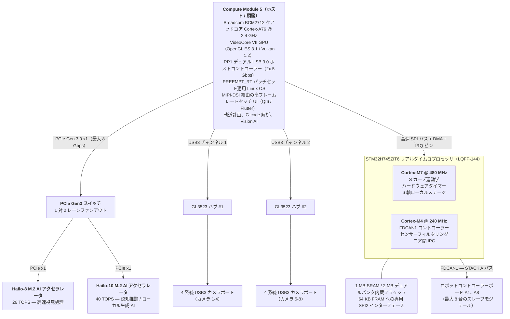
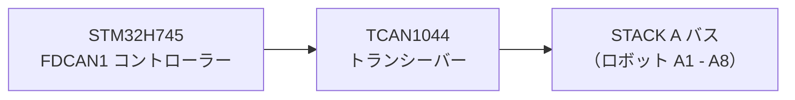
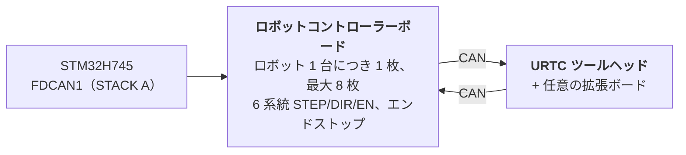

<p align="center">
  
</p>

# 🚀 HYDRA-UMC 技術仕様書

<p align="center">
  <a href="README.md">🇺🇸 English</a> |
  <a href="README_spa.md">🇪🇸 Español</a> |
  <a href="README_fra.md">🇫🇷 Français</a> |
  <a href="README_ita.md">🇮🇹 Italiano</a> |
  <a href="README_deu.md">🇩🇪 Deutsch</a> |
  <a href="README_zho.md">🇨🇳 简体中文</a> |
  🇯🇵 <b>日本語</b>
</p>

### 🤖 究極のデュアルコア・マイクロファクトリー＆マルチロボットコントローラープラットフォーム（V1.0 — デュアル PCIe Hailo-8 + Hailo-10 AI アクセラレータ & デュアル USB 3.0 ハブ）

<p align="left">
  
  
  
  
  
</p>


---

## 1. 🛠️ プロジェクト概要とマイクロファクトリーエコシステム

**HYDRA-UMC**（Universal Machines Controller）は、多軸セル型ロボティクス、マイクロファクトリー、自動化製造、複雑なツールヘッドの統合制御を目的とした、産業グレードの分散制御プラットフォームであり、高性能な HMI アーキテクチャです。

**ヘテロジニアスなホスト + リアルタイムコプロセッサアーキテクチャ** の上に構築された HYDRA-UMC は、高水準のユーザーインターフェース描画・コンピュータビジョン・AI 推論・クラウド接続を、リアルタイムなステップパルス生成・フィールドバス管理・パワーエレクトロニクス駆動から完全に分離しています。



### 🤖 マイクロファクトリーとしての機能：
* 📡 **分散型マルチロボットネットワーク：** 単一の物理 FDCAN バス上で、最大 8 台の分散スレーブロボットモジュール（現時点で 3・4・5・6 自由度に対応、将来のリリースでは 7・8・9 自由度およびデュアルロボット構成へ拡張予定）を協調動作させます。
* 🧠 **デュアル組み込みニューラルコプロセッシング：** 板載の PCIe Gen3 スイッチが、CM5 の単一 PCIe レーンを 2 基の M.2 AI アクセラレータへファンアウトします。Hailo-8（26 TOPS）は 8 台のカメラすべてに対し、マルチストリームの YOLOv8/YOLO11 物体検出・欠陥検査・リアルタイム PnP フィデューシャルアライメントを駆動し、Hailo-10（40 TOPS）はクラウドへの往復通信なしに、ローカル・オンデバイスで認知推論と生成 AI（量子化された LLM/VLA モデル）を実行します。
* 📐 **ローカル 6 軸ステージ：** 6 つのローカル軸（X、Y1、Y2、Z、E0、E1）に対する直接的な step/dir/enable パルス生成。副ロボット、ATC（自動工具交換装置）タレット、コンベアベルト同期、XYZ テーブルガントリーといった補助用途に対応します。
* 🎯 **JuanenPNP・JuanenCNC 統合：** Pick-and-Place システム（LumenPNP ハードウェア構成）や、PCB プロトタイピング・SMD 実装向けの 10W 光学レーザーモジュールを搭載した CNC ユニットと直接互換性があります。
* 👁️ **8 系統カメラビジョン・検査マトリクス：** デュアル USB 3.0 コントローラーを統合し、8 個の専用 USB カメラポートを駆動。リアルタイム OpenCV による Pick-and-Place 光学アライメント、熱画像検査、リモートストリーム監視を実現します。
* ⚡ **駆動マトリクス・熱管理：** 16 系統の産業用ローサイド MOSFET チャンネル（8 系統の電磁空圧バルブ + 8 系統の真空ポンプ／ベンチュリ発生器）と、SMD リフローはんだ付けや 3D プリント用ベッド向けの大電流ベッドドライバーを制御します。
* 🚜 **JuanenBOT モバイルプラットフォーム：** 重量級の 48V 4輪走行プラットフォーム（オムニホイール／メカナムホイールを備えた 50x50x50 cm フレーム、100 kg ペイロード対応）とインターフェース可能な、スケーラブルな通信アーキテクチャ。

---

## 2. 🖥️ ホストコンピューティングサブシステム（HMI・上位処理系）

* 🧩 **モジュール：** Raspberry Pi Compute Module 5（CM5）
* ⚙️ **プロセッサ：** Broadcom BCM2712 クアッドコア ARM Cortex-A76 @ 2.4 GHz
* 🎮 **グラフィックスエンジン：** VideoCore VII GPU（OpenGL ES 3.1、Vulkan 1.2）
* 💾 **システムメモリ：** 2 GB / 4 GB LPDDR4X（CM5 に統合）
* 💽 **高速ストレージ：** 統合型 eMMC フラッシュ
* 🐧 **オペレーティングシステム：** Linux 64 ビット（Raspberry Pi OS / Yocto、`PREEMPT_RT` パッチ適用）
* 📺 **ディスプレイインターフェース：** MIPI-DSI（2 レーン／4 レーン）、高解像度静電容量式タッチパネルに接続（Bambu Lab 風 UI、60 FPS）
* 🌐 **接続機能：**
  * 🌐 ギガビットイーサネット（RJ45）×1 — 産業用 LAN／RTSP 映像配信／WebSocket／MQTT 向け
  * 📶 Wi-Fi 6・Bluetooth 5.4
  * 📷 **USB 3.0／2.0 ビジョンポート ×8：** 板載のデュアル Genesys Logic GL3523 コントローラーで駆動。
  * 🎮 **USB 2.0 HID ポート ×2：** ゲームパッド／マウス／キーボード — 第 4a 節参照。

---

## 3. 🧠 PCIE AI アクセラレータサブシステム（HAILO-8 + HAILO-10 デュアル NPU）

* 🔀 **PCIe ファンアウト：** CM5 コネクタが公開する PCIe Gen 2.0/3.0 レーンは **1 系統のみ**（CM5 データシートの Table 5、`docs/PINOUT_CM5_CARRIER.TXT` にて確認済み）— 2 基の M.2 AI アクセラレータを直接接続するには不足しています。板載の PCIe Gen3 パケットスイッチ（候補：ASMedia ASM2806 系列または同等品、型番未定 — Hailo-10 のリンク速度がネイティブ速度を下回らないよう、Gen3 対応であることが必須）が、CM5 側の単一レーンを、下記の各 M.2 ソケットに接続する 2 系統の独立した下流 PCIe x1 レーンへファンアウトします。
* 🔌 **物理インターフェース：** 板載の M.2 Key M ソケット ×2（2242／2280 フォームファクタ）。それぞれ CM5 に直接ではなく、上記 PCIe スイッチ自身の個別の下流ポートに接続されています。
* 🚀 **NPU エンジン 1 — Hailo-8（高速知覚処理）：** 消費電力 5W 未満で **26 TOPS**（Tera Operations Per Second）を発揮する Hailo-8 産業用 AI プロセッサ。8 台全カメラ（第 4 節）にわたるマルチストリームの YOLOv8/YOLO11 物体検出、欠陥検査、リアルタイム PnP フィデューシャルアライメントを担います — 既存のアクセラレータであり、その役割に変更はありません。
* 🧠 **NPU エンジン 2 — Hailo-10（認知推論・ローカル生成 AI）：** Hailo-8 の置き換えではなく、それに加えて搭載されます。**40 TOPS** を発揮し、量子化された LLM および Vision-Language-Action（VLA）モデルをローカルかつプライベートに実行します。オペレーターの自然言語／音声指示を運動学的軌道へと変換し、ロボットがタスクに失敗した際には外部クラウドサービスへの往復通信なしに、意味理解に基づくエラー復旧を行います。これは、HYDRA-UMC エコシステムの他の部分（同族プロジェクトである HYDRA-UMC-COGNITIVE-NODE）ですでに確立されている Hailo-10 の認知的役割と同一のものです。
* ⚡ **ソフトウェア統合：** 両アクセラレータ向けの公式 Hailo RT ソフトウェアスイートが Raspberry Pi OS に統合されており、Hailo-8 のゼロ CPU オーバーヘッドなビジョン推論のために GStreamer/TAPPAS パイプラインと OpenCV を実行します。Hailo-10 自身の LLM/VLA ランタイム統合は、まだ設計段階です（`src/cm5_host/ai_inference/README.md` 参照）。
* ⚠️ **未確定事項：** PCIe スイッチの正確な型番、および Hailo-10 自身の実際の消費電力は、いずれも未確定です — `hardware/PCB/kinematic_brain_stm32h745/BOM.TXT` の項目 05・09 を参照してください。

---

## 4. 📷 デュアル USB 3.0 ビジョンサブシステム（カメラポート ×8）

* 🎛️ **ハブコントローラー：** Genesys Logic `GL3523` USB 3.0／SuperSpeed ハブ IC ×2、マザーボードに直接統合。
* 🔀 **トポロジーと分配：**
  * 🅰️ **ハブ #1（`GL3523-A`）：** CM5 のネイティブ USB3-0 SuperSpeed PHY（5 Gbps）に接続。USB ポート 1〜4（カメラ A1〜A4）へ供給。
  * 🅱️ **ハブ #2（`GL3523-B`）：** CM5 のネイティブ USB3-1 SuperSpeed PHY（5 Gbps）に接続。USB ポート 5〜8（カメラ A5〜A8）へ供給。
  * ℹ️ CM5（BCM2712）はこの 2 系統の SuperSpeed PHY を直接公開しており、RP1 コンパニオンチップは関与しません（RP1 は Raspberry Pi 5 ボード専用で、CM5 には存在しません）。ピンレベルの完全な信号配線は `docs/PINOUT_CM5_CARRIER.TXT` を参照。
* 🛡️ **電源スイッチ・回路保護：** 各 USB VBUS は、ハイサイド電流制限電源スイッチ（`TPS2065`／`SY6280`）により個別に保護され、500 mA〜1 A に設定、故障報告機能付き。
* ⚡ **大電流 VBUS レール：** 専用の 24V→5V 降圧レギュレータにより給電（5V @ 連続 6A）。

### 4a. 🎮 USB 2.0 HID サブシステム（ゲームパッド／マウス／キーボードポート ×2）

* 🎛️ **ハブコントローラー：** CM5 の単一ネイティブ USB 2.0 PHY を 2 系統の物理ポートへファンアウトする、小型 USB 2.0 ハブ IC ×1（例：Genesys Logic `GL850G`／`FE1.1s`、型番未定）。
* ℹ️ **ハブが必要な理由：** CM5 データシート（`docs/datasheets/Raspberry Pi CM5.pdf`、§2.5）により、BCM2712 が DF40 コネクタ上に公開する USB 2.0（High Speed）ポートは **1 系統のみ**（`USB_N`／`USB_P`、ピン 103／105）であることが確認されています — これは GL3523 カメラハブ（第 4 節）にすでに専用割り当てされている 2 系統のネイティブ USB 3.0 SuperSpeed PHY とは別個のものです。単一の物理信号対は、間にハブを挟まない限り 2 ポートに分割できません。
* 🔀 **トポロジー：** `USB_N`／`USB_P`（CM5）→ ハブのアップストリームポート → 2 系統のダウンストリーム USB 2.0 Type-A ポート（フロント／サイドパネル、ゲームパッド・マウス・キーボード用 — タッチスクリーンとは独立した手動ジョグ／ティーチペンダント操作および HMI 入力）。
* 📌 ピンレベルの完全な信号配線は `docs/PINOUT_CM5_CARRIER.TXT` 第 1 節を参照。

---

## 5. ⚡ リアルタイムコプロセッシングサブシステム

* 🎛️ **マイクロコントローラー：** STMicroelectronics **STM32H745ZIT6**（コスト最適化デュアルコア MCU）
* 📦 **パッケージ：** LQFP-144（0.5 mm ピンピッチ）
* 🧠 **アーキテクチャ：** デュアルコア非対称マルチプロセッシング（AMP）
  * 🚀 **コア 1（Cortex-M7 @ 480 MHz）：** リアルタイムモーションエンジン、ハードウェアパルス生成、S カーブ運動学速度プロファイル、PID 制御ループ。
  * 📡 **コア 2（Cortex-M4 @ 240 MHz）：** FDCAN プロトコル管理、アナログセンサーフィルタリング、安全インターロック、コア間 IPC 処理。
* 💾 **内蔵メモリアーキテクチャ：**
  * 💾 **2 MB** デュアルバンク内蔵フラッシュ
  * 🧠 **1 MB** 内蔵 SRAM 総容量（512 KB AXI SRAM + 128 KB ITCM／128 KB DTCM + SRAM1/SRAM2/SRAM3）
* 🧵 **RTOS：** **FreeRTOS**、コアごとに独立したインスタンスを実行（AMP であり SMP ではない — コア 1・コア 2 間でスケジューラの状態を共有しません）。ファームウェアの骨格：`src/mcu_stm32h745/`、詳細は `docs/architecture.md` 第 2 節を参照。

---

## 6. 📡 分散フィールドバス通信（単一 FDCAN）

マザーボードは、単一の物理 CAN バス上に分散した最大 8 台の個別スレーブロボットモジュールに対するマスターコントローラーとして機能します。

* 🔌 **ハードウェアペリフェラル：** STM32H745 に直接内蔵されたネイティブハードウェア FDCAN コントローラー（`FDCAN1`）×1。実際のブートローダー実装により **クラシック CAN モード**（`FDCAN_FRAME_CLASSIC`、`BRS_OFF`）で動作しています — このペリフェラル自体は FD 対応シリコンですが、本プロジェクトが現時点で実際に使用している CAN-OTA/SPI-OTA プロトコル（`docs/CANBUS_STM32H745.TXT`、`docs/CANBUS_STM32G474.TXT`）は、他のすべての階層（G474 ロボットコントローラーボード、URTC）と同様、クラシックフレーム（最大 DLC 8）のみを使用します。CAN FD のより大きな 64 バイト BRS ペイロードは、将来のための実際のハードウェア余裕であり、現時点のプロトコルではまだ使用されていません。
* ⚡ **物理層トランシーバー：** 高速 CAN FD トランシーバー ×1（例：TI `TCAN1044AVD`／NXP `TJA1443`）— 現在のトラフィックがクラシックフレームであっても、上記ペリフェラルと同じ理由から FD 対応ハードウェアが選定されています。
* 🔀 **バストポロジー：**
  * 🅰️ **STACK A（`FDCAN1`）：** スレーブモジュール A1〜A8 に対応。
* ⏱️ **プロトコル仕様：** 公称ビットレート約 1 Mbps（クラシック CAN、フレームあたり最大 8 バイトペイロード）。自動バスオフ復旧は Cortex-M4 が管理する計画ですが、アプリケーションファームウェアにはまだ実装されていません（現時点の CM4 の `main.c` はブリングアップ／ブリンク用の骨格コードです。`src/mcu_stm32h745/CM4/` 参照）。実際の将来対応事項として管理されており、すでに実装済みの機能ではありません。
* 🔌 **物理コネクタ：** 40 ピン、2.54mm ピッチのスタッキング型ヘッダー／ソケット（+24V ×10 ピン、GND ×10 ピン、補助 +5V ×4 ピン、FDCAN1 H/L、`BOARD_PRESENT_N`、予備 13 ピン）— 8 枚のロボットコントローラーボードは本ボードの片側に物理的に積み重なるように取り付けられます（確認済みのトポロジーであり、バックプレーン方式ではありません）。各ボードは 40 本の信号すべてを、その上に取り付けられるボードへストレートスルーで伝達します。スロットアドレスは各ボードごとのローカル DIP スイッチによって決まります（`BOARD_ID[2:0]`、README.md 第 12 節）— このコネクタから導出されるものではありません。完全なピン表とスタックトポロジーは `docs/PINOUT_STACKA_CONNECTOR.TXT` を参照。Kinematic Brain 自身のポートおよび各ロボットコントローラーボードの一対のポートも、すべて同一のコネクタ定義です。



---

## 7. 💾 超高速不揮発性メモリ（SPI FRAM）

緊急停電時のデータ損失ゼロと即時状態復旧を保証するために：

* 🧪 **メモリ IC：** Cypress/Infineon `FM25V05-G`／Fujitsu `MB85RS64`（64 KB SPI FRAM）
* ⚡ **バスインターフェース：** 専用 SPI2 バス、最大 40 MHz。
* ♾️ **耐久性：** 無制限の書き込み耐久性（10^14 サイクル）、ナノ秒オーダーの書き込みレイテンシ。
* 🛡️ **停電保護シーケンス（PVD）：** 内蔵の電圧監視回路（PVD）が 3.3V レールを常時監視。電圧低下を検知すると、電源遮断前の **5 マイクロ秒以内** に、ノンマスカブル割り込み（NMI）によりエンコーダのベクトル値、アクティブなステートマシン、座標情報を FRAM へダンプします。

---

## 8. 🦾 ローカルモーション・駆動・センサー系

### ⚙️ モーション出力
* 🎯 **対応軸数：** 6 軸ローカルステージ — デュアル Y ガントリー + ツール軸（`X`、`Y1`、`Y2`、`Z`、`E0`、`E1`）、SPI デイジーチェーン接続された TMC5160A ステッピングドライバー 6 基により駆動。
* ⚡ **信号：** 3.3V CMOS（`STEP`、`DIR`、`ENABLE`）、全 6 ドライバー共有の SPI4 デイジーチェーン。
* ⏱️ **タイマー：** 高機能制御タイマー（X/Y1/Y2/Z 用 `TIM1`、E0/E1 用 `TIM8`）、ハードウェアパルス生成対応。
* 🛑 **エンドストップ：** 入力 12 系統、各軸につき 2 系統（MIN + MAX）。
* 📌 ピンレベルの完全な割り当ては `docs/PINOUT_STM32H745_KINEMATIC_BRAIN.TXT` を参照。

### 🔌 電源・流体アクチュエータ
* 🔀 **ローサイドスイッチングチャンネル ×20：** フライバック保護付き産業用 N チャンネル MOSFET 出力。
  * 🧲 **8+2 チャンネル：** 真空ポンプ／ベンチュリ式 Pick-and-Place 発生器。
  * 💨 **8+2 チャンネル：** 電磁空圧バルブ（5V/24V 駆動）。
* 💨 **ファン：** 3 線式ファン ×3（ローサイド MOSFET による PWM 給電切替 + チャンネルごとのタコメーター検出）。
* 🌡️ **熱管理：**
  * 🔥 ヒートベッド用ソリッドステートリレー制御出力 ×1、**AC230V 電源** をスイッチング — MCU／ロジック領域からフォトカップラーで絶縁済み。これは商用電源電圧を扱う回路であり、PCB 上には 24V バス相当ではなく、実際の沿面距離／空間距離の設計が必要です。
  * 🌡️ 高精度 NTC サーミスタアナログ入力 ×2（ヒートベッド用）、`ADC1` によりサンプリング。

---

## 9. 🔌 電源分配・レギュレーション

本ボードは単一の産業用 **24V DC** 入力電源バスから動作します。

* ⚡ **主 DC 入力：** 24V DC ±10%
* 🔋 **5V メイン電源系統：** 同期降圧レギュレータにより、CM5 モジュール・タッチスクリーンディスプレイのバックライト・板載ロジック向けに **連続 5A** を供給。
* 📷 **5V USB VBUS 電源系統：** 専用の同期降圧レギュレータにより、8 系統の USB 3.0 カメラポートおよび GL3523 ハブコントローラー専用に **連続 6A** を供給。
* 🎛️ **3.3V 電源系統：** 低ノイズレギュレータにより **連続 4A** を供給（STM32、FRAM、トランシーバー、PCIe スイッチ（第 3 節）、および両方の M.2 ソケット（Hailo-8 + Hailo-10）の 3.3V レール向けに設計）。両 M.2 モジュールの実際の消費電力が確定した時点（Hailo-8 は 5W 未満、Hailo-10 自身の数値は未確定）で、この 4A という電力予算は再検証が必要です — 4A を超える可能性があります。`hardware/PCB/kinematic_brain_stm32h745/BOM.TXT` の項目 09 を参照。

---

## 10. 🔄 プロセッサ間通信（IPC）

CM5（ホスト）と STM32H745（コプロセッサ）間の通信には、ハードウェア支援によるゼロコピー SPI リンクを使用します。

* 🔗 **物理トランスポート：** 全二重 SPI1、最大 50 MHz — STM32 側はスレーブモード、CM5 側はマスターモードで動作。
* 🤝 **ハンドシェイク信号線：** `HYDRA_DATA_READY` GPIO 信号線。
* ⚡ **実行フロー：** Cortex-M4 が共有 AXI SRAM 上に 128 バイトのテレメトリフレームを準備し、`HYDRA_DATA_READY` をアサートします。その後 CM5 は、ポーリング処理のオーバーヘッドなしに、高速 SPI DMA 経由でそのパケットを取得します。

---

## 11. 🎛️ 4 層 PCB ハードウェア仕様

* 📐 **フォームファクタ：** 一体型産業用マザーボード。
* 🥞 **層構成（4 層）：**
  * 🟢 **レイヤー 1（表層）：** 部品配置、高周波信号、90 オーム USB SuperSpeed 差動ペア、85 オーム PCIe Gen 3.0 差動ペア。
  * 🛡️ **レイヤー 2（内層 1）：** 連続したソリッドグラウンドプレーン（`GND`）。
  * ⚡ **レイヤー 3（内層 2）：** 分割型電源プレーン（`24V`、`5V_MAIN`、`5V_USB`、`3.3V`）。
  * 🔴 **レイヤー 4（裏層）：** 二次的な信号配線と大電流電源の分岐。
* 🛠️ **コネクタ・実装：**
  * 🔲 STM32H745 は LQFP-144 パッケージ（0.5 mm ピッチ）、GL3523 ハブ ×2 は QFN-88 パッケージ。加えて、板載 PCIe Gen3 スイッチから給電される M.2 Key M 2242/2280 ソケット ×2（Hailo-8 + Hailo-10、第 3 節）。
  * 🔌 Compute Module 5 用のデュアル Hirose DF40 メザニンコネクタ。
  * 📌 STACK A バス接続用（ロボットコントローラーボードの物理スタックのベース）の 40 ピン、2.54 mm ピッチスタッキングヘッダー — `docs/PINOUT_STACKA_CONNECTOR.TXT`。
  * 🔌 ロボットカメラ用の USB 3.0 Type-A（または Hirose 産業用ラッチ式）コネクタ ×8。

---

## 12. 🦾 ロボットコントローラーボードと URTC ツールヘッド（分散階層）

STACK A（第 6 節）上の最大 8 台のスレーブモジュールそれぞれは、**ロボットコントローラーボード** です。ロボット 1 台につき 1 枚配置され、そのロボット自身の 6 軸（STEP/DIR/ENABLE）を駆動し、そのエンドストップを読み取り、自身のツールヘッドの通信を *もう一段先* の別の CAN 接続を介して、ロボットの頭部に取り付けられた **URTC**（Universal Robot Tool Controller — 同族リポジトリ `URTC` 参照）ボードへ中継します。この URTC ボードには、任意で独自の拡張ボードを追加できます。



* 🎛️ **MCU：** STMicroelectronics **STM32G474RET6**（Cortex-M4 @ 170 MHz、LQFP-64、512 KB フラッシュ）、自身の 3 系統の FDCAN ペリフェラルのうち 2 系統を使用 — 1 系統は STM32H745 への FDCAN アップリンク、もう 1 系統は自身の URTC ヘッドへの CAN ダウンリンクとして機能します。詳細は `docs/architecture.md` §1 を参照。
* 🔢 **アドレッシング：** `BOARD_ID[2:0]` — 各ボード上のローカル 3 ビット DIP スイッチで、設置時に手動で 0〜7 に設定され、各ボードに固有の FDCAN1 スロットベース ID を割り当てます。物理的なスタック位置や STACK A コネクタから導出されるものではありません（すべてのボードは同一の互換 PCB です）。詳細は `docs/PINOUT_STM32G474_ROBOT_CONTROLLER.TXT` §1c を参照。
* 🧵 **RTOS：** **FreeRTOS**（ブートローダーはベアメタルのまま — 受信／検証／ジャンプにスケジューラは不要）。ファームウェアの骨格：`src/mcu_stm32g474/`。
* 📡 **4 階層に及ぶ CAN-OTA ファームウェア更新：** STM32H745 自身（CM5 との既存 SPI リンク経由）、本ボード、その URTC ツールヘッド（STM32F303CCT6）、そして —— 取り付けられている場合のみ —— そのヘッド自身の高度拡張ボード（STM32F303CBT6、`expansion_board_type` 3 または 4、URTC 自身の `docs/EXPANSION.TXT` 参照）まで、いずれも JTAG/SWD プローブや USB-CAN ドングルなしに、HYDRA-UMC-STUDIO のフラッシャー／テスターから書き込み・診断が可能です。完全なアドレッシング方式、新たなプロトコル設計を必要とせず最後の 2 階層まで到達する中継トンネル、および現在の実装状況は `docs/architecture.md` を参照してください。

完全な階層アーキテクチャ（本節はその要約）は `docs/architecture.md` を参照 — どこまでが確認済みのハードウェア事実で、どこからが実装待ちの提案設計であるかも含まれています。同ドキュメントの第 8 節では、現行のブートローダーが抱える既知かつ許容済みのセキュリティ上の制約（読み出し保護の未実装、共有の防ロールバック回避値、認証なしの読み戻し）も追跡しています —— これらは実機到着前の意図的な未対応事項であり、見落としではありません。

---

## 📂 リポジトリのディレクトリ構成

```text
HYDRA-UMC/
├── .vscode/                    # 推奨拡張機能 + ビルドタスク — 下記「開発環境」参照
├── docs/
│   ├── datasheets/             # 本リポジトリ内の各ボードで使用する部品のデータシート
│   ├── architecture.md         # 4 階層システムアーキテクチャ（まずここから）
│   ├── COMPILE_STM32G474.TXT   # ロボットコントローラーボードファームウェアのビルド参考資料
│   ├── COMPILE_STM32H745.TXT   # Kinematic Brain ファームウェアのビルド参考資料（デュアルコア）
│   ├── PINOUT_STM32H745_KINEMATIC_BRAIN.TXT    # Kinematic Brain の完全ピン割り当て
│   ├── PINOUT_STM32G474_ROBOT_CONTROLLER.TXT   # ロボットコントローラーボードの完全ピン割り当て
│   ├── PINOUT_CM5_CARRIER.TXT                  # CM5 ホストサブシステムの信号配線
│   ├── PINOUT_STACKA_CONNECTOR.TXT             # 共用の 40 ピン STACK A スタッキングコネクタ
│   ├── CANBUS_STM32H745.TXT                    # Kinematic Brain のワイヤレベルプロトコル（SPI1／メールボックス／FDCAN1 マスター）
│   ├── CANBUS_STM32G474.TXT                    # ロボットコントローラーボードのワイヤレベルプロトコル（FDCAN1 スレーブ／FDCAN2）
│   └── HYDRA-UMC_*.md/txt/TXT  # 旧版ドキュメント — Markdown として書かれたものは Markdown 化；各ファイル自身の注記を参照
├── hardware/
│   ├── PCB/
│   │   ├── kinematic_brain_stm32h745/          # メインマザーボード — 回路図はまだなし、自身の README 参照
│   │   └── robot_controller_board_stm32g474/   # ロボット単体ボード — 回路図はまだなし、自身の README 参照
│   └── gerbers/                # 製造用出力ファイル（基板レイアウト完了までは空）
├── src/                         # 同族 URTC リポジトリと同じ構成規約：src/ がソースコード
│   ├── cm5_host/                # os/ 自身のイメージ上で動作する Linux ユーザースペースアプリ
│   │   ├── hmi_qt6/             # HYDRA-UMC-STUDIO 自身のダッシュボードをラップする Qt6 キオスクシェル
│   │   ├── ai_inference/        # Hailo-8 TAPPAS／YOLOv8 パイプライン
│   │   ├── video_streamer/      # マルチカメラ RTSP/WebRTC サーバー（MediaMTX）
│   │   ├── ipc_driver/          # CM5 <-> STM32H745 SPI リンク（ユーザースペース）— 未完成の C スケルトン、参考として保持
│   │   └── spi_bridge/          # 本物の CM5<->STM32H745 SPI-OTA ブリッジ（Python）— ipc_driver/ を置き換え、
│   │                              URTC-FLASHER 自身の実証済み CRC32/HMAC ブートローダー状態機械を流用
│   ├── mcu_stm32h745/           # Kinematic Brain ファームウェア（第 0 階層）— デュアルコア
│   │   ├── CM7/                 # モーションエンジン、ハードウェアタイマー（+ 自身の boot/）
│   │   ├── CM4/                 # FDCAN ドライバー、センサーフィルタリング（+ 自身の boot/）
│   │   └── Common/              # CM7<->CM4 共有メモリ IPC メールボックス（ipc_mailbox.h）— 実装済み、両コアのブートローダーで共用
│   └── mcu_stm32g474/           # ロボットコントローラーボードファームウェア（第 1 階層）— シングルコア、+ 自身の boot/
├── os/                          # CM5 OS イメージ — ベース OS の選定、systemd ユニット、初回起動時のプロビジョニング
├── images/                      # README バナー + アイコン + スプラッシュスクリーン（SVG）
├── build_firmware.sh            # クリーンなチェックアウトから、上記の全 MCU ファームウェアターゲットを一括ビルド（Linux/Mac）
├── build_firmware.bat           # 同じビルド、Windows 版（下記「ファームウェアのビルド」参照）
├── build-test.sh / build-test.bat # バージョンを更新しないビルド/コンパイル確認
├── generate_manifest.py         # フルビルド後に firmware/firmware_manifest.json（バージョン／CRC32）を再生成
├── bump_version.py              # オドメーター式バージョンインクリメント、build_firmware.sh/.bat が実行
├── bump_manifest_version.py     # hydra-umc.project.json のバージョンをネイティブ側と同期（--sync）
├── tools/
│   ├── verify_firmware_inventory.py # コミット済み6コンポーネント在庫の読み取り専用検証
│   ├── build_test.py                # バージョンを更新しないビルド/コンパイル確認
│   └── ci_validate.py               # CI が使用する manifest/CHANGELOG/docs の検証
├── firmware/                    # コミット済みのビルド成果物（.bin/.hex/.elf + マニフェスト）— gitignore 対象外、URTC 自身の出力フォルダと同じ規約、下記「ファームウェアのビルド」参照
├── README.md                    # 本ファイル
└── README_spa.md / README_ita.md / README_fra.md / README_deu.md / README_zho.md / README_jpn.md    # <- 各言語訳
```

各階層が実際に何を行い、どのように接続されているかは `docs/architecture.md` を参照。上記の各フォルダに含まれる `README.md` には、このトップレベルの要約以上の詳細が記載されています。

## 🛠️ 開発環境

本プロジェクト自身の開発マシンに実際にインストールされ、動作確認済みの環境（`build_firmware.sh`/`build_firmware.bat`、`g474`/`h745`/デフォルトターゲット、エラー 0 件）— 机上の理論的なリストではありません：

* 🔧 **ARM GNU ツールチェーン**（`arm-none-eabi-gcc` 10.3 以降）— すべての MCU ファームウェアターゲットをコンパイル。STM32CubeIDE／CubeMX のプロジェクトファイルは使用も必要もありません — `build_firmware.sh`/`build_firmware.bat` は ST 公式の GitHub リポジトリから最新の HAL/CMSIS ソースを直接取得し、コンパイラを直接駆動します。これは、同族の `URTC` リポジトリ自身の `build_firmware.sh`/`build_firmware.bat` がすでに確立している方針と同じです。
* 🧩 **VS Code と拡張機能**（`.vscode/extensions.json` に以下すべてを記載）：[STM32 VS Code Extension](https://marketplace.visualstudio.com/items?itemName=stmicroelectronics.stm32-vscode-extension)（プロジェクト／ビルド／デバッグ統合）、**Cortex-Debug**（SWD/JTAG デバッグ — `build_firmware.sh` とは独立、実機到着後に有用）、**CMake Tools**（`src/cm5_host/hmi_qt6/` 自身の CMake プロジェクト向け）、**C/C++**（全ファームウェア／ホストソースファイルにわたる IntelliSense）、**Python**（`ai_inference/` パイプラインスクリプト）、**Hex Editor**（`.bin` ファームウェア出力の確認）、**YAML**（`video_streamer/` 自身の MediaMTX 設定）。リポジトリを開き、推奨拡張機能のインストール案内を承諾した後、あらかじめ用意されたビルドタスク（`.vscode/tasks.json`）を **ターミナル → タスクの実行** から使用してください。
* 🗂️ **git** — 本リポジトリ自身のためだけでなく、`build_firmware.sh` 自身による ST の HAL/CMSIS パッケージの固定タグでのベンダリング取得にも使用（`build/` 配下にキャッシュ、gitignore 対象、`--clean` 時に再取得）。

## 🏗️ ファームウェアのビルド

**Linux/Mac：**
```bash
./build_firmware.sh          # 全 MCU ターゲットをビルド（ロボットコントローラーボード + Kinematic Brain、両コア含む）
./build_firmware.sh g474     # ロボットコントローラーボードのみ
./build_firmware.sh h745     # Kinematic Brain のみ（両コア含む）
./build_firmware.sh --clean  # ベンダリング済み HAL/CMSIS キャッシュを先に消去
```

**Windows：**
```bat
build_firmware.bat          :: 全 MCU ターゲットをビルド（ロボットコントローラーボード + Kinematic Brain、両コア含む）
build_firmware.bat g474     :: ロボットコントローラーボードのみ
build_firmware.bat h745     :: Kinematic Brain のみ（両コア含む）
build_firmware.bat --clean  :: ベンダリング済み HAL/CMSIS キャッシュを先に消去
```

`build_firmware.bat` は `build_firmware.sh` をバッチファイルに変換した完全に対応するもの（同じ手順、同じ固定 HAL/CMSIS バージョン、同じ合格／警告／失敗の報告方式）です — [Arm GNU Toolchain](https://developer.arm.com/downloads/-/arm-gnu-toolchain-downloads) がインストールされ、`arm-none-eabi-gcc` が `PATH` に通った実際の Windows マシン上でエンドツーエンドに実行済みです：すべての HAL モジュール、両方のブートローダー、すべてのアプリケーションがクリーンにコンパイル・リンクされ、再生成された `firmware_manifest.json` の CRC32 は Linux/Mac ビルド自身の出力と一致します。必要なツールは Linux/Mac スクリプトと同じです：Arm GNU Toolchain、`git`（ST 公式の HAL/CMSIS ソース取得用）、マニフェスト生成ステップ用の `python`。

**手動ビルド（いずれの OS でも、スクリプトを使わない場合）：** このスクリプトが自動化しているのは、まさに `docs/COMPILE_STM32G474.TXT` および `docs/COMPILE_STM32H745.TXT` に記載された手順そのものです — `build_firmware.sh`/`build_firmware.bat` の冒頭にリストされた固定バージョンの HAL/CMSIS/FreeRTOS ソースを取得し、各ターゲットの HAL モジュールとスタートアップ／システムファイルを `arm-none-eabi-gcc` でコンパイル（コンパイルオプション／モジュール一覧は同スクリプト内に記載）、その後各ブートローダー・アプリケーションを、ソースの隣にあるそれぞれ自身のリンカスクリプト（`*.ld`）に対して `arm-none-eabi-gcc`／`-Wl,--gc-sections` でリンクし、`arm-none-eabi-objcopy` で `.bin`／`.hex` へ変換します。いずれのスクリプトも使いたくない場合は、これら 2 つの `docs/COMPILE_*.TXT` ファイルが権威ある手順書です — スクリプトはこれらを自動化するために存在するのであり、事実上の根拠を置き換えるものではありません。

ビルド成果物は `firmware/` に配置され、本リポジトリにコミット・プッシュされます（URTC 自身の `firmware/` 出力フォルダと同じ規約）。これにより、HYDRA-UMC-STUDIO の GitHub ダウンロード機能が `firmware_manifest.json` 経由で実際に存在する `.bin` ファイルを見つけられるようになっています — このディレクトリは gitignore の対象では **ありません**。各ステップの内容と理由は `docs/COMPILE_STM32G474.TXT` および `docs/COMPILE_STM32H745.TXT` を、現在の状況は各ファームウェアフォルダ自身の `README.md` を参照してください。3 つのターゲット（G474、H745 CM7、H745 CM4）すべての **ブートローダー** は、実際に動作する CAN-OTA/SPI-OTA 実装です（CRC32 + HMAC-SHA256 による検証後にバックアップへ書き込み、その後メイン領域へコピーするという、URTC 自身のブートローダーと同じ防文鎮化の仕組み）— エンドツーエンドでクリーンにコンパイルされていますが、実機での検証はまだです。**アプリケーション** は、現時点ではコンパイル検証済みの FreeRTOS GPIO 点滅スモークテストにとどまり、実際のモーション／ビジョン／中継ファームウェアではまだありません。何が実際で何がまだ未着手かは、`docs/architecture.md`（特に第 6 節の状況表と第 8 節の既知かつ許容済みのセキュリティ上の制約）を参照してください。

## 🔢 バージョン管理

全 6 つのファームウェアコンポーネント（ブートローダー 3 つ + アプリケーション 3 つ — ロボットコントローラーボードの STM32G474、Kinematic Brain の CM7、Kinematic Brain の CM4、チップ／コアごとにブートローダーとアプリケーションのペア）は、いずれもバージョン逐次加算方式を採用しています：`build_firmware.sh`/`.bat` は、あるコンポーネントをコンパイルする直前に、`bump_version.py` を通じてそのコンポーネント自身の PATCH バージョンを正確に 1 だけ加算します。したがって、あるコンポーネントの新しいバイナリを実際に生成するすべてのビルドには、その新しいバージョン番号が焼き込まれます — 手入力されることは一切なく、実際にコンパイルされた内容とずれることもありません。繰り上がりルール（「オドメーター」方式）：PATCH が 9 を超えるとゼロに戻り、MINOR が 1 増加します（例：`1.1.9` -> `1.2.0`、`1.1.10` にはなりません）。MINOR が 9 を超えた場合も同様に MAJOR へ繰り上がります。完全な仕組みは各コンポーネント自身の `bootloader_common.h` と `bump_version.py` 自身のヘッダーコメントを参照してください。

## 🔗 関連プロジェクト

本プロジェクトは、同じ作者(JuanenRac / Electro Hobby 3D)による HYDRA-UMC ロボティクスエコシステムの一部です。リクエストが実はこの中のどれかについてのものである可能性があるため、知っておく価値があります。

**直接関連** —— このファームウェアに直接接続するプロジェクト
- **[URTC](https://github.com/JuanenRac/URTC)** — 物理的な Universal Robot Tool Controller 基板向けファームウェア、CAN バス経由の 25 以上のツールプロファイル。本基板が駆動する各ロボットアームが搭載するツールヘッドのファームウェアで、自身の CAN ダウンリンクをさらに 1 ホップ先に持つ。
- **[HYDRA-UMC-OS](https://github.com/JuanenRac/HYDRA-UMC-OS)** — CM5 向けの再現可能な Raspberry Pi OS プロダクト層——読み取り専用エージェント、検証済み設定/プロファイル、WiFi 初回接続プロビジョニング。本基板自身の CM5 ホストが実行する OS。
- **[HYDRA-UMC-SERVER](https://github.com/JuanenRac/HYDRA-UMC-SERVER)** — すべての制御クライアントが実際に通信する、本物のヘッドレスバックエンド(REST/WebSocket)。その `spi_bridge` サービスが実際の CM5↔STM32H745 SPI-OTA 接続を介して本ファームウェアと通信する。
- **[HYDRA-UMC-VISION-NODE](https://github.com/JuanenRac/HYDRA-UMC-VISION-NODE)** — Hailo-8 ビジョンパイプラインの統合ハブ、段階ごとの実際のハードウェア準備状況チェック付き。SPI/CAN 経由で本ファームウェアとの知覚/E-STOP ループを閉じる。
- **[HYDRA-UMC-SAFETY-ZONES](https://github.com/JuanenRac/HYDRA-UMC-SAFETY-ZONES)** — キャリブレーションの鮮度を強制する、実際のゾーン侵入チェックと E-STOP 要求。侵入を検知した瞬間に本ファームウェアの E-STOP をトリガーする。
- **[HYDRA-UMC-VISUAL-SERVOING-API](https://github.com/JuanenRac/HYDRA-UMC-VISUAL-SERVOING-API)** — 上流のゾーン状態に応じて安全ゲート制御される、実際の Position-Based Visual Servoing 補正則。運動学的補正を本ファームウェアへ直接送信する。
- **[HYDRA-UMC-ORCHESTRATOR](https://github.com/JuanenRac/HYDRA-UMC-ORCHESTRATOR)** — 実際の gRPC/Protobuf ヘルスレポート契約とミッションステートマシンを持つ統合ハブ。複数の HYDRA-UMC ユニットをスウォームとして調整する。
- **[HYDRA-UMC-TWIN](https://github.com/JuanenRac/HYDRA-UMC-TWIN)** — 実際のバージョン互換性同期契約を持つ、デジタルツインエンジンの統合ハブ。本ファームウェア自身の運動学を再現する。
- **[URTC-SMART-RACK](https://github.com/JuanenRac/URTC-SMART-RACK)** — 実際の工具 ID デコードと Smart Idle 予熱ロジックを備えた、基板搭載ラック用ファームウェア。本ファームウェアと同じツール CAN バスを共有する。
- **[URTC-VISION-TOOL](https://github.com/JuanenRac/URTC-VISION-TOOL)** — サーマル/RGB 検査ツールヘッド向けの、ファームウェアと実際の Python ビジョンコンパニオン。本ファームウェアと同じツール CAN バスを共有する。

**エコシステムの他のプロジェクト**

*コアハードウェア&プラットフォーム*
- **[HYDRA-UMC-SDK](https://github.com/JuanenRac/HYDRA-UMC-SDK)** — すべてのブリッジが自身のコマンドを検証する共有 JSON-Schema 契約と安全ゲートの境界。

*コアバックエンド&クライアント*
- **[HYDRA-UMC-STUDIO](https://github.com/JuanenRac/HYDRA-UMC-STUDIO)** — リアルタイムのマルチロボット 3D 可視化を備えたウェブ制御ダッシュボード。
- **[HYDRA-UMC-SUITE](https://github.com/JuanenRac/HYDRA-UMC-SUITE)** — 複数のサーバーを同時に扱えるデスクトップ(PySide6)スウォームコマンドセンター、スタンドアロン実行ファイルとしてパッケージ化。
- **[HYDRA-UMC-ANDROID-CONTROL](https://github.com/JuanenRac/HYDRA-UMC-ANDROID-CONTROL)** — 生体認証ログインとペアリングされた Wear OS コンパニオンを備えたネイティブ Android 制御アプリ。
- **[HYDRA-UMC-IOS-CONTROL](https://github.com/JuanenRac/HYDRA-UMC-IOS-CONTROL)** — リアルタイム WebSocket 同期を備えた iOS/iPadOS 制御アプリ(Flutter)。
- **[HYDRA-UMC-DSI](https://github.com/JuanenRac/HYDRA-UMC-DSI)** — 本体搭載の 7 インチ DSI タッチスクリーン向けネイティブタッチ UI、CM5 自体に組み込み。
- **[HYDRA-UMC-EDITOR-URDF](https://github.com/JuanenRac/HYDRA-UMC-EDITOR-URDF)** — 完成したモデルを STUDIO 自身のカタログへ送信するデスクトップ用グラフィカル URDF 作成/編集ツール。
- **[HYDRA-UMC-BRIDGE-AMR](https://github.com/JuanenRac/HYDRA-UMC-BRIDGE-AMR)** — 実際の VDA 5050 MQTT パブリッシャーによる AGV/AMR フリートの調整境界。
- **[HYDRA-UMC-BRIDGE-CNC](https://github.com/JuanenRac/HYDRA-UMC-BRIDGE-CNC)** — 実際の GRBL ステータス/制御バイトへのアクセスを持つ、CNC セルの高レベルコーディネーター。
- **[HYDRA-UMC-BRIDGE-DROIDS](https://github.com/JuanenRac/HYDRA-UMC-BRIDGE-DROIDS)** — 実際の Boston Dynamics Spot コマンド送信機能を持つ、脚型/ヒューマノイドドロイドの調整境界。
- **[HYDRA-UMC-BRIDGE-LASER](https://github.com/JuanenRac/HYDRA-UMC-BRIDGE-LASER)** — 実際のキー/筐体/インターロック GPIO セーフガード 3 系統を読み取る、レーザーセルの安全コーディネーター。
- **[HYDRA-UMC-BRIDGE-OPENPNP](https://github.com/JuanenRac/HYDRA-UMC-BRIDGE-OPENPNP)** — OpenPnP ピックアンドプレースの基板フローを安全に統括する高レベルコーディネーター。
- **[HYDRA-UMC-BRIDGE-PRINTER3D](https://github.com/JuanenRac/HYDRA-UMC-BRIDGE-PRINTER3D)** — 実際にゲート制御されたジョブコマンドを持つ、Moonraker/Klipper 3D プリンター向けの安全な調整境界。
- **[HYDRA-UMC-BRIDGE-ROS2](https://github.com/JuanenRac/HYDRA-UMC-BRIDGE-ROS2)** — 実際の遅延インポート rclpy ROS 2 トランスポートを持つ安全コーディネーター。
- **[HYDRA-UMC-BRIDGE-UAV](https://github.com/JuanenRac/HYDRA-UMC-BRIDGE-UAV)** — 実際の MAVLink コマンド送信機能を持つ、カメラ搭載 UAV の調整境界。

*URTC ツールプラットフォーム*
- **[URTC-FLASHER](https://github.com/JuanenRac/URTC-FLASHER)** — URTC 基板用のデスクトップ GUI 書き込みツール、CAN-OTA およびフルチップ SWD/JTAG。
- **[URTC-TESTER](https://github.com/JuanenRac/URTC-TESTER)** — URTC 基板向けのデスクトップ CAN バスライブ診断ツール、ツールプロファイルごとに 1 パネル。
- **[URTC-WEB-STUDIO](https://github.com/JuanenRac/URTC-WEB-STUDIO)** — Web Serial API を使ったブラウザベースの URTC-TESTER の代替、ローカルインストール不要。

*ビジョン AI ノード(Hailo-8)*
- **[HYDRA-UMC-DETECTION-HEF](https://github.com/JuanenRac/HYDRA-UMC-DETECTION-HEF)** — Hailo アーキテクチャ/チェックサムによる安全読み込み検証を備えた、実際のコンパイル済みモデルレジストリ。
- **[HYDRA-UMC-VISION-STREAMER](https://github.com/JuanenRac/HYDRA-UMC-VISION-STREAMER)** — 実際の HailoRT 統合境界を持つ、実際の GStreamer パイプライン + MediaMTX 設定生成器。

*コグニティブ AI ノード(Hailo-10)*
- **[HYDRA-UMC-COGNITIVE-NODE](https://github.com/JuanenRac/HYDRA-UMC-COGNITIVE-NODE)** — Hailo-10 コグニティブパイプライン(LLM/VLA/音声オーケストレーション)の統合ハブ。
- **[HYDRA-UMC-VLA-ENGINE](https://github.com/JuanenRac/HYDRA-UMC-VLA-ENGINE)** — Vision-Language-Action モデル向けの、実際のアクショントークンのエンコード/デコードと軌道生成。
- **[HYDRA-UMC-VOICE-UI](https://github.com/JuanenRac/HYDRA-UMC-VOICE-UI)** — 確認ゲート付きの限定的な Watch リレーを備えた、実際の音声フロントエンド(VAD + 意図解析)。
- **[HYDRA-UMC-SEMANTIC-PLANNER](https://github.com/JuanenRac/HYDRA-UMC-SEMANTIC-PLANNER)** — MCU エラーコードに対する、実際のルールベースのタスク分解と意味的エラー復旧。
- **[HYDRA-UMC-DOCS-QA](https://github.com/JuanenRac/HYDRA-UMC-DOCS-QA)** — このエコシステム自身の Markdown ドキュメントに対する、標準ライブラリのみの実際の TF-IDF 文書検索。

*オーケストレーション&スウォーム*
- **[HYDRA-UMC-JOB-DISPATCHER](https://github.com/JuanenRac/HYDRA-UMC-JOB-DISPATCHER)** — 実際の HTTP API 上に構築された、優先度ベースの実際のジョブキュー(重複排除付き)。
- **[HYDRA-UMC-NODE-HEALING](https://github.com/JuanenRac/HYDRA-UMC-NODE-HEALING)** — リトライ/バックオフとアイデンティティ不一致検出を備えた、実際の gRPC ベースのフリートヘルスウォッチドッグ。
- **[HYDRA-UMC-PATH-PLANNER-3D](https://github.com/JuanenRac/HYDRA-UMC-PATH-PLANNER-3D)** — 実際の障害物/ワークスペース衝突検証を備えた、実際の RRT ベースの 3D 経路プランナー。
- **[HYDRA-UMC-SWARM-SYNC](https://github.com/JuanenRac/HYDRA-UMC-SWARM-SYNC)** — 複数セルの収束についてプロパティテストされた、実際の CRDT LWW-Element-Map 状態同期。

*デジタルツイン&シミュレーション*
- **[HYDRA-UMC-HIL-BRIDGE](https://github.com/JuanenRac/HYDRA-UMC-HIL-BRIDGE)** — シミュレーションと実際のハードウェアの間でコマンドをルーティングする、実際のハードウェア・イン・ザ・ループ安全インターロック。
- **[HYDRA-UMC-PHYSICS-REPLICA](https://github.com/JuanenRac/HYDRA-UMC-PHYSICS-REPLICA)** — 実際の URDF サブセットに対する、実際の順運動学と関節限界検証。
- **[HYDRA-UMC-SYNTHETIC-DATA-GEN](https://github.com/JuanenRac/HYDRA-UMC-SYNTHETIC-DATA-GEN)** — YOLO/COCO アノテーションのエクスポート機能を持つ、実際のプロシージャル 2D シーンジェネレーター。

*データ&分析*
- **[HYDRA-UMC-DATALAKE](https://github.com/JuanenRac/HYDRA-UMC-DATALAKE)** — 実際の取り込み/クエリ HTTP API を備えた、実際の sqlite3 ベースの時系列ストア。
- **[HYDRA-UMC-ANOMALY-DETECTOR](https://github.com/JuanenRac/HYDRA-UMC-ANOMALY-DETECTOR)** — ドリフト監視を備えた、実際の FFT + 統計ベースラインによる異常検知器。
- **[HYDRA-UMC-PRODUCTION-REPORTS](https://github.com/JuanenRac/HYDRA-UMC-PRODUCTION-REPORTS)** — DATALAKE の履歴に対する実際の OEE/稼働率計算、再現可能な CSV エクスポート付き。
- **[HYDRA-UMC-TELEMETRY-COLLECTOR](https://github.com/JuanenRac/HYDRA-UMC-TELEMETRY-COLLECTOR)** — シーケンス重複排除機能を備えた、DATALAKE への実際の CAN/WebSocket 取り込みパイプライン。

*産業用ゲートウェイ*
- **[HYDRA-UMC-GATEWAY-INDUSTRIAL](https://github.com/JuanenRac/HYDRA-UMC-GATEWAY-INDUSTRIAL)** — 実際のコマンド許可リスト/バックプレッシャー層を持つ、産業用プロトコルへ中継する統合ハブ。
- **[HYDRA-UMC-OPCUA-SERVER](https://github.com/JuanenRac/HYDRA-UMC-OPCUA-SERVER)** — 実際のバイナリプロトコルクライアントセッションで検証された、実際の OPC-UA アドレス空間。
- **[HYDRA-UMC-MQTT-BROKER](https://github.com/JuanenRac/HYDRA-UMC-MQTT-BROKER)** — クライアント単位のオプション認証とトピック ACL を備えた、実際の MQTT ブローカー。
- **[HYDRA-UMC-MTCONNECT-ADAPTER](https://github.com/JuanenRac/HYDRA-UMC-MTCONNECT-ADAPTER)** — 縮退モード出力を備えた、実際の MTConnect `/probe` および `/current` XML エンドポイント。

*補完ツール&エコシステム運用*
- **[HYDRA-UMC-DASHBOARD-AI](https://github.com/JuanenRac/HYDRA-UMC-DASHBOARD-AI)** — 誠実な統計フォールバックを備えた、DATALAKE/ANOMALY-DETECTOR 上のスマートサマリーと異常ハイライトパネル。
- **[HYDRA-UMC-TOOL-CLI](https://github.com/JuanenRac/HYDRA-UMC-TOOL-CLI)** — 実際の安定した終了コード契約を持つフリート CLI、HYDRA-UMC-SERVER 自身の API の本物のライブクライアント。
- **[HYDRA-UMC-WATCH](https://github.com/JuanenRac/HYDRA-UMC-WATCH)** — 実際の触覚アラートとペアリングされたスマートフォンへの音声リレーを備えた WearOS コンパニオンアプリ。
- **[HYDRA-UMC-UPDATER](https://github.com/JuanenRac/HYDRA-UMC-UPDATER)** — このエコシステム内のすべてのリポジトリを検出・クローン・更新する、管理用デスクトップツール。
- **[HYDRA-UMC-OS-REBUILDER](https://github.com/JuanenRac/HYDRA-UMC-OS-REBUILDER)** — エコシステムの最新バージョンをプリロードした、書き込み可能なCM5イメージを構築するWindows/Linuxデスクトップツール。Raspberry Pi Imager方式の初回起動Wi-Fi/ユーザー/SSH設定を備える。

---

## 📚 ドキュメント & コミュニティ

- **[CONTRIBUTING.md](CONTRIBUTING.md)** —— プルリクエストのための技術スタックとコーディング指針。
- **[CODE_OF_CONDUCT.md](CODE_OF_CONDUCT.md)** —— このコミュニティで期待される行動規範。
- **[SECURITY.md](SECURITY.md)** —— 脆弱性の報告方法と、このプロジェクトの実際のセキュリティ重点領域。
- **[SUPPORT.md](SUPPORT.md)** —— 質問の投稿先とバグの報告先。
- **[LICENSE.md](LICENSE.md)** —— このプロジェクト自身のライセンス。

## 👤 作者
**JuanenRac** (Electro Hobby 3D)
📧 electrohobby3d@gmail.com
📺 [youtube.com/@electrohobby3d](https://youtube.com/@electrohobby3d)

## 📜 ライセンス

HYDRA-UMC の著作権は (c) 2026 JuanenRac（Electro Hobby 3D）に帰属します。本プロジェクトまたはその派生物を配布する際は、この表示を必ず含めてください。

本プロジェクトは複数の異なる種類のコンテンツで構成されているため、すべてを単一のライセンスで強制的にカバーするのではなく、各部分が実際にカバーする内容に適したライセンスを個別に採用しています。

1. `./firmware` に配置された **ファームウェア**（アプリケーションおよび CAN ブートローダーの両方）は、**GNU General Public License v3.0（GPL-3.0）** の下で提供されます。全文は https://www.gnu.org/licenses/gpl-3.0.html を参照してください。

2. **ハードウェア設計**（Eagle 回路図／基板ファイル、Gerber データ、および `./hardware` と `./3D` 配下の 3D プリント可能パーツ）は、**CERN Open Hardware Licence v2 - Strongly Reciprocal（CERN-OHL-S v2）** の下で提供されます。全文は https://cern-ohl.web.cern.ch/ を参照してください。

3. **ドキュメント**（本 README、サービスマニュアル、`./docs` 配下の参考資料）は、**クリエイティブ・コモンズ 表示-継承 4.0 国際（CC BY-SA 4.0）** の下で提供されます。全文は https://creativecommons.org/licenses/by-sa/4.0/ を参照してください。

本プロジェクトを基に開発を行う際は、このライセンス区分を念頭に置いてください：ファームウェアや書き込みツールへのコード変更は GPL-3.0 を維持し、ハードウェアの改変は CERN-OHL-S を維持し、ドキュメントの派生物は CC BY-SA を維持してください —— いずれも本プロジェクトへの帰属表示を伴う必要があります。
