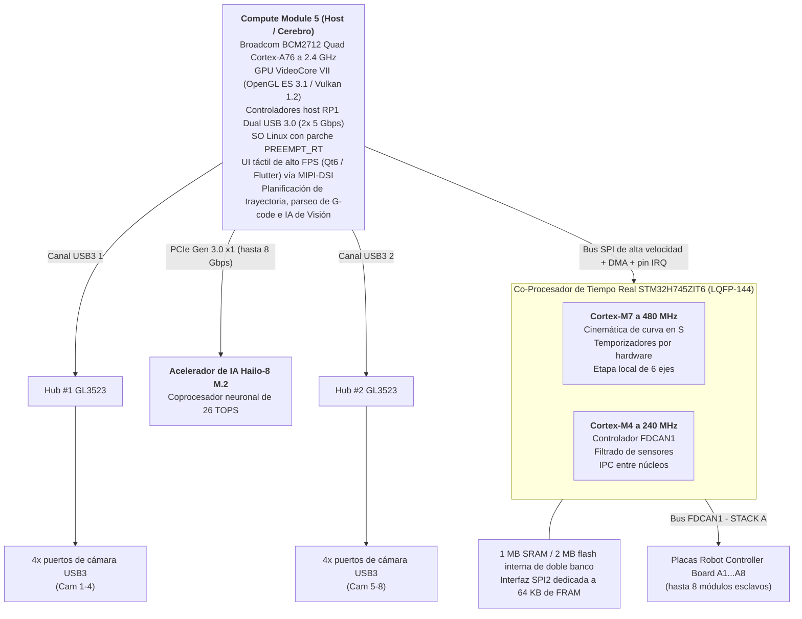
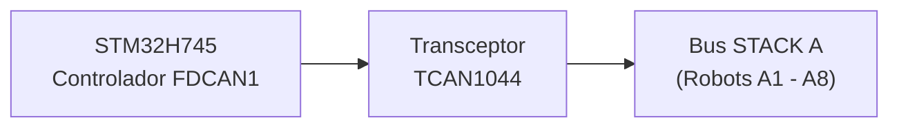
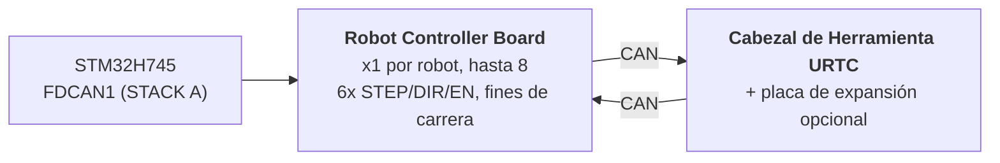

<p align="center">
  
</p>

# 🚀 ESPECIFICACIÓN TÉCNICA DE HYDRA-UMC
### 🤖 La Plataforma Definitiva de Micro-Fábrica de Doble Núcleo y Controlador Multi-Robot (V1.0 - Acelerador de IA Hailo-8 por PCIe y Doble Hub USB 3.0)

---

## 1. 🛠️ VISIÓN GENERAL DEL PROYECTO Y EL ECOSISTEMA MICRO-FÁBRICA

**HYDRA-UMC** (Universal Multi-axis Controller) es una plataforma de control distribuido de grado industrial y una arquitectura HMI de alto rendimiento diseñada para robótica celular multi-eje, micro-fábricas, fabricación automatizada y orquestación compleja de cabezales de herramienta.

Construida sobre una **Arquitectura Heterogénea de Host + Co-Procesador de Tiempo Real**, HYDRA-UMC desacopla el renderizado de interfaz de usuario de alto nivel, la visión por computador, la inferencia de IA y la conectividad en la nube, de la generación de pasos en tiempo real, la gestión del bus de campo y la actuación de la electrónica de potencia.



### 🤖 Capacidades de la Micro-Fábrica:
* 📡 **Red Multi-Robot Distribuida:** Coordina hasta 8 módulos robóticos esclavos distribuidos (p. ej., brazos robóticos Parol6, cabezales de herramienta y ejes auxiliares) conectados a través de un único bus físico FDCAN.
* 🧠 **Supercomputación de Visión Neuronal Embebida:** Coprocesador Hailo-8 M.2 por PCIe a bordo (26 TOPS) que permite detección de objetos multi-flujo YOLOv8/YOLO11, inspección de defectos y alineación de fiduciales PnP en tiempo real en las 8 cámaras.
* 📐 **Etapa Local de 6 Ejes:** Generación directa de pulsos step/dir/enable para 6 ejes locales (X, Y, Z, A, B, C) que accionan sistemas de posicionamiento cartesiano, indexadores o pórticos (gantries) locales.
* 🎯 **Integración con JuanenPNP y JuanenCNC:** Directamente compatible con sistemas de Pick-and-Place (estructuras de hardware LumenPNP) y unidades CNC equipadas con módulos de láser óptico de 10W para prototipado de PCB y colocación SMD.
* 👁️ **Matriz de Visión e Inspección Óctuple por Cámara:** Doble controlador USB 3.0 integrado que alimenta 8 puertos de cámara USB dedicados para alineación óptica pick-and-place con OpenCV en tiempo real, inspección térmica y monitorización remota de flujo de vídeo.
* ⚡ **Matriz de Actuación y Gestión Térmica:** Controla 16 canales industriales de MOSFET de lado bajo (8 válvulas electroneumáticas + 8 bombas de vacío/generadores venturi) y drivers de cama de alta corriente para soldadura por reflujo SMD o camas de impresión 3D.
* 🚜 **Plataformas Móviles JuanenBOT:** Arquitectura de comunicación escalable capaz de interconectar con plataformas de transporte de 4 ruedas de servicio pesado a 48V (chasis de 50x50x50 cm con ruedas omnidireccionales/mecanum para cargas de 100 kg).

---

## 2. 🖥️ SUBSISTEMA DE COMPUTACIÓN HOST (HMI Y ALTO NIVEL)

* 🧩 **Módulo:** Raspberry Pi Compute Module 5 (CM5)
* ⚙️ **Procesador:** Broadcom BCM2712 Quad-Core ARM Cortex-A76 a 2.4 GHz
* 🎮 **Motor Gráfico:** GPU VideoCore VII (OpenGL ES 3.1, Vulkan 1.2)
* 💾 **Memoria del Sistema:** 2 GB / 4 GB LPDDR4X (integrada en el CM5)
* 💽 **Almacenamiento de Alta Velocidad:** Flash eMMC integrada
* 🐧 **Sistema Operativo:** Linux de 64 bits (Raspberry Pi OS / Yocto parcheado con `PREEMPT_RT`)
* 📺 **Interfaz de Pantalla:** MIPI-DSI (2 carriles / 4 carriles) conectada a un panel táctil capacitivo de alta resolución (UI estilo Bambu Lab a 60 FPS)
* 🌐 **Suite de Conectividad:**
  * 🌐 1x Ethernet Gigabit (RJ45) para LAN industrial / streaming de vídeo RTSP / WebSockets / MQTT
  * 📶 Wi-Fi 6 y Bluetooth 5.4
  * 📷 **8x Puertos de Visión USB 3.0 / 2.0:** Alimentados por dos controladores Genesys Logic GL3523 a bordo.
  * 🎮 **2x Puertos HID USB 2.0:** Mando/ratón/teclado - ver sección 4a.

---

## 3. 🧠 SUBSISTEMA ACELERADOR DE IA POR PCIE (NPU HAILO-8)

* 🔌 **Interfaz Física:** Zócalo M.2 Key M a bordo (factor de forma 2242 / 2280) conectado directamente al bus PCIe Gen 2.0 / 3.0 x1 del CM5.
* 🚀 **Motor NPU:** Procesador de IA industrial Hailo-8 que entrega **26 TOPS** (Tera Operaciones Por Segundo) con un consumo por debajo de 5W.
* ⚡ **Integración de Software:** Suite oficial de software Hailo RT integrada con Raspberry Pi OS, ejecutando pipelines GStreamer y OpenCV para inferencia neuronal sin sobrecarga de CPU.

---

## 4. 📷 SUBSISTEMA DE VISIÓN DOBLE USB 3.0 (8x PUERTOS DE CÁMARA)

* 🎛️ **Controladores de Hub:** 2x circuitos integrados de hub USB 3.0 / SuperSpeed Genesys Logic `GL3523` integrados directamente en la placa base.
* 🔀 **Topología y Distribución:**
  * 🅰️ **Hub #1 (`GL3523-A`):** Conectado al PHY SuperSpeed USB3-0 nativo del CM5 (5 Gbps). Alimenta los puertos USB 1 a 4 (Cámaras A1-A4).
  * 🅱️ **Hub #2 (`GL3523-B`):** Conectado al PHY SuperSpeed USB3-1 nativo del CM5 (5 Gbps). Alimenta los puertos USB 5 a 8 (Cámaras A5-A8).
  * ℹ️ El CM5 expone estos 2 PHY SuperSpeed directamente (BCM2712) - no interviene ningún chip complementario RP1 (el RP1 es específico de la placa Raspberry Pi 5, no del CM5). Enrutado completo de señales a nivel de pin: `docs/PINOUT_CM5_CARRIER.TXT`.
* 🛡️ **Interruptor de Potencia y Protección de Circuito:** Protección VBUS individual por USB mediante interruptores de potencia de limitación de corriente de lado alto (`TPS2065` / `SY6280`) configurados para 500 mA - 1 A con reporte de fallos.
* ⚡ **Riel VBUS de Alta Corriente:** Alimentado por un regulador Step-Down dedicado de 24V a 5V (5V @ 6A continuos).

### 4a. 🎮 SUBSISTEMA HID USB 2.0 (2x PUERTOS PARA MANDO / RATÓN / TECLADO)

* 🎛️ **Controlador de Hub:** 1x pequeño circuito integrado de hub USB 2.0 (p. ej. Genesys Logic `GL850G` / `FE1.1s`, por confirmar) que reparte el único PHY USB 2.0 nativo del CM5 en 2 puertos físicos.
* ℹ️ **Por qué se necesita un hub:** la hoja de datos del CM5 (`docs/datasheets/Raspberry Pi CM5.pdf`, §2.5) confirma que el BCM2712 expone exactamente **un** puerto USB 2.0 (High Speed) en el conector DF40 (`USB_N`/`USB_P`, pines 103/105) - separado y distinto de los 2 PHY SuperSpeed USB 3.0 nativos ya dedicados a los hubs de cámara GL3523 (sección 4). Un único par físico no puede dividirse en 2 puertos sin un hub de por medio.
* 🔀 **Topología:** `USB_N`/`USB_P` (CM5) -> puerto ascendente del hub -> 2x puertos descendentes USB 2.0 Type-A (panel frontal/lateral, para mando, ratón o teclado - control manual de jog/teach-pendant y entrada HMI, independiente de la pantalla táctil).
* 📌 Enrutado completo de señales a nivel de pin: `docs/PINOUT_CM5_CARRIER.TXT` sección 1.

---

## 5. ⚡ SUBSISTEMA DE COPROCESAMIENTO EN TIEMPO REAL

* 🎛️ **Microcontrolador:** STMicroelectronics **STM32H745ZIT6** (MCU de doble núcleo optimizado en coste)
* 📦 **Encapsulado:** LQFP-144 (paso de pin de 0.5 mm)
* 🧠 **Arquitectura:** Multiprocesamiento Asimétrico de Doble Núcleo (AMP)
  * 🚀 **Núcleo 1 (Cortex-M7 a 480 MHz):** Motor de movimiento en tiempo real, generación de pulsos por hardware, perfiles de velocidad cinemáticos de curva en S, bucles de control PID.
  * 📡 **Núcleo 2 (Cortex-M4 a 240 MHz):** Gestión del protocolo FDCAN, filtrado de sensores analógicos, enclavamientos de seguridad y gestión de IPC entre núcleos.
* 💾 **Arquitectura de Memoria Interna:**
  * 💾 **2 MB** de flash interna de doble banco
  * 🧠 **1 MB** de SRAM interna total (512 KB AXI SRAM + 128 KB ITCM / 128 KB DTCM + SRAM1/SRAM2/SRAM3)
* 🧵 **RTOS:** **FreeRTOS**, una instancia independiente por núcleo (AMP, no SMP - sin estado de planificador compartido entre el Núcleo 1 y el Núcleo 2). Esqueleto de firmware: `src/mcu_stm32h745/`, ver `docs/architecture.md` sección 2.

---

## 6. 📡 COMUNICACIÓN DE BUS DE CAMPO DISTRIBUIDO (FDCAN ÚNICO)

La placa base actúa como controlador maestro para hasta 8 módulos robóticos esclavos individuales distribuidos a través de un único bus físico CAN:

* 🔌 **Periférico de Hardware:** 1x Controlador FDCAN por hardware nativo (`FDCAN1`) integrado directamente en el STM32H745, ejecutado en **modo CAN Clásico** (`FDCAN_FRAME_CLASSIC`, `BRS_OFF`) por la implementación real del bootloader - el periférico es un silicio con capacidad FD, pero el protocolo CAN-OTA/SPI-OTA que este proyecto realmente habla hoy (`docs/CANBUS_STM32H745.TXT`, `docs/CANBUS_STM32G474.TXT`) usa únicamente tramas clásicas (DLC máximo 8), igual que cualquier otro nivel (Placas Robot Controller Board G474, URTC). Los payloads BRS de 64 bytes de CAN FD son margen de hardware real para más adelante, no algo que el protocolo use todavía.
* ⚡ **Transceptor de Capa Física:** 1x Transceptor CAN FD de alta velocidad (p. ej., TI `TCAN1044AVD` / NXP `TJA1443`) - hardware con capacidad FD elegido por la misma razón de margen futuro que el periférico de arriba, aunque el tráfico de hoy sean tramas clásicas.
* 🔀 **Topología de Bus:**
  * 🅰️ **STACK A (`FDCAN1`):** Sirve a los Módulos Esclavos A1 a A8.
* ⏱️ **Especificaciones del Protocolo:** ~1 Mbps de bitrate nominal (CAN Clásico, payload máximo de 8 bytes por trama). La recuperación automática de bus-off está planificada para ser gestionada por el Cortex-M4 - todavía no implementada en el firmware de aplicación (el `main.c` actual del CM4 es un esqueleto de bring-up/parpadeo, ver `src/mcu_stm32h745/CM4/`), registrado como trabajo futuro real en vez de una capacidad ya entregada.
* 🔌 **Conector Físico:** Cabecera/zócalo de APILAMIENTO de 40 pines, paso de 2.54mm (+24V ×10 pines, GND ×10 pines, +5V ×4 pines auxiliares, FDCAN1 H/L, `BOARD_PRESENT_N`, 13 de repuesto) - las 8 Placas Robot Controller Board se APILAN físicamente una sobre otra en un lado de esta placa (topología CONFIRMADA, no un backplane), cada placa pasando directamente las 40 señales a lo que se monte encima. El direccionamiento de slot es un interruptor DIP LOCAL por placa (`BOARD_ID[2:0]`, README.md sección 12), no derivado de este conector. Tabla completa de pines y topología de apilamiento en `docs/PINOUT_STACKA_CONNECTOR.TXT`. Definición de conector idéntica tanto en el propio puerto del Kinematic Brain como en cada par de puertos de las Placas Robot Controller Board.



---

## 7. 💾 MEMORIA NO VOLÁTIL ULTRA-RÁPIDA (SPI FRAM)

Para garantizar cero pérdida de datos y recuperación instantánea de estado durante interrupciones de emergencia de energía:

* 🧪 **Circuito de Memoria:** Cypress/Infineon `FM25V05-G` / Fujitsu `MB85RS64` (64 KB de SPI FRAM)
* ⚡ **Interfaz de Bus:** Bus SPI2 dedicado de hasta 40 MHz.
* ♾️ **Durabilidad:** Resistencia infinita (10^14 ciclos) con latencias de escritura del orden de nanosegundos.
* 🛡️ **Secuencia Anti-Pérdida de Energía (PVD):** El Detector de Voltaje de Potencia (PVD) interno monitoriza el riel de 3.3V. Al detectar una caída de tensión, una Interrupción No Enmascarable (NMI) vuelca los vectores de encoder, las máquinas de estado activas y las coordenadas a la FRAM en menos de **5 microsegundos** antes del apagado de la alimentación.

---

## 8. 🦾 SUITE LOCAL DE MOVIMIENTO, ACTUACIÓN Y SENSORES

### ⚙️ Salidas de Movimiento
* 🎯 **Ejes Soportados:** Etapa Local de 6 Ejes - pórtico (gantry) de doble Y más ejes de herramienta (`X`, `Y1`, `Y2`, `Z`, `E0`, `E1`), accionados por 6x drivers de motor paso a paso TMC5160A en cadena margarita SPI.
* ⚡ **Señales:** CMOS 3.3V (`STEP`, `DIR`, `ENABLE`), cadena margarita SPI4 compartida a los 6 drivers.
* ⏱️ **Temporizadores:** Temporizadores de Control Avanzado (`TIM1` para X/Y1/Y2/Z, `TIM8` para E0/E1) con generación de pulsos por hardware.
* 🛑 **Fines de Carrera:** 12x entradas, 2 por eje (MIN + MAX).
* 📌 Asignación completa de pines: `docs/PINOUT_STM32H745_KINEMATIC_BRAIN.TXT`.

### 🔌 Actuadores de Potencia y Fluídicos
* 🔀 **20x Canales de Conmutación de Lado Bajo:** Salidas industriales de MOSFET canal N con protección flyback.
  * 🧲 **8+2 Canales:** Bombas de vacío / generadores venturi de Pick-and-Place.
  * 💨 **8+2 Canales:** Válvulas electroneumáticas (accionamiento 5V/24V).
* 💨 **Ventiladores:** 3x ventiladores de 3 hilos (alimentación conmutada por PWM vía MOSFET de lado bajo + detección de tacómetro por canal).
* 🌡️ **Gestión Térmica:**
  * 🔥 1x salida de control de relé de estado sólido para la Cama Caliente, conmutando **red eléctrica de 230VAC** - aislado ópticamente de los dominios del MCU/lógica; este es un circuito de tensión de red y necesita una separación/distancia de fuga real en la PCB, no una huella propia de bus de 24V.
  * 🌡️ 2x entradas analógicas de termistor NTC de precisión (cama caliente) muestreadas por `ADC1`.

---

## 9. 🔌 DISTRIBUCIÓN Y REGULACIÓN DE POTENCIA

La placa opera desde un único bus de alimentación industrial de **24V DC**:

* ⚡ **Entrada Principal DC:** 24V DC ±10%
* 🔋 **Dominio de Potencia Principal a 5V:** Regulador buck síncrono step-down que suministra **5A continuos** para el módulo CM5, la retroiluminación de la pantalla táctil y la lógica a bordo.
* 📷 **Dominio de Potencia VBUS USB a 5V:** Regulador buck síncrono dedicado que suministra **6A continuos** exclusivamente para los 8 puertos de cámara USB 3.0 y los controladores de hub GL3523.
* 🎛️ **Dominio de Potencia a 3.3V:** Regulador de bajo ruido que suministra **4A continuos** (dimensionado para el STM32, la FRAM, los transceptores y el riel de 3.3V del zócalo M.2 Hailo-8).

---

## 10. 🔄 COMUNICACIÓN ENTRE PROCESADORES (IPC)

La comunicación entre el CM5 (Host) y el STM32H745 (Co-Procesador) utiliza un enlace SPI de copia cero asistido por hardware:

* 🔗 **Transporte Físico:** SPI1 full-duplex funcionando hasta a 50 MHz en Modo Esclavo en el STM32 y Modo Maestro en el CM5.
* 🤝 **Línea de Handshake:** Línea GPIO `HYDRA_DATA_READY`.
* ⚡ **Flujo de Ejecución:** El Cortex-M4 prepara una trama de telemetría de 128 bytes en la SRAM AXI compartida, activa `HYDRA_DATA_READY`, y el CM5 recoge el paquete vía DMA de SPI de alta velocidad sin sobrecarga de sondeo (polling).

---

## 11. 🎛️ ESPECIFICACIONES DE HARDWARE DE LA PCB DE 4 CAPAS

* 📐 **Factor de Forma:** Placa Base Industrial Monolítica.
* 🥞 **Apilamiento de Capas (4 Capas):**
  * 🟢 **Capa 1 (Superior):** Colocación de componentes, señales de alta frecuencia, pares diferenciales USB SuperSpeed de 90 ohmios, pares PCIe Gen 3.0 de 85 ohmios.
  * 🛡️ **Capa 2 (Interna 1):** Plano de Masa (`GND`) sólido continuo.
  * ⚡ **Capa 3 (Interna 2):** Planos de Potencia divididos (`24V`, `5V_MAIN`, `5V_USB`, `3.3V`).
  * 🔴 **Capa 4 (Inferior):** Pistas de señal secundarias y salidas de potencia de alta corriente.
* 🛠️ **Conectores y Ensamblaje:**
  * 🔲 Encapsulado LQFP-144 (paso 0.5 mm) para el STM32H745, encapsulados QFN-88 para los 2 hubs GL3523, y zócalo M.2 Key M 2242/2280 para el Hailo-8.
  * 🔌 Doble conector mezzanine Hirose DF40 para el Compute Module 5.
  * 📌 Cabecera de APILAMIENTO de 40 pines, paso 2.54 mm, para la conexión al bus STACK A (base de la pila física de Placas Robot Controller Board) - `docs/PINOUT_STACKA_CONNECTOR.TXT`.
  * 🔌 8x conectores USB 3.0 Type-A (o de enganche industrial Hirose) para las cámaras de robot.

---

## 12. 🦾 PLACAS ROBOT CONTROLLER BOARD Y CABEZAL DE HERRAMIENTA URTC (NIVEL DISTRIBUIDO)

Cada uno de los hasta 8 módulos esclavos en STACK A (sección 6) es una **Robot
Controller Board**: una por robot, accionando los propios 6 ejes de ese robot
(STEP/DIR/ENABLE), leyendo sus fines de carrera, y reenviando el tráfico de su
propio cabezal de herramienta un salto más lejos a través de una *segunda*
conexión CAN hacia una placa **URTC** (Universal Robot Tool Controller - ver
el repositorio hermano `URTC`) montada en el cabezal del robot, opcionalmente
con su propia placa de expansión.



* 🎛️ **MCU:** STMicroelectronics **STM32G474RET6** (Cortex-M4 a 170 MHz,
  LQFP-64, 512 KB de flash), usando 2 de sus 3 periféricos FDCAN a bordo - uno
  como el enlace ascendente FDCAN hacia el STM32H745, otro como el enlace
  descendente CAN hacia su propio cabezal URTC. Ver `docs/architecture.md`
  §1.
* 🔢 **Direccionamiento:** `BOARD_ID[2:0]` - un interruptor DIP local de 3
  posiciones en cada placa, ajustado manualmente de 0 a 7 en el momento de la
  instalación, le da a cada placa su propia base de slot FDCAN1 - no derivado
  de la posición física en la pila ni del conector STACK A (cada placa es la
  misma PCB intercambiable). Ver
  `docs/PINOUT_STM32G474_ROBOT_CONTROLLER.TXT` §1c.
* 🧵 **RTOS:** **FreeRTOS** (su bootloader permanece bare-metal - no se
  necesita planificador para recibir/verificar/saltar). Esqueleto de
  firmware: `src/mcu_stm32g474/`.
* 📡 **Actualizaciones de firmware CAN-OTA, 4 niveles de profundidad:** el
  propio STM32H745 (a través de su enlace SPI existente hacia el CM5), esta
  placa, su Cabezal de Herramienta URTC (STM32F303CCT6), y - solo cuando está
  instalada - la propia Placa de Expansión Avanzada de ese cabezal
  (STM32F303CBT6, `expansion_board_type` 3 o 4, ver el propio
  `docs/EXPANSION.TXT` de URTC) pueden flashearse y diagnosticarse todos
  desde el Flasher/Tester de HYDRA-UMC-STUDIO sin sonda JTAG/SWD y sin
  dongle USB-CAN. Esquema completo de direccionamiento, el túnel de relevo
  que alcanza los últimos 2 niveles sin ningún diseño de protocolo nuevo, y
  el estado actual de la implementación: `docs/architecture.md`.

Ver `docs/architecture.md` para la arquitectura completa de niveles (esta
sección es un resumen), incluyendo lo que está confirmado como hecho de
hardware frente a lo que sigue siendo un diseño propuesto pendiente de
implementación. La sección 8 de ese documento también registra las
limitaciones de seguridad conocidas y aceptadas de los bootloaders actuales
(todavía sin Protección de Lectura, un valor de bypass anti-rollback
compartido, lectura sin autenticar) - vacíos deliberados previos al hardware,
no descuidos.

---

## 📂 ESTRUCTURA DEL DIRECTORIO DEL REPOSITORIO

```text
HYDRA-UMC/
├── .vscode/                    # Extensiones recomendadas + tareas de build - ver "Entorno de Desarrollo" abajo
├── docs/
│   ├── datasheets/             # Hojas de datos de los componentes usados en cada placa de este repositorio
│   ├── architecture.md         # La arquitectura del sistema de 4 niveles (empezar aquí)
│   ├── COMPILE_STM32G474.TXT   # Referencia de compilación del firmware de la Robot Controller Board
│   ├── COMPILE_STM32H745.TXT   # Referencia de compilación del firmware del Kinematic Brain (doble núcleo)
│   ├── PINOUT_STM32H745_KINEMATIC_BRAIN.TXT    # Asignación completa de pines del Kinematic Brain
│   ├── PINOUT_STM32G474_ROBOT_CONTROLLER.TXT   # Asignación completa de pines de la Robot Controller Board
│   ├── PINOUT_CM5_CARRIER.TXT                  # Enrutado de señales del subsistema host CM5
│   ├── PINOUT_STACKA_CONNECTOR.TXT             # Conector de apilamiento compartido STACK A de 40 pines
│   ├── CANBUS_STM32H745.TXT                    # Protocolo a nivel de cable del Kinematic Brain (SPI1/buzón/FDCAN1-maestro)
│   ├── CANBUS_STM32G474.TXT                    # Protocolo a nivel de cable de la Robot Controller Board (FDCAN1-esclavo/FDCAN2)
│   └── HYDRA-UMC_*.txt/TXT     # Documentos antiguos - varios superados, ver el propio encabezado de cada archivo
├── hardware/
│   ├── PCB/
│   │   ├── kinematic_brain_stm32h745/          # Placa madre principal - sin esquemático todavía, ver su propio README
│   │   └── robot_controller_board_stm32g474/   # Placa por robot - sin esquemático todavía, ver su propio README
│   └── gerbers/                # Archivos de salida de fabricación (vacío hasta que se diseñe una placa)
├── src/                         # Misma convención de estructura que el repositorio hermano URTC: src/ es la FUENTE
│   ├── cm5_host/                # Aplicaciones Linux userspace que corren ENCIMA de la propia imagen de os/
│   │   ├── hmi_qt6/             # Shell kiosco Qt6 que envuelve el propio panel de HYDRA-UMC-STUDIO
│   │   ├── ai_inference/        # Pipeline Hailo-8 TAPPAS / YOLOv8
│   │   ├── video_streamer/      # Servidor RTSP/WebRTC multi-cámara (MediaMTX)
│   │   └── ipc_driver/          # Enlace SPI CM5 <-> STM32H745 (userspace)
│   ├── mcu_stm32h745/           # Firmware del Kinematic Brain (Nivel 0) - doble núcleo
│   │   ├── CM7/                 # Motor de movimiento, temporizadores por hardware (+ su propio boot/)
│   │   ├── CM4/                 # Drivers FDCAN, filtrado de sensores (+ su propio boot/)
│   │   └── Common/              # Buzón IPC de memoria compartida CM7<->CM4 (ipc_mailbox.h) - implementado, usado por los bootloaders de ambos núcleos
│   └── mcu_stm32g474/           # Firmware de la Robot Controller Board (Nivel 1) - un solo núcleo, + su propio boot/
├── os/                          # Imagen de SO del CM5 - elección de SO base, unidades systemd, aprovisionamiento de primer arranque
├── images/                      # Banner del README + icono + splashscreen (SVG)
├── build_firmware.sh            # Compila cada objetivo de firmware MCU de arriba desde una copia limpia (Linux/Mac)
├── build_firmware.bat           # La misma compilación, Windows (ver "Compilando el Firmware" abajo)
├── generate_manifest.py         # Regenera firmware/firmware_manifest.json (versiones/CRC32) tras una compilación completa
├── firmware/                    # Salida de compilación comiteada (.bin/.hex/.elf + manifest) - NO en gitignore, misma convención que la propia carpeta de salida de URTC, ver "Compilando el Firmware" abajo
├── README.md                    # Este archivo
└── README_spa.md / README_ita.md / README_fra.md / README_deu.md    # <- traducciones
```

Ver `docs/architecture.md` para lo que realmente hace cada nivel y cómo se
conectan; cada carpeta de arriba con su propio `README.md` tiene más detalle
que este resumen de nivel superior.

## 🛠️ ENTORNO DE DESARROLLO

Lo que las propias máquinas de desarrollo de este proyecto tienen realmente
instalado y verificado funcionando (`build_firmware.sh`/`build_firmware.bat`,
objetivos `g474`/`h745`/por defecto, 0 errores) - no una lista teórica:

* 🔧 **ARM GNU Toolchain** (`arm-none-eabi-gcc` 10.3+) - compila cada objetivo
  de firmware MCU. No se usan ni se requieren archivos de proyecto
  STM32CubeIDE/CubeMX para compilar -
  `build_firmware.sh`/`build_firmware.bat` obtiene las propias fuentes
  HAL/CMSIS de ST directamente de sus repositorios oficiales de GitHub y
  ejecuta el compilador directamente, la misma filosofía que ya estableció
  el propio `build_firmware.sh`/`build_firmware.bat` del repositorio hermano
  `URTC`.
* 🧩 **VS Code + extensiones** (`.vscode/extensions.json` lista todas
  estas): [STM32 VS Code Extension](https://marketplace.visualstudio.com/items?itemName=stmicroelectronics.stm32-vscode-extension)
  (integración de proyecto/compilación/depuración), **Cortex-Debug**
  (depuración SWD/JTAG - independiente de `build_firmware.sh`, útil cuando
  exista hardware real), **CMake Tools** (para el propio proyecto CMake de
  `src/cm5_host/hmi_qt6/`), **C/C++** (IntelliSense en cada archivo fuente de
  firmware/host), **Python** (scripts del pipeline de `ai_inference/`),
  **Hex Editor** (inspeccionar la salida de firmware `.bin`), **YAML**
  (configuración propia de MediaMTX de `video_streamer/`). Abre el
  repositorio, acepta el aviso de extensiones recomendadas, y usa
  **Terminal → Run Task** para las tareas de compilación ya preconfiguradas
  (`.vscode/tasks.json`).
* 🗂️ **git** - tanto para este propio repositorio como para el propio
  vendoring de tags fijos de los paquetes HAL/CMSIS de ST que hace
  `build_firmware.sh` (cacheado bajo `build/`, en gitignore, vuelto a obtener
  con `--clean`).

## 🏗️ COMPILANDO EL FIRMWARE

**Linux/Mac:**
```bash
./build_firmware.sh          # compila cada objetivo MCU (Robot Controller Board + Kinematic Brain, ambos núcleos)
./build_firmware.sh g474     # solo Robot Controller Board
./build_firmware.sh h745     # solo Kinematic Brain (ambos núcleos)
./build_firmware.sh --clean  # borra primero la caché de HAL/CMSIS obtenida
```

**Windows:**
```bat
build_firmware.bat          :: compila cada objetivo MCU (Robot Controller Board + Kinematic Brain, ambos núcleos)
build_firmware.bat g474     :: solo Robot Controller Board
build_firmware.bat h745     :: solo Kinematic Brain (ambos núcleos)
build_firmware.bat --clean  :: borra primero la caché de HAL/CMSIS obtenida
```

`build_firmware.bat` es la misma compilación que `build_firmware.sh`
traducida a batch (mismos pasos, mismas versiones fijas de HAL/CMSIS, mismo
reporte pass/warn/fail) - ejecutada de principio a fin en una máquina
Windows real con el [Arm GNU
Toolchain](https://developer.arm.com/downloads/-/arm-gnu-toolchain-downloads)
instalado y `arm-none-eabi-gcc` en el `PATH`: cada módulo HAL, ambos
bootloaders, y cada aplicación se compilaron y enlazaron limpio, y
`firmware_manifest.json` se regeneró con CRC32s que coinciden con la propia
salida de la compilación de Linux/Mac. Requiere las mismas herramientas que
el script de Linux/Mac: el Arm GNU Toolchain, `git` (para obtener las propias
fuentes HAL/CMSIS de ST), y `python` para el paso del manifest.

**Compilación manual (cualquier SO, sin el script):** el script automatiza
exactamente los pasos de `docs/COMPILE_STM32G474.TXT` y
`docs/COMPILE_STM32H745.TXT` - obtiene las fuentes fijas de
HAL/CMSIS/FreeRTOS listadas al principio de
`build_firmware.sh`/`build_firmware.bat`, compila los módulos HAL y los
archivos de arranque/sistema de cada objetivo con `arm-none-eabi-gcc` (las
flags/listas de módulos están listadas en ese mismo script), luego enlaza
cada bootloader y aplicación contra su propio script de enlazado (`*.ld`,
junto a su fuente) con `arm-none-eabi-gcc`/`-Wl,--gc-sections` y convierte con
`arm-none-eabi-objcopy` a `.bin`/`.hex`. Esos dos archivos
`docs/COMPILE_*.TXT` son la referencia autoritativa paso a paso si prefieres
no ejecutar ninguno de los scripts - los scripts existen para automatizarlos,
no para reemplazarlos como fuente de verdad.

La salida termina en `firmware/`, que está comiteada y subida a este
repositorio (misma convención que la propia carpeta de salida `firmware/` de
URTC) para que la función de descarga desde GitHub de HYDRA-UMC-STUDIO pueda
encontrar de verdad archivos `.bin` reales ahí vía
`firmware_manifest.json` - NO está en gitignore.
Ver `docs/COMPILE_STM32G474.TXT` y `docs/COMPILE_STM32H745.TXT` para
exactamente qué hace cada paso y por qué - y el propio `README.md` de cada
carpeta de firmware para el estado actual. Los **bootloaders** de los 3
objetivos (G474, H745 CM7, H745 CM4) son implementaciones reales y
funcionales de CAN-OTA/SPI-OTA (verificación CRC32 + HMAC-SHA256,
verificar-en-el-slot-de-respaldo-antes-de-copiar-al-principal, la misma
disciplina anti-brickeo que el propio bootloader de URTC) - compilando limpio
de principio a fin, todavía no verificados contra hardware real. Las
**aplicaciones** siguen siendo pruebas de humo FreeRTOS de GPIO-toggle
verificadas por compilación, todavía no el firmware real de
movimiento/visión/relé. Ver `docs/architecture.md` (especialmente la tabla
de estado de la sección 6 y las limitaciones de seguridad conocidas y
aceptadas de la sección 8) para exactamente qué es real frente a lo que
sigue abierto.

## 🔗 Proyectos Relacionados

Este proyecto forma parte de un ecosistema de robótica más amplio del mismo autor (JuanenRac / Electro Hobby 3D). Vale la pena conocerlo, ya que una petición podría en realidad tratarse de uno de estos en vez de este repositorio:

**Plataforma HYDRA-UMC** — la celda de micro-fábrica multi-robot
- **HYDRA-UMC** *(este repositorio)* — la propia placa madre: host Raspberry Pi CM5 + co-procesador de tiempo real STM32H745 de doble núcleo, orquestando hasta 8 brazos de robot distribuidos vía CAN-OTA/SPI-OTA. Hardware + firmware propios, GPL-3.0/CERN-OHL-S v2/CC BY-SA 4.0.
- **[HYDRA-UMC STUDIO](https://github.com/JuanenRac/HYDRA-UMC-STUDIO)** — panel de control basado en web para HYDRA-UMC: visualización 3D multi-robot, grabación de cinemática/trayectoria, flasheo y pruebas CAN-OTA para toda la plataforma. React + Vite + Three.js.
- **[HYDRA-UMC-ANDROID-CONTROL](https://github.com/JuanenRac/HYDRA-UMC-ANDROID-CONTROL)** — app de control Android para HYDRA-UMC vía Wi-Fi/Bluetooth. App real y funcional - conjunto completo de funciones de control remoto, autenticación JWT, almacenamiento cifrado de credenciales.
- **[HYDRA-UMC-IOS-CONTROL](https://github.com/JuanenRac/HYDRA-UMC-IOS-CONTROL)** — app de control iOS/iPadOS para HYDRA-UMC vía Wi-Fi, construida en Flutter (multiplataforma, verificable en Windows sin necesidad de un Mac; el empaquetado final `.ipa` todavía necesita Xcode). App real y funcional - mismo conjunto de funciones que la app de Android.
- **[HYDRA-UMC-SUITE](https://github.com/JuanenRac/HYDRA-UMC-SUITE)** — centro de mando de enjambre de escritorio (Python/PySide6): descubrimiento de red multi-controlador, sincronización bidireccional en vivo, viewport 3D de robot real, espacio de trabajo acoplable estilo Photoshop. Real y funcional, no un placeholder.
- **[HYDRA-UMC-EDITOR-URDF](https://github.com/JuanenRac/HYDRA-UMC-EDITOR-URDF)** — creador/editor gráfico de URDF de escritorio (Python/PySide6) para el propio catálogo de modelos de este proyecto: obtiene archivos fuente desde GitHub o una carpeta local, valida la viabilidad de los grados de libertad (DOF), edita color/escala/cinemática con una vista previa 3D en vivo, y publica el resultado final a un servidor STUDIO en ejecución. Real y funcional, no un placeholder.
- **[HYDRA-UMC-DSI](https://github.com/JuanenRac/HYDRA-UMC-DSI)** — planificado: una UI táctil nativa para la propia pantalla táctil DSI de 7" (1280×800) de HYDRA-UMC en el Compute Module 5, controlando este mismo servidor directamente desde la placa. Todavía no iniciado.

**Plataforma URTC** — el controlador de cabezal de herramienta que porta cada brazo de robot HYDRA-UMC
- **[URTC](https://github.com/JuanenRac/URTC)** — Universal Robot Tool Controller: controlador de cabezal de herramienta por bus CAN basado en STM32F303, 25 perfiles de herramienta completamente implementados, actualización de firmware CAN-OTA.
- **[URTC Flasher](https://github.com/JuanenRac/URTC-FLASHER)** — herramienta de escritorio de flasheo CAN-OTA + chip completo SWD/JTAG para placas URTC (Windows/Linux).
- **[URTC Tester](https://github.com/JuanenRac/URTC-TESTER)** — herramienta de escritorio de diagnóstico de bus CAN en vivo para placas URTC, un panel por perfil de herramienta (Windows/Linux).
- **[URTC Web Studio](https://github.com/JuanenRac/URTC-WEB-STUDIO)** — alternativa basada en navegador a las 2 herramientas de escritorio de arriba (Web Serial API + SLCAN), sin instalación local necesaria.

## 👤 Autor

**JuanenRac** (Electro Hobby 3D)
📧 electrohobby3d@gmail.com
📺 youtube.com/@electrohobby3d

## 📜 Licencia y Avisos de Copyright

HYDRA-UMC es (c) 2026 JuanenRac (Electro Hobby 3D). Este aviso debe incluirse en cualquier distribución de este proyecto o trabajos derivados.

Dado que este proyecto consiste en varios tipos de contenido distintos, cada parte individual se pone a disposición bajo licencias diferentes - cada una adecuada a lo que realmente cubre, en vez de forzar una única licencia a cubrirlo todo:

1. El **firmware** ubicado en `./firmware` (tanto la aplicación como el bootloader CAN) está disponible bajo la **GNU General Public License v3.0 (GPL-3.0)**. Texto completo en https://www.gnu.org/licenses/gpl-3.0.html.

2. Los **diseños de hardware** (archivos de esquemático/placa Eagle, gerbers, y las piezas imprimibles en 3D bajo `./hardware` y `./3D`) están disponibles bajo la **CERN Open Hardware Licence v2 - Strongly Reciprocal (CERN-OHL-S v2)**. Texto completo en https://cern-ohl.web.cern.ch/.

3. La **documentación** (este README, el manual de servicio, y los archivos de referencia bajo `./docs`) está disponible bajo **Creative Commons Attribution-ShareAlike 4.0 International (CC BY-SA 4.0)**. Texto completo en https://creativecommons.org/licenses/by-sa/4.0/.

Si construyes sobre este proyecto, ten en cuenta la separación de licencias: los cambios de código al firmware deberían mantenerse GPL-3.0, las modificaciones de hardware deberían mantenerse CERN-OHL-S, y los derivados de documentación deberían mantenerse CC BY-SA - cada uno con atribución de vuelta a este proyecto.
