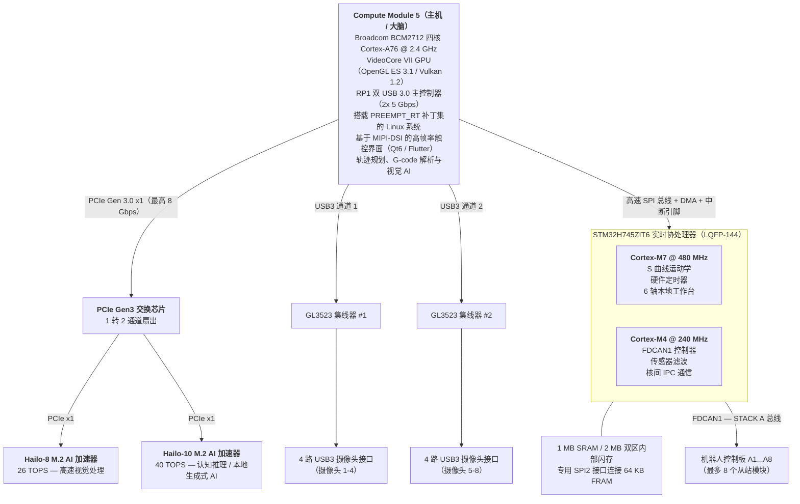
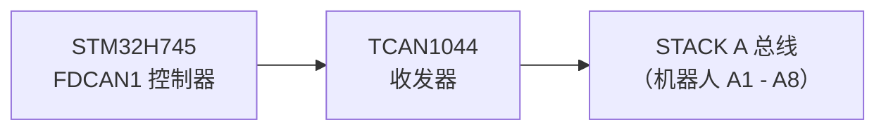
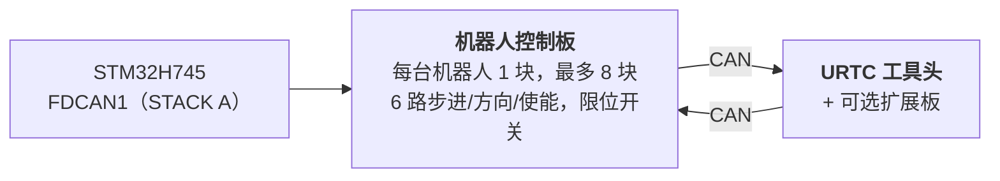

<p align="center">
  
</p>

# 🚀 HYDRA-UMC 技术规格说明

<p align="center">
  <a href="README.md">🇺🇸 English</a> |
  <a href="README_spa.md">🇪🇸 Español</a> |
  <a href="README_fra.md">🇫🇷 Français</a> |
  <a href="README_ita.md">🇮🇹 Italiano</a> |
  <a href="README_deu.md">🇩🇪 Deutsch</a> |
  🇨🇳 <b>简体中文</b> |
  <a href="README_jpn.md">🇯🇵 日本語</a>
</p>

### 🤖 终极双核微工厂与多机器人控制器平台（V1.0 — 双 PCIe Hailo-8 + Hailo-10 AI 加速器 与 双 USB 3.0 集线器）

<p align="left">
  
  
  
  
  
</p>


---

## 1. 🛠️ 项目概述与微工厂生态系统

**HYDRA-UMC**（Universal Machines Controller，通用多轴控制器）是一套工业级分布式控制平台与高性能 HMI 架构，专为多轴单元机器人、微工厂、自动化制造以及复杂工具头编排而设计。

HYDRA-UMC 基于 **异构主机 + 实时协处理器架构** 构建，将高层用户界面渲染、计算机视觉、AI 推理与云端连接，同实时步进脉冲生成、现场总线管理及功率电子驱动完全解耦。



### 🤖 微工厂能力：
* 📡 **分布式多机器人网络：** 通过单一物理 FDCAN 总线，协调多达 8 个分布式从属机器人模块（目前支持 3、4、5、6 自由度；未来版本将扩展至 7、8、9 自由度及双机器人架构）。
* 🧠 **双嵌入式神经协处理：** 板载 PCIe Gen3 交换芯片将 CM5 的单条 PCIe 通道扇出为 2 个 M.2 AI 加速器 —— 一颗 Hailo-8（26 TOPS）负责多路 YOLOv8/YOLO11 目标检测、缺陷检测，以及全部 8 路摄像头的实时 PnP 基准点对齐；一颗 Hailo-10（40 TOPS）负责本地设备端的认知推理与生成式 AI（量化后的 LLM/VLA 模型），无需回传云端。
* 📐 **本地 6 轴工作台：** 为 6 个本地轴（X、Y1、Y2、Z、E0、E1）直接生成 步进/方向/使能 脉冲，服务于辅助需求：额外机器人、ATC（自动换刀装置）转塔、传送带同步或 XYZ 工作台龙门架。
* 🎯 **JuanenPNP 与 JuanenCNC 集成：** 直接兼容 Pick-and-Place 系统（LumenPNP 硬件结构）以及配备 10W 光学激光模块的 CNC 设备，用于 PCB 原型制作与 SMD 贴装。
* 👁️ **八路摄像头视觉与检测矩阵：** 集成双 USB 3.0 控制器，驱动 8 个专用 USB 摄像头接口，用于实时 OpenCV Pick-and-Place 光学对位、热成像检测及远程视频流监控。
* ⚡ **驱动矩阵与热管理：** 控制 16 路工业级低边 MOSFET 通道（8 路电磁气动阀 + 8 路真空泵/文丘里发生器）以及用于 SMD 回流焊或 3D 打印热床的大电流加热床驱动。
* 🚜 **JuanenBOT 移动平台：** 可扩展的通信架构，能够对接重载 48V 四轮运输平台（50x50x50 cm 车架，配备全向轮/麦克纳姆轮，可承载 100 kg 负载）。

---

## 2. 🖥️ 主机计算子系统（HMI 与高层处理）

* 🧩 **模块：** Raspberry Pi Compute Module 5（CM5）
* ⚙️ **处理器：** Broadcom BCM2712 四核 ARM Cortex-A76 @ 2.4 GHz
* 🎮 **图形引擎：** VideoCore VII GPU（OpenGL ES 3.1、Vulkan 1.2）
* 💾 **系统内存：** 2 GB / 4 GB LPDDR4X（CM5 集成）
* 💽 **高速存储：** 板载 eMMC 闪存
* 🐧 **操作系统：** Linux 64 位（Raspberry Pi OS / Yocto，打有 `PREEMPT_RT` 补丁）
* 📺 **显示接口：** MIPI-DSI（2 线 / 4 线），连接高分辨率电容触控面板（Bambu Lab 风格 UI，60 FPS）
* 🌐 **连接组件：**
  * 🌐 1 路千兆以太网（RJ45），用于工业局域网 / RTSP 视频流 / WebSocket / MQTT
  * 📶 Wi-Fi 6 与蓝牙 5.4
  * 📷 **8 路 USB 3.0 / 2.0 视觉接口：** 由板载双 Genesys Logic GL3523 控制器驱动。
  * 🎮 **2 路 USB 2.0 HID 接口：** 手柄 / 鼠标 / 键盘 —— 见第 4a 节。

---

## 3. 🧠 PCIE AI 加速子系统（HAILO-8 + HAILO-10 双 NPU）

* 🔀 **PCIe 扇出：** CM5 连接器仅暴露 **一条** PCIe Gen 2.0/3.0 x1 通道（已对照 CM5 数据手册 Table 5 确认，`docs/PINOUT_CM5_CARRIER.TXT`）——不足以直接连接 2 个 M.2 AI 加速器。板载 PCIe Gen3 数据包交换芯片（候选方案：ASMedia ASM2806 系列或同等产品，具体型号待定 —— 需为 Gen3 规格，以避免 Hailo-10 链路速率低于其原生速度）将 CM5 侧的单条通道扇出为 2 条独立的下游 PCIe x1 通道，分别连接下方的两个 M.2 插槽。
* 🔌 **物理接口：** 板载 2 个 M.2 Key M 插槽（2242 / 2280 尺寸），各自连接至上述 PCIe 交换芯片自身的一个下游端口 —— 而非直接连接 CM5。
* 🚀 **NPU 引擎 1 — Hailo-8（高速感知）：** Hailo-8 工业级 AI 处理器，功耗低于 5W，算力达 **26 TOPS**（每秒万亿次运算）。负责全部 8 路摄像头（第 4 节）的多路 YOLOv8/YOLO11 目标检测、缺陷检测及实时 PnP 基准点对齐 —— 沿用既有加速器，角色不变。
* 🧠 **NPU 引擎 2 — Hailo-10（认知推理 / 本地生成式 AI）：** 与 Hailo-8 并存，而非替代。算力达 **40 TOPS**，可在本地私密运行量化后的 LLM 与 Vision-Language-Action（VLA）模型 —— 将操作员的自然语言/语音指令转换为运动学轨迹，并在机器人执行任务失败时进行语义级错误恢复，全程无需连接任何外部云服务。这一认知角色与 HYDRA-UMC 生态系统其余部分（同族项目 HYDRA-UMC-COGNITIVE-NODE）中 Hailo-10 已确立的定位一致。
* ⚡ **软件集成：** 官方 Hailo RT 软件套件已针对两颗加速器与 Raspberry Pi OS 完成集成，执行 GStreamer/TAPPAS 管线与 OpenCV，实现 Hailo-8 的零 CPU 开销视觉推理；Hailo-10 自身的 LLM/VLA 运行时集成仍处于设计阶段（见 `src/cm5_host/ai_inference/README.md`）。
* ⚠️ **待定事项：** PCIe 交换芯片的具体型号，以及 Hailo-10 自身的真实功耗，均仍待确定 —— 见 `hardware/PCB/kinematic_brain_stm32h745/BOM.TXT` 第 05 项与第 09 项。

---

## 4. 📷 双 USB 3.0 视觉子系统（8 路摄像头接口）

* 🎛️ **集线器控制器：** 2 颗 Genesys Logic `GL3523` USB 3.0 / SuperSpeed 集线器芯片，直接集成于主板之上。
* 🔀 **拓扑与分配：**
  * 🅰️ **集线器 #1（`GL3523-A`）：** 连接至 CM5 原生 USB3-0 SuperSpeed PHY（5 Gbps）。为 USB 端口 1 至 4（摄像头 A1-A4）供电供数据。
  * 🅱️ **集线器 #2（`GL3523-B`）：** 连接至 CM5 原生 USB3-1 SuperSpeed PHY（5 Gbps）。为 USB 端口 5 至 8（摄像头 A5-A8）供电供数据。
  * ℹ️ CM5（BCM2712）直接暴露这两路 SuperSpeed PHY —— 无需 RP1 协处理芯片参与（RP1 是 Raspberry Pi 5 主板专属，CM5 上不存在）。完整引脚级信号走线见 `docs/PINOUT_CM5_CARRIER.TXT`。
* 🛡️ **电源开关与电路保护：** 每路 USB VBUS 均通过高边限流电源开关（`TPS2065` / `SY6280`）单独保护，配置为 500 mA - 1 A 并具备故障报告功能。
* ⚡ **大电流 VBUS 供电轨：** 由专用 24V 转 5V 降压稳压器供电（5V @ 持续 6A）。

### 4a. 🎮 USB 2.0 HID 子系统（2 路手柄 / 鼠标 / 键盘接口）

* 🎛️ **集线器控制器：** 1 颗小型 USB 2.0 集线器芯片（例如 Genesys Logic `GL850G` / `FE1.1s`，具体型号待定），将 CM5 单一原生 USB 2.0 PHY 扇出为 2 个物理端口。
* ℹ️ **为何需要集线器：** CM5 数据手册（`docs/datasheets/Raspberry Pi CM5.pdf`，§2.5）确认 BCM2712 在 DF40 连接器上仅暴露 **一路** USB 2.0（High Speed）端口（`USB_N`/`USB_P`，引脚 103/105）—— 与已专供 GL3523 摄像头集线器使用的两路原生 USB 3.0 SuperSpeed PHY（第 4 节）相互独立。单一物理信号对若不经过集线器，无法拆分为 2 个端口。
* 🔀 **拓扑：** `USB_N`/`USB_P`（CM5）→ 集线器上行端口 → 2 个下行 USB 2.0 Type-A 端口（前面板/侧面板，用于连接手柄、鼠标或键盘 —— 独立于触摸屏的手动点动/示教器控制及 HMI 输入）。
* 📌 完整引脚级信号走线见 `docs/PINOUT_CM5_CARRIER.TXT` 第 1 节。

---

## 5. ⚡ 实时协处理子系统

* 🎛️ **微控制器：** STMicroelectronics **STM32H745ZIT6**（成本优化型双核 MCU）
* 📦 **封装：** LQFP-144（0.5 mm 引脚间距）
* 🧠 **架构：** 双核非对称多处理（AMP）
  * 🚀 **核心 1（Cortex-M7 @ 480 MHz）：** 实时运动引擎、硬件脉冲生成、S 曲线运动学速度曲线、PID 控制回路。
  * 📡 **核心 2（Cortex-M4 @ 240 MHz）：** FDCAN 协议管理、模拟传感器滤波、安全联锁及核间 IPC 处理。
* 💾 **内部存储架构：**
  * 💾 **2 MB** 双区内部闪存
  * 🧠 **1 MB** 内部 SRAM 总容量（512 KB AXI SRAM + 128 KB ITCM / 128 KB DTCM + SRAM1/SRAM2/SRAM3）
* 🧵 **RTOS：** **FreeRTOS**，每个核心运行独立实例（AMP 而非 SMP —— 核心 1 与核心 2 之间不共享调度器状态）。固件骨架：`src/mcu_stm32h745/`，详见 `docs/architecture.md` 第 2 节。

---

## 6. 📡 分布式现场总线通信（单一 FDCAN）

主板作为主控制器，通过单一物理 CAN 总线管理最多 8 个独立的从属机器人模块：

* 🔌 **硬件外设：** 1 路原生硬件 FDCAN 控制器（`FDCAN1`），直接内置于 STM32H745 中，由当前的真实引导加载程序实现以 **经典 CAN 模式** 运行（`FDCAN_FRAME_CLASSIC`，`BRS_OFF`）—— 该外设本身具备 FD 能力，但本项目目前实际采用的 CAN-OTA/SPI-OTA 协议（`docs/CANBUS_STM32H745.TXT`、`docs/CANBUS_STM32G474.TXT`）仅使用经典帧（最大 DLC 为 8），与其他各层级（G474 机器人控制板、URTC）保持一致。CAN FD 更大的 64 字节 BRS 载荷是为未来预留的真实硬件余量，目前协议尚未使用。
* ⚡ **物理层收发器：** 1 路高速 CAN FD 收发器（例如 TI `TCAN1044AVD` / NXP `TJA1443`）—— 出于与上述外设相同的未来余量考量而选用具备 FD 能力的硬件，尽管当前流量仍为经典帧。
* 🔀 **总线拓扑：**
  * 🅰️ **STACK A（`FDCAN1`）：** 服务于从属模块 A1 至 A8。
* ⏱️ **协议规格：** 标称比特率约 1 Mbps（经典 CAN，每帧最大 8 字节载荷）。自动总线关闭恢复计划由 Cortex-M4 管理 —— 目前尚未在应用固件中实现（当前 CM4 的 `main.c` 仍是启动/闪烁骨架代码，见 `src/mcu_stm32h745/CM4/`），作为真实的未来工作项跟踪，而非已交付的能力。
* 🔌 **物理连接器：** 40 针、2.54mm 间距的堆叠式排针/插座（+24V ×10 针，GND ×10 针，辅助 +5V ×4 针，FDCAN1 H/L，`BOARD_PRESENT_N`，13 针备用）—— 8 块机器人控制板在本板一侧依次物理堆叠（已确认为此拓扑，而非背板式），每块板都将全部 40 路信号直通传递给堆叠在其上方的下一块板。插槽地址由每块板自身的本地 DIP 开关决定（`BOARD_ID[2:0]`，README.md 第 12 节），而非由此连接器派生。完整引脚表与堆叠拓扑见 `docs/PINOUT_STACKA_CONNECTOR.TXT`。运动学大脑自身端口与每块机器人控制板的一对端口，均采用完全相同的连接器定义。



---

## 7. 💾 超高速非易失性存储器（SPI FRAM）

为确保紧急断电时数据零丢失、状态即时恢复：

* 🧪 **存储芯片：** Cypress/Infineon `FM25V05-G` / Fujitsu `MB85RS64`（64 KB SPI FRAM）
* ⚡ **总线接口：** 专用 SPI2 总线，最高 40 MHz。
* ♾️ **耐久性：** 无限读写寿命（10^14 次循环），纳秒级写入延迟。
* 🛡️ **断电保护序列（PVD）：** 内部电压检测器（PVD）持续监测 3.3V 供电轨。一旦检测到电压跌落，将触发不可屏蔽中断（NMI），在断电前 **5 微秒内** 将编码器向量、活动状态机及坐标数据写入 FRAM。

---

## 8. 🦾 本地运动、驱动与传感套件

### ⚙️ 运动输出
* 🎯 **支持轴数：** 6 轴本地工作台 —— 双 Y 龙门架 + 工具轴（`X`、`Y1`、`Y2`、`Z`、`E0`、`E1`），由 6 颗以 SPI 菊花链方式连接的 TMC5160A 步进驱动器驱动。
* ⚡ **信号：** 3.3V CMOS（`STEP`、`DIR`、`ENABLE`），全部 6 颗驱动器共享一条 SPI4 菊花链。
* ⏱️ **定时器：** 高级控制定时器（`TIM1` 用于 X/Y1/Y2/Z，`TIM8` 用于 E0/E1），支持硬件脉冲生成。
* 🛑 **限位开关：** 12 路输入，每轴 2 路（最小值 + 最大值）。
* 📌 完整引脚级分配见 `docs/PINOUT_STM32H745_KINEMATIC_BRAIN.TXT`。

### 🔌 电源与流体驱动器
* 🔀 **20 路低边开关通道：** 工业级 N 沟道 MOSFET 输出，带续流保护。
  * 🧲 **8+2 通道：** 真空泵 / 文丘里 Pick-and-Place 发生器。
  * 💨 **8+2 通道：** 电磁气动阀（5V/24V 驱动）。
* 💨 **风扇：** 3 路三线风扇（低边 MOSFET PWM 调速供电 + 每通道转速反馈）。
* 🌡️ **热管理：**
  * 🔥 1 路固态继电器控制输出，用于加热床，切换 **230VAC 市电** —— 与 MCU/逻辑域光电隔离；该电路涉及市电电压，PCB 上需要真实的爬电距离/电气间隙设计，而非按 24V 总线标准布板。
  * 🌡️ 2 路精密 NTC 热敏电阻模拟输入（加热床），由 `ADC1` 采样。

---

## 9. 🔌 电源分配与稳压

本板由单一工业级 **24V DC** 输入电源总线供电：

* ⚡ **主直流输入：** 24V DC ±10%
* 🔋 **5V 主电源域：** 同步降压稳压器，为 CM5 模块、触摸屏背光及板载逻辑电路提供 **持续 5A** 供电。
* 📷 **5V USB VBUS 电源域：** 专用同步降压稳压器，专门为 8 路 USB 3.0 摄像头接口及 GL3523 集线器控制器提供 **持续 6A** 供电。
* 🎛️ **3.3V 电源域：** 低噪声稳压器，提供 **持续 4A** 供电（预算涵盖 STM32、FRAM、收发器、PCIe 交换芯片（第 3 节），以及两个 M.2 插槽的 3.3V 供电轨 —— Hailo-8 + Hailo-10）。待两颗 M.2 模块的真实功耗确认后（Hailo-8 低于 5W；Hailo-10 自身数值仍待定），该 4A 预算需要重新核算 —— 可能需要超过 4A；见 `hardware/PCB/kinematic_brain_stm32h745/BOM.TXT` 第 09 项。

---

## 10. 🔄 处理器间通信（IPC）

CM5（主机）与 STM32H745（协处理器）之间的通信，采用硬件辅助的零拷贝 SPI 链路：

* 🔗 **物理传输层：** 全双工 SPI1，最高 50 MHz —— STM32 端为从机模式，CM5 端为主机模式。
* 🤝 **握手信号线：** `HYDRA_DATA_READY` GPIO 信号线。
* ⚡ **执行流程：** Cortex-M4 在共享的 AXI SRAM 中准备一个 128 字节的遥测数据帧，拉高 `HYDRA_DATA_READY` 信号，随后 CM5 通过高速 SPI DMA 获取该数据包，全程无需轮询开销。

---

## 11. 🎛️ 四层 PCB 硬件规格

* 📐 **外形：** 一体式工业主板。
* 🥞 **层叠结构（4 层）：**
  * 🟢 **第 1 层（顶层）：** 元件布局、高频信号、90 欧姆 USB SuperSpeed 差分对、85 欧姆 PCIe Gen 3.0 差分对。
  * 🛡️ **第 2 层（内层 1）：** 连续实心接地层（`GND`）。
  * ⚡ **第 3 层（内层 2）：** 分割式电源层（`24V`、`5V_MAIN`、`5V_USB`、`3.3V`）。
  * 🔴 **第 4 层（底层）：** 次级信号走线及大电流电源分支。
* 🛠️ **连接器与装配：**
  * 🔲 STM32H745 采用 LQFP-144 封装（0.5 mm 间距），2 颗 GL3523 集线器芯片采用 QFN-88 封装，另有 2 个由板载 PCIe Gen3 交换芯片供电的 M.2 Key M 2242/2280 插槽（Hailo-8 + Hailo-10，第 3 节）。
  * 🔌 双 Hirose DF40 夹层连接器，用于 Compute Module 5。
  * 📌 40 针、2.54 mm 间距堆叠式排针，用于 STACK A 总线连接（机器人控制板物理堆叠的底座）—— `docs/PINOUT_STACKA_CONNECTOR.TXT`。
  * 🔌 8 路 USB 3.0 Type-A（或 Hirose 工业锁扣型）连接器，用于机器人摄像头。

---

## 12. 🦾 机器人控制板与 URTC 工具头（分布式层级）

STACK A（第 6 节）上最多 8 个从属模块中的每一个，都是一块 **机器人控制板**：每台机器人配备一块，驱动该机器人自身的 6 个轴（步进/方向/使能），读取其限位开关状态，并将其自身工具头的通信数据经由 *另一条* CAN 连接再转发一跳，传递给安装在机器人头部的 **URTC** 板（Universal Robot Tool Controller —— 详见同族仓库 `URTC`），该 URTC 板可选配自身的扩展板。



* 🎛️ **MCU：** STMicroelectronics **STM32G474RET6**（Cortex-M4 @ 170 MHz，LQFP-64，512 KB 闪存），使用其自带 3 路 FDCAN 外设中的 2 路 —— 一路作为连接 STM32H745 的 FDCAN 上行链路，另一路作为连接自身 URTC 头部的 CAN 下行链路。详见 `docs/architecture.md` §1。
* 🔢 **地址分配：** `BOARD_ID[2:0]` —— 每块板上的本地 3 位 DIP 开关，安装时手动设置为 0-7，为每块板赋予自己的 FDCAN1 插槽基础地址 —— 并非由物理堆叠位置或 STACK A 连接器派生（每块板都是完全相同、可互换的 PCB）。详见 `docs/PINOUT_STM32G474_ROBOT_CONTROLLER.TXT` §1c。
* 🧵 **RTOS：** **FreeRTOS**（其引导加载程序保持裸机运行 —— 接收/校验/跳转无需调度器）。固件骨架：`src/mcu_stm32g474/`。
* 📡 **CAN-OTA 固件更新，深达 4 个层级：** STM32H745 自身（通过其与 CM5 之间既有的 SPI 链路）、本板、其 URTC 工具头（STM32F303CCT6），以及 —— 仅当已安装时 —— 该工具头自身的高级扩展板（STM32F303CBT6，`expansion_board_type` 为 3 或 4，详见 URTC 自身的 `docs/EXPANSION.TXT`），均可从 HYDRA-UMC-STUDIO 的烧录器/测试器中完成烧录与诊断，全程无需 JTAG/SWD 探针，也无需 USB-CAN 转接器。完整地址方案、无需任何新协议设计即可触达最后两个层级的中继隧道，以及当前实现状态：详见 `docs/architecture.md`。

完整的分层架构详见 `docs/architecture.md`（本节仅为摘要），其中包括哪些内容是已确认的硬件事实、哪些仍是尚待实现的提议方案。该文档第 8 节还记录了当前引导加载程序已知且已被接受的安全局限（尚无读出保护、共享的防回滚绕过值、未经身份验证的回读）——这些均是硬件到位前的刻意留白，而非疏漏。

---

## 📂 仓库目录结构

```text
HYDRA-UMC/
├── .vscode/                    # 推荐扩展 + 构建任务 —— 见下方“开发环境”
├── docs/
│   ├── datasheets/             # 本仓库中每块板所用元件的数据手册
│   ├── architecture.md         # 4 层系统架构（从这里开始阅读）
│   ├── COMPILE_STM32G474.TXT   # 机器人控制板固件构建参考
│   ├── COMPILE_STM32H745.TXT   # 运动学大脑固件构建参考（双核）
│   ├── PINOUT_STM32H745_KINEMATIC_BRAIN.TXT    # 运动学大脑完整引脚分配
│   ├── PINOUT_STM32G474_ROBOT_CONTROLLER.TXT   # 机器人控制板完整引脚分配
│   ├── PINOUT_CM5_CARRIER.TXT                  # CM5 主机子系统信号走线
│   ├── PINOUT_STACKA_CONNECTOR.TXT             # 共用的 40 针 STACK A 堆叠连接器
│   ├── CANBUS_STM32H745.TXT                    # 运动学大脑线级协议（SPI1/邮箱/FDCAN1 主机）
│   ├── CANBUS_STM32G474.TXT                    # 机器人控制板线级协议（FDCAN1 从机/FDCAN2）
│   └── HYDRA-UMC_*.md/txt/TXT  # 旧版文档 —— 原本按 Markdown 编写的采用 Markdown；详见各文件自身的标注
├── hardware/
│   ├── PCB/
│   │   ├── kinematic_brain_stm32h745/          # 主主板 —— 尚无原理图，详见其自身 README
│   │   └── robot_controller_board_stm32g474/   # 单机器人板 —— 尚无原理图，详见其自身 README
│   └── gerbers/                # 制造输出文件（在完成板图设计前为空）
├── src/                         # 与同族 URTC 仓库相同的目录约定：src/ 即为源代码
│   ├── cm5_host/                # 运行于 os/ 自身镜像之上的 Linux 用户空间应用
│   │   ├── hmi_qt6/             # 封装 HYDRA-UMC-STUDIO 自身仪表盘的 Qt6 一体机外壳
│   │   ├── ai_inference/        # Hailo-8 TAPPAS / YOLOv8 推理管线
│   │   ├── video_streamer/      # 多摄像头 RTSP/WebRTC 服务器（MediaMTX）
│   │   └── ipc_driver/          # CM5 <-> STM32H745 SPI 链路（用户空间）
│   ├── mcu_stm32h745/           # 运动学大脑固件（第 0 层）—— 双核
│   │   ├── CM7/                 # 运动引擎、硬件定时器（+ 自身的 boot/）
│   │   ├── CM4/                 # FDCAN 驱动、传感器滤波（+ 自身的 boot/）
│   │   └── Common/              # CM7<->CM4 共享内存 IPC 邮箱（ipc_mailbox.h）—— 已实现，被两个核心的引导加载程序共用
│   └── mcu_stm32g474/           # 机器人控制板固件（第 1 层）—— 单核，+ 自身的 boot/
├── os/                          # CM5 操作系统镜像 —— 基础系统选型、systemd 单元、首次启动配置
├── images/                      # README 横幅 + 图标 + 启动画面（SVG）
├── build_firmware.sh            # 从全新检出一次性构建上述所有 MCU 固件目标（Linux/Mac）
├── build_firmware.bat           # 相同构建，Windows 版（见下方“构建固件”）
├── generate_manifest.py         # 完整构建后重新生成 firmware/firmware_manifest.json（版本号/CRC32）
├── tools/verify_firmware_inventory.py # 对已提交六组件清单的只读验证
├── firmware/                    # 已提交的构建产物（.bin/.hex/.elf + 清单文件）—— 未被 gitignore 排除，与 URTC 自身的输出文件夹约定一致，见下方“构建固件”
├── README.md                    # 本文件
└── README_spa.md / README_ita.md / README_fra.md / README_deu.md / README_zho.md / README_jpn.md    # <- 各语言译文
```

各层级具体职能及其相互连接方式详见 `docs/architecture.md`；上方每个自带 `README.md` 的文件夹，都比这份顶层摘要提供更多细节。

## 🛠️ 开发环境

本项目自身的开发机器实际安装并验证可用的环境（`build_firmware.sh`/`build_firmware.bat`，`g474`/`h745`/默认目标，0 错误）——而非纸面理论清单：

* 🔧 **ARM GNU 工具链**（`arm-none-eabi-gcc` 10.3+）—— 编译每一个 MCU 固件目标。构建过程不使用也不需要任何 STM32CubeIDE/CubeMX 工程文件 —— `build_firmware.sh`/`build_firmware.bat` 会直接从 ST 官方 GitHub 仓库获取最新的 HAL/CMSIS 源码并直接驱动编译器，与同族 `URTC` 仓库自身 `build_firmware.sh`/`build_firmware.bat` 已确立的理念一致。
* 🧩 **VS Code 及扩展**（`.vscode/extensions.json` 列出了以下全部扩展）：[STM32 VS Code Extension](https://marketplace.visualstudio.com/items?itemName=stmicroelectronics.stm32-vscode-extension)（工程/构建/调试集成）、**Cortex-Debug**（SWD/JTAG 调试 —— 独立于 `build_firmware.sh`，待真实硬件到位后有用）、**CMake Tools**（面向 `src/cm5_host/hmi_qt6/` 自身的 CMake 工程）、**C/C++**（覆盖每个固件/主机源文件的智能感知）、**Python**（`ai_inference/` 管线脚本）、**Hex Editor**（查看 `.bin` 固件输出）、**YAML**（`video_streamer/` 自身的 MediaMTX 配置）。打开本仓库，接受推荐扩展的安装提示，然后使用 **终端 → 运行任务** 执行预先配置好的构建任务（`.vscode/tasks.json`）。
* 🗂️ **git** —— 既用于本仓库自身，也用于 `build_firmware.sh` 对 ST 官方 HAL/CMSIS 软件包的固定版本获取（缓存于 `build/` 下，已被 gitignore 排除，`--clean` 时会重新拉取）。

## 🏗️ 构建固件

**Linux/Mac：**
```bash
./build_firmware.sh          # 构建全部 MCU 目标（机器人控制板 + 运动学大脑，双核均包含）
./build_firmware.sh g474     # 仅构建机器人控制板
./build_firmware.sh h745     # 仅构建运动学大脑（双核均包含）
./build_firmware.sh --clean  # 先清空已缓存的 HAL/CMSIS
```

**Windows：**
```bat
build_firmware.bat          :: 构建全部 MCU 目标（机器人控制板 + 运动学大脑，双核均包含）
build_firmware.bat g474     :: 仅构建机器人控制板
build_firmware.bat h745     :: 仅构建运动学大脑（双核均包含）
build_firmware.bat --clean  :: 先清空已缓存的 HAL/CMSIS
```

`build_firmware.bat` 是 `build_firmware.sh` 转换为批处理脚本后的完全对应版本（相同步骤、相同的固定 HAL/CMSIS 版本、相同的通过/警告/失败报告方式）——已在装有 [Arm GNU 工具链](https://developer.arm.com/downloads/-/arm-gnu-toolchain-downloads)、并将 `arm-none-eabi-gcc` 加入 `PATH` 的真实 Windows 机器上完整跑通：每个 HAL 模块、两个引导加载程序以及每个应用程序均编译链接干净通过，且重新生成的 `firmware_manifest.json` 中的 CRC32 与 Linux/Mac 构建自身的输出完全一致。所需工具与 Linux/Mac 脚本相同：Arm GNU 工具链、`git`（用于获取 ST 官方 HAL/CMSIS 源码），以及用于清单生成步骤的 `python`。

**手动构建（任一操作系统，不使用脚本）：** 该脚本自动化的正是 `docs/COMPILE_STM32G474.TXT` 与 `docs/COMPILE_STM32H745.TXT` 中列出的步骤 —— 获取 `build_firmware.sh`/`build_firmware.bat` 顶部列出的固定版本 HAL/CMSIS/FreeRTOS 源码，用 `arm-none-eabi-gcc` 编译每个目标的 HAL 模块与启动/系统文件（编译参数/模块列表均列于该脚本中），然后为每个引导加载程序与应用程序分别链接其自身的链接脚本（`*.ld`，位于源码旁），使用 `arm-none-eabi-gcc`/`-Wl,--gc-sections`，并通过 `arm-none-eabi-objcopy` 转换为 `.bin`/`.hex`。如果你不想运行任一脚本，这两份 `docs/COMPILE_*.TXT` 文档就是权威的分步参考 —— 脚本的存在是为了自动化这些步骤，而非取代它们作为事实依据。

构建产物存放于 `firmware/`，该目录会被提交并推送到本仓库（与 URTC 自身 `firmware/` 输出文件夹的约定一致），以便 HYDRA-UMC-STUDIO 的 GitHub 下载功能能够通过 `firmware_manifest.json` 真正找到实际存在的 `.bin` 文件 —— 该目录 **不会** 被 gitignore 排除。各步骤的具体内容与原因详见 `docs/COMPILE_STM32G474.TXT` 与 `docs/COMPILE_STM32H745.TXT`；当前状态详见各固件文件夹自身的 `README.md`。全部 3 个目标（G474、H745 CM7、H745 CM4）的 **引导加载程序** 均为真实可用的 CAN-OTA/SPI-OTA 实现（CRC32 + HMAC-SHA256 校验后先写入备份区再复制到主区，与 URTC 自身引导加载程序相同的防变砖机制）—— 端到端编译干净通过，但尚未在真实硬件上验证。**应用程序** 目前仍是经过编译验证的 FreeRTOS GPIO 闪烁烟雾测试代码，尚非真正的运动/视觉/中继固件。哪些内容属实、哪些仍待完成，详见 `docs/architecture.md`（尤其是第 6 节的状态表与第 8 节已知且已被接受的安全局限）。

## 🔢 版本管理

全部 6 个固件组件（3 个引导加载程序 + 3 个应用程序 —— 机器人控制板的 STM32G474、运动学大脑的 CM7、运动学大脑的 CM4，每颗芯片/核心各一对引导加载程序/应用程序）均采用版本递增机制：`build_firmware.sh`/`.bat` 会在编译某个组件之前，立即通过 `bump_version.py` 将该组件自身的 PATCH 版本号精确递增 1 —— 因此每一次真正产出新二进制文件的构建，都会将其自身的新版本号内建其中，绝不手动填写，也绝不可能与实际编译出的内容脱节。进位规则（“里程表”式）：PATCH 超过 9 时归零，MINOR 递增 1（例如 `1.1.9` -> `1.2.0`，而非 `1.1.10`）；MINOR 超过 9 时以同样方式进位至 MAJOR。完整机制详见各组件自身的 `bootloader_common.h` 与 `bump_version.py` 自身的头部注释。

## 🔗 相关项目

本项目是同一作者（JuanenRac / Electro Hobby 3D）旗下更大规模机器人生态系统的一部分，该生态系统由众多项目组成，涵盖视觉、编排、数字孪生与工业连接等领域。值得留意 —— 因为某个需求实际指向的可能是这些项目之一，而非本仓库：

**与 HYDRA-UMC 直接相关** —— 直接对接本固件的项目
- **[HYDRA-UMC-VISION-NODE](https://github.com/JuanenRac/HYDRA-UMC-VISION-NODE)** —— 通过 SPI/CAN 与本固件闭合感知/急停回路。
- **[HYDRA-UMC-SAFETY-ZONES](https://github.com/JuanenRac/HYDRA-UMC-SAFETY-ZONES)** —— 一旦检测到入侵，立即触发本固件的急停。
- **[HYDRA-UMC-VISUAL-SERVOING-API](https://github.com/JuanenRac/HYDRA-UMC-VISUAL-SERVOING-API)** —— 将运动学修正指令直接发送给本固件。
- **[HYDRA-UMC-ORCHESTRATOR](https://github.com/JuanenRac/HYDRA-UMC-ORCHESTRATOR)** —— 将多台 HYDRA-UMC 设备作为集群统一协调。
- **[HYDRA-UMC-TWIN](https://github.com/JuanenRac/HYDRA-UMC-TWIN)** —— 复现本固件自身运动学的数字孪生。
- **[URTC-SMART-RACK](https://github.com/JuanenRac/URTC-SMART-RACK)** —— 与本固件共用同一条工具 CAN 总线。
- **[URTC-VISION-TOOL](https://github.com/JuanenRac/URTC-VISION-TOOL)** —— 与本固件共用同一条工具 CAN 总线。

**生态系统其余部分** —— 按类别分组
- 💠 **核心生态系统：** [HYDRA-UMC-SERVER](https://github.com/JuanenRac/HYDRA-UMC-SERVER)、[HYDRA-UMC-STUDIO](https://github.com/JuanenRac/HYDRA-UMC-STUDIO)、[HYDRA-UMC-SUITE](https://github.com/JuanenRac/HYDRA-UMC-SUITE)、[HYDRA-UMC-DSI](https://github.com/JuanenRac/HYDRA-UMC-DSI)、[HYDRA-UMC-ANDROID-CONTROL](https://github.com/JuanenRac/HYDRA-UMC-ANDROID-CONTROL)、[HYDRA-UMC-IOS-CONTROL](https://github.com/JuanenRac/HYDRA-UMC-IOS-CONTROL)、[HYDRA-UMC-EDITOR-URDF](https://github.com/JuanenRac/HYDRA-UMC-EDITOR-URDF)、[URTC](https://github.com/JuanenRac/URTC)、[URTC-FLASHER](https://github.com/JuanenRac/URTC-FLASHER)、[URTC-TESTER](https://github.com/JuanenRac/URTC-TESTER)、[URTC-WEB-STUDIO](https://github.com/JuanenRac/URTC-WEB-STUDIO)
- 👁️ **视觉 AI 节点（Hailo-8）：** [HYDRA-UMC-VISION-STREAMER](https://github.com/JuanenRac/HYDRA-UMC-VISION-STREAMER)、[HYDRA-UMC-DETECTION-HEF](https://github.com/JuanenRac/HYDRA-UMC-DETECTION-HEF)
- 🧠 **认知 AI 节点（Hailo-10）：** [HYDRA-UMC-COGNITIVE-NODE](https://github.com/JuanenRac/HYDRA-UMC-COGNITIVE-NODE)、[HYDRA-UMC-VLA-ENGINE](https://github.com/JuanenRac/HYDRA-UMC-VLA-ENGINE)、[HYDRA-UMC-VOICE-UI](https://github.com/JuanenRac/HYDRA-UMC-VOICE-UI)、[HYDRA-UMC-SEMANTIC-PLANNER](https://github.com/JuanenRac/HYDRA-UMC-SEMANTIC-PLANNER)、[HYDRA-UMC-DOCS-QA](https://github.com/JuanenRac/HYDRA-UMC-DOCS-QA)
- 🐝 **编排与集群：** [HYDRA-UMC-SWARM-SYNC](https://github.com/JuanenRac/HYDRA-UMC-SWARM-SYNC)、[HYDRA-UMC-PATH-PLANNER-3D](https://github.com/JuanenRac/HYDRA-UMC-PATH-PLANNER-3D)、[HYDRA-UMC-JOB-DISPATCHER](https://github.com/JuanenRac/HYDRA-UMC-JOB-DISPATCHER)、[HYDRA-UMC-NODE-HEALING](https://github.com/JuanenRac/HYDRA-UMC-NODE-HEALING)
- 🎮 **数字孪生与仿真：** [HYDRA-UMC-PHYSICS-REPLICA](https://github.com/JuanenRac/HYDRA-UMC-PHYSICS-REPLICA)、[HYDRA-UMC-HIL-BRIDGE](https://github.com/JuanenRac/HYDRA-UMC-HIL-BRIDGE)、[HYDRA-UMC-SYNTHETIC-DATA-GEN](https://github.com/JuanenRac/HYDRA-UMC-SYNTHETIC-DATA-GEN)
- 📊 **数据与分析：** [HYDRA-UMC-DATALAKE](https://github.com/JuanenRac/HYDRA-UMC-DATALAKE)、[HYDRA-UMC-TELEMETRY-COLLECTOR](https://github.com/JuanenRac/HYDRA-UMC-TELEMETRY-COLLECTOR)、[HYDRA-UMC-ANOMALY-DETECTOR](https://github.com/JuanenRac/HYDRA-UMC-ANOMALY-DETECTOR)、[HYDRA-UMC-PRODUCTION-REPORTS](https://github.com/JuanenRac/HYDRA-UMC-PRODUCTION-REPORTS)
- 🏭 **工业网关：** [HYDRA-UMC-GATEWAY-INDUSTRIAL](https://github.com/JuanenRac/HYDRA-UMC-GATEWAY-INDUSTRIAL)、[HYDRA-UMC-OPCUA-SERVER](https://github.com/JuanenRac/HYDRA-UMC-OPCUA-SERVER)、[HYDRA-UMC-MQTT-BROKER](https://github.com/JuanenRac/HYDRA-UMC-MQTT-BROKER)、[HYDRA-UMC-MTCONNECT-ADAPTER](https://github.com/JuanenRac/HYDRA-UMC-MTCONNECT-ADAPTER)
- 🛠️ **配套工具：** [HYDRA-UMC-WATCH](https://github.com/JuanenRac/HYDRA-UMC-WATCH)、[HYDRA-UMC-TOOL-CLI](https://github.com/JuanenRac/HYDRA-UMC-TOOL-CLI)、[HYDRA-UMC-DASHBOARD-AI](https://github.com/JuanenRac/HYDRA-UMC-DASHBOARD-AI)

## 👤 作者

**JuanenRac**（Electro Hobby 3D）
📧 electrohobby3d@gmail.com
📺 youtube.com/@electrohobby3d

## 📜 许可与版权声明

HYDRA-UMC 版权所有 (c) 2026 JuanenRac（Electro Hobby 3D）。任何形式的本项目分发或衍生作品，均须包含此声明。

由于本项目由多种不同类型的内容组成，各部分依据其自身性质，分别采用不同的许可协议 —— 而非强行用同一份协议覆盖一切：

1. 位于 `./firmware` 的 **固件**（应用程序与 CAN 引导加载程序均包含在内）采用 **GNU 通用公共许可证 v3.0（GPL-3.0）**。完整文本见 https://www.gnu.org/licenses/gpl-3.0.html 。

2. **硬件设计**（Eagle 原理图/板图文件、Gerber 文件，以及 `./hardware` 与 `./3D` 下的可 3D 打印零件）采用 **CERN 开放硬件许可证 v2 — 强互惠版（CERN-OHL-S v2）**。完整文本见 https://cern-ohl.web.cern.ch/ 。

3. **文档**（本 README、维修手册，以及 `./docs` 下的参考文件）采用 **知识共享 署名-相同方式共享 4.0 国际版（CC BY-SA 4.0）**。完整文本见 https://creativecommons.org/licenses/by-sa/4.0/ 。

若你基于本项目进行二次开发，请留意这一许可协议的划分：对固件或烧录工具的代码修改应保持 GPL-3.0，硬件修改应保持 CERN-OHL-S，文档衍生作品应保持 CC BY-SA —— 并均需注明源自本项目。
